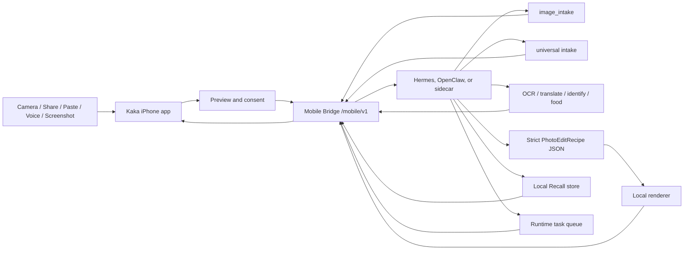

# Kaka

Languages: English | [简体中文](README.zh-CN.md)

Kaka is a local-first iPhone front end for user-owned agent runtimes. It turns the phone into a trusted capture, share, paste, voice, inbox, and consent surface while Hermes, OpenClaw, or a compatible Mobile Bridge runtime owns model credentials, model routing, tool execution, memory, task state, and retention policy.

The project began as an image-intake MVP: pair an iPhone with a local runtime, capture or choose an image, run `image_intake`, receive suggested skills, and continue in an image conversation for OCR, translation, identification, food estimates, or parameterized photo editing.

The latest codebase now includes the first **Pocket Agents** foundation: Share to Kaka Inbox capture, explicit Paste-to-Inbox Courier, explicit Files-to-Inbox import, confirmed local pending Inbox discard before Send, visible Inbox action feedback, local pending item Review Details before Send, universal intake contracts, permission-aware context snapshots, explicit Recall actions, Recall result-review provenance, Recall browse/search/export foundations, runtime-owned semantic Recall search with provider-backed adapter support, production Recall retrieval packaging readiness and material intake review, local renderer backend readiness and capability-gate planning, Runtime Kit SQLite persistence behind `--runtime-store-path`, runtime settings/status, Runtime Kit `settings-preview`, `package-preview`, and `host-package-preview` contracts for Hermes/OpenClaw plugin shells, derived `consumer_ui` and `process_ownership` contracts for ordinary-user runtime controls, P2.9 `host-adapter-run` for Mac/runtime-side host action execution, production-capable short-lived QR pairing and mobile token revocation scaffolding, static runtime shell manifests, runtime task inbox models, safe App Intent and Action Button review handoff surfaces, a Live Activity task-state pipeline with WidgetKit Lock Screen and Dynamic Island presentation, and real push-to-talk voice follow-up. The P2.8 host packaging contract covers distribution metadata, install policy, safe command artifacts, and host-owned lifecycle actions as a JSON handoff; P2.9 adds a testable `mock` adapter and structured unavailable behavior for unconfigured private mode. P3.0 implements ordinary-user connection QA/readiness with a non-mutating `connection-qa-preview` report and first-run checklist. The P3.1 boundary is a host-private command bridge contract: Runtime Kit can call a configured host command, while proprietary Hermes/OpenClaw private API implementations remain outside this repository. P3.2 adds a runtime-side `host-private-adapter-conformance` report that validates a host-owned command without moving distribution or proprietary binaries into Kaka. P3.3 adds `host-package-preview.private_adapter_package` metadata for host-owned command discovery, distribution/update channels, signature policy, and conformance gating while keeping the phone on `/mobile/v1`.

> Status: early MVP / active development. The Swift client, iOS app target, Share Extension target, Mobile Bridge contract, mock bridge, Runtime Kit scaffold, local recipe path, runtime-owned vision path, tests, and UI/UX prototypes are in this repository.

P3.3 is implemented as a package-contract slice. P3.4a adds `host-shell-pilot-report`, a Runtime Kit receipt for the first external Hermes/OpenClaw host-shell pilot. P3.4b lets that report discover a host-owned command in order from explicit argument/config, runtime env var, manifest entrypoint, then well-known path. P3.4c adds the host private adapter implementation guide and schema-checked JSON examples for external host teams. P3.4d keeps the `host-shell-pilot-report` verified boolean gate unchanged while allowing optional host-supplied audit refs: `distribution.evidence.native_channel_ref`, `distribution.evidence.signature_subject`, `distribution.evidence.notarization_team_id`, `distribution.evidence.update_feed_ref`, `drills.evidence.install_receipt_ref`, `drills.evidence.update_receipt_ref`, `drills.evidence.failure_recovery_receipt_ref`, and `drills.evidence.release_notes_ref`. P3.4e adds `host-shell-pilot-handoff`, a machine-readable handoff bundle that wraps the receipt, checks deliverables and audit-ref completeness, can become `ready_to_submit`, and still reports `p3_4_complete: false` because final completion remains external-host-owned. P3.4f adds `host-shell-pilot-preflight`, a read-only local report that can become `ready_for_conformance` after host shell and command discovery inputs exist, without invoking the private command or running conformance. P3.4g adds `host-shell-pilot-runbook`, a read-only operator runbook with brief, ordered steps, command artifacts, evidence requirements, and acceptance gates for the external host team. P3.4h adds `host-shell-pilot-artifact-review`, a read-only post-run review of preflight, conformance, receipt, and handoff JSON artifacts. P3.4i adds `host-shell-pilot-request`, a read-only materials request bundle that tells the Hermes/OpenClaw host team exactly which command binary, action matrix, audit refs, and JSON artifacts to provide. P3.4j adds `host-shell-pilot-evidence-manifest`, a read-only manifest that hashes the local pilot JSON artifacts for external archive review without creating the archive. Runtime Kit verifies and records readiness evidence; these refs do not automatically set verified booleans, and Runtime Kit does not download, read, or validate external materials behind them. The refs stay runtime-side, are not exposed through the phone `/mobile/v1` API, and must not contain secrets, raw logs, private keys, provider keys, tokens, or credentials. Runtime Kit does not own, build, sign, distribute, install, update, or bundle proprietary Hermes/OpenClaw private API binaries. Missing discovery remains `not_ready`. Local fake fixture conformance is `synthetic_only` and cannot mark P3.4 complete. P3.4 release completion still requires a real host-owned `hermes-kaka-host-api` or `openclaw-kaka-host-api` binary outside this repository.

P3.5 adds the productization contract for installable Host Extensions. Ordinary
users should install a Hermes Plugin or OpenClaw Skill/sidecar, enable Kaka
Mobile Bridge in the host UI, and pair by QR or Bonjour. The host-private
adapter command remains host-owned, but it is represented as bundled or
internally discovered by the extension; explicit command paths and
`HERMES_KAKA_HOST_API` / `OPENCLAW_KAKA_HOST_API` are developer and external
pilot fallback paths only.

P3.6 turns those host-owned distribution facts into a read-only
`host-extension-readiness` contract so host teams can prove whether the
plugin/skill package is ready for an external install drill without asking
ordinary users to write commands or set environment variables.

Current product-installation direction: the stable user path should be an
installable Hermes Plugin or OpenClaw Skill/sidecar. Users install the
extension, open the host Kaka Mobile Bridge panel, explicitly enable the bridge,
show a short-lived QR or opt into Bonjour, and pair Kaka iPhone through
`/mobile/v1`. Ordinary users should not write adapter code, export
`HERMES_KAKA_HOST_API` / `OPENCLAW_KAKA_HOST_API`, or paste Runtime Kit command
chains.

The follow-up implementation roadmap for this decision is
[docs/kaka-host-extension-plugin-skill-roadmap.md](docs/kaka-host-extension-plugin-skill-roadmap.md).
It keeps the ordinary-user Hermes/OpenClaw package, Runtime Kit generators, and
Codex developer automation as three separate surfaces.

Implementation guidance as of 2026-06-11: if the next work is about
installation, build toward the host-native Plugin/Skill package rather than a
public Codex plugin or Codex skill. A Codex plugin/skill may still be generated
for Hermes/OpenClaw engineers to scaffold and validate host extension material,
but it must stay source-only, opt-in, and host-team-facing. The ordinary-user
story remains: install the Hermes Plugin or OpenClaw Skill, enable Kaka Mobile
Bridge in the host UI, scan QR or choose Bonjour, then use Kaka through
`/mobile/v1`.

Future plans should treat "make it a plugin/skill" as a host-native packaging
requirement, not as a request to move onboarding into Codex. Ordinary users
should never be asked to install a Codex marketplace plugin, copy a
`SKILL.md` into `~/.codex/skills`, write adapter code, or configure
`--private-adapter-command`. If Codex automation is useful later, it should be
generated as host-team developer source with tests proving no user-home writes,
no marketplace update, no bridge start, no private adapter invocation, and no
phone API change.

External P3.7 still needs the real host-owned materials listed in
[docs/kaka-host-extension-external-materials.md](docs/kaka-host-extension-external-materials.md).
The 2026-06-07 readiness audit shows both Hermes and OpenClaw are still
`blocked` because no real install command, update channel, extension-internal
adapter location, host UI entry point, signed package ref, signature ref, P3.2
conformance report ref, or P3.4 evidence manifest ref has been supplied yet.
The next install-focused handoff should be a sanitized host package candidate
bundle from the Hermes/OpenClaw owner: package ref, host UI entry point,
disabled-by-default evidence, extension-internal adapter command location,
drill receipts, conformance/evidence refs, and release notes. Review that bundle
with P3.28 `host-extension-material-intake` before writing or executing P3.7.
While those inputs are blocked, the in-repository install-UX/devkit support path
now includes P3.12 Host Extension Starter Kit, P3.13 Host Extension installable
package handoff, P3.15 Host Plugin/Skill Devkit, P3.18 Host Codex developer
plugin source, P3.19 Host Extension install experience acceptance, P3.28 Host
Extension material intake, and P3.31 Host Extension User Quickstart:
[docs/superpowers/plans/2026-06-07-kaka-pocket-agents-host-extension-starter-kit.md](docs/superpowers/plans/2026-06-07-kaka-pocket-agents-host-extension-starter-kit.md).
[docs/superpowers/plans/2026-06-07-kaka-pocket-agents-host-extension-installable-package-handoff.md](docs/superpowers/plans/2026-06-07-kaka-pocket-agents-host-extension-installable-package-handoff.md).
[docs/superpowers/plans/2026-06-07-kaka-pocket-agents-host-plugin-skill-developer-kit.md](docs/superpowers/plans/2026-06-07-kaka-pocket-agents-host-plugin-skill-developer-kit.md).
[docs/superpowers/plans/2026-06-11-kaka-pocket-agents-host-extension-user-quickstart.md](docs/superpowers/plans/2026-06-11-kaka-pocket-agents-host-extension-user-quickstart.md).
P3.13 turns the starter-kit output into host-team Plugin/Skill package
materials while keeping signing, update channels, proprietary private adapter
implementation, conformance evidence, and final distribution with
Hermes/OpenClaw. P3.15 adds a template-only developer materials index on top of
those contracts; it is for host engineers, not the public install surface.

Next implementation guidance: keep improving this as a Host Extension product.
The normal user path is plugin/skill install, host-side Kaka Mobile Bridge
enablement, QR or Bonjour pairing, and `/mobile/v1` traffic. Manual adapter
commands, `HERMES_KAKA_HOST_API`, `OPENCLAW_KAKA_HOST_API`, Runtime Kit command
chains, and Codex automation templates stay host-team development or
external-pilot fallback tools. If a future Codex plugin or Codex skill is built,
it should automate host-team scaffolding and validation only; ordinary users
still install the host-native Hermes Plugin or OpenClaw Skill/sidecar. If real
host package facts arrive, review the host package candidate bundle with P3.28
and rerun P3.6 readiness before P3.7. P3.28 Host Extension material intake is
now implemented for the blocked case:
`host-extension-material-intake --manifest /path/to/materials.json` reviews
host-owned package facts and install-drill refs without installing, signing,
publishing, fetching refs, starting the bridge, invoking private adapters, or
turning Codex automation into ordinary-user onboarding. P3.7 still requires a
real external install drill after host-owned materials are accepted. P3.31 is
the allowed quickstart/user-journey acceptance refinement on the existing
install-package handoff while materials remain blocked; if the next work is not
installation-focused, pick an independent repo-owned product slice.
C.1b network-only Context Snapshot is now implemented. P3.16 local renderer
backend readiness and P3.17 photo-edit capability truth are now implemented as
repo-owned product slices.

P3.18 is now implemented as host-team developer plugin source generation, not as
the user installer. The source generator writes only under an explicit output
directory, avoids user-home install roots and marketplace updates, keeps
Hermes/OpenClaw outputs runtime-specific, and proves that the phone still talks
only to `/mobile/v1`. The real user-facing release proof remains the
host-native Hermes Plugin / OpenClaw Skill install drill once external package
materials are available.

P3.19 Host Extension install experience acceptance now strengthens the existing
`host-extension-install-package` output with host UI acceptance metadata,
generated `host-ui/acceptance.json`, ordered install-drill steps, evidence
receipt refs, TLS/readiness/evidence/Codex developer source release gates, and
static manifest/schema drift protection. It does not add a new CLI, install
packages, sign/publish, start the bridge, expose private host APIs, or make
Codex automation the ordinary-user installer.

The latest install-experience refinements are P3.31 Host Extension User
Quickstart and P3.35 Host-Native Plugin/Skill Installation Blueprint. Together
they extend the host-native Plugin/Skill handoff with ordinary-user quickstart
copy, a user-journey acceptance artifact, a machine-readable installation
blueprint, and host UI/lifecycle/evidence expectations while keeping Runtime
Kit and Codex automation out of the public install path.

Post-P3.35 guidance: if real Hermes/OpenClaw package facts arrive, review the
host package candidate bundle with P3.28 and then run P3.7 against accepted
host-owned materials. If facts remain blocked, do not add another
repository-only installer wrapper or public Codex plugin/skill. P3.36a Inbox
Voice Capture Context Copy is now implemented as a small product slice: Inbox
draft capture says Save Draft, row-level instruction capture says Save
Instruction, and both still save locally before visible Inbox Send. P3.36b
Explicit Paste-to-Inbox Courier is now implemented as the next small Inbox
slice: a visible Paste button reads clipboard text once, creates a pending text
or http/https link item with `sourceSurface = "paste"`, and still requires
visible Inbox Send. It adds no background pasteboard reading, automatic
submission, automatic Recall, URL fetching, file paste, Host Extension change,
or `/mobile/v1` change.

P3.37 Inbox Result Review Provenance is now implemented as the next small
product slice after P3.36b. Completed Inbox results show source/context review
copy and preserve a phone-safe `InboxSubmissionContext`; explicit Recall actions
from that banner now pass both `source_task_id` and `source_inbox_item_id`
through the existing Recall action contract. It adds no automatic Recall, new
endpoint, runtime schema change, provider call, Host Extension change, or P3.7
install drill; P3.37 itself added no Files picker.

Host Extension implementation handoff: use
[docs/kaka-host-extension-next-implementation.md](docs/kaka-host-extension-next-implementation.md)
before writing any new install-focused plan.

P3.38 Explicit Files-to-Inbox Import is now implemented. A visible main-app
Files button imports one supported PDF or image into the existing Inbox payload
store with `sourceSurface = "file_picker"`; runtime submission still waits for
visible Inbox `Send`. It adds no automatic upload, automatic submission,
automatic Recall, folder scanning, Mobile Bridge endpoint, App Intent submit
path, Host Extension change, or P3.7 install drill.

P3.39 Inbox Pending Item Discard is now implemented. A visible row-level
Discard button removes one pending Inbox item from the local Inbox store before
runtime submission; payload cleanup stays on the existing store removal path. It
adds no runtime upload, runtime task, Recall action, Mobile Bridge endpoint, App
Intent, Host Extension change, folder scan, or P3.7 install drill.

P3.40 Inbox Discard Confirmation is now implemented. The row-level Discard
control opens a visible confirmation dialog and calls the existing local
discard path only after the user confirms. Cancel or dismissal leaves the
pending item untouched. It adds no runtime upload/task/cancel, Recall
action/delete, Mobile Bridge endpoint, App Intent, Host Extension change, folder
scan, source-file deletion, or P3.7 install drill.

P3.41 Inbox Action Feedback Banner is now implemented. Inbox shows visible
local feedback for failed Inbox actions and in-flight submission progress using
the existing `InboxViewModel.state` and `progressText`; failures can be
dismissed locally. It adds no retry, runtime task cancel, automatic submission,
Recall action/write/delete, Mobile Bridge endpoint, App Intent, Host Extension
change, source-file deletion, or P3.7 install drill.

P3.42 Inbox Pending Item Review Details is now implemented. Each pending Inbox
row can expand local read-only Review Details before visible `Send`, showing
existing source/type metadata, a bounded text or URL excerpt, file name/type,
copied-payload state, saved instruction, route, locale/profile when present,
and Context Snapshot inclusion state. It does not compute file size, read
payload bytes, fetch URLs, parse PDFs/OCR, summarize content, submit, write
Recall, add Mobile Bridge fields, add App Intents, change Host Extension
packaging, scan folders, delete source files, or execute P3.7.

P3.14 is implemented as the next repo-owned Runtime Kit safety slice:
`retention-purge` is an explicit runtime-side dry-run/apply command that emits
`kaka.runtime_retention_purge_receipt.v1`, deletes only old terminal task
history from `SQLiteRuntimeStore`, preserves active tasks, reports current
mock-bridge assets safely, and leaves Recall deletion explicit. P3.22 extends
the same receipt flow with timestamp-aware mock bridge input/output asset purge
receipts for in-memory assets. P3.24 adds Runtime Kit SQLite-backed input/output
asset storage when `--runtime-store-path` is configured, so explicit
`retention-purge` apply can delete old persisted assets while receipts still
list only asset IDs. It does not add automatic cleanup, a phone purge endpoint,
phone-side settings writes, Swift UI, Recall purge, provider calls, host package
changes, task-result detail persistence, raw asset bytes in receipts, or private
host API exposure. P3.15 has now packaged the Hermes Plugin / OpenClaw Skill developer
workflow as template-only host-team materials so host teams can scaffold,
validate, and release the extension without asking ordinary users to write
adapter code or export environment variables.
P3.25 store-backed task result detail persistence is now implemented. It
persists only phone-safe photo-edit result manifests in runtime task metadata,
keeps bytes in `runtime_assets`, rebuilds download links from asset IDs, keeps
task lists summary-only, and avoids any new install wrapper, phone purge
endpoint, automatic cleanup, Swift UI, Recall write/purge, provider call, host
package change, path leakage, or phone settings write.
P3.26 Recall retrieval material intake is now implemented as a Runtime Kit
review contract. `recall-retrieval-material-intake` reads a local
host/runtime-supplied materials manifest, filters secret-like fields and values,
embeds the existing P3.21 readiness snapshot, and can report
`accepted_for_external_retrieval_packaging_review` without fetching refs,
validating signatures, invoking providers, changing `/mobile/v1/recall/search`,
or marking production retrieval implemented.
P3.16 adds a runtime-side `local-renderer-backend-readiness` report that runs a
synthetic `recipe_local` render probe, validates the existing local parametric
renderer path, and emits `kaka.local_renderer_backend_readiness.v1` without
adding a phone API, cloud image provider path, persistent asset storage, bridge
startup, LAN binding, Bonjour, credentials, or new renderer dependencies. P3.27
adds `local-renderer-backend-capability-manifest` so host teams can review the
current Pillow/`recipe_local` contract and future Core
Image/ImageMagick/OpenCV/libvips gates without installing dependencies,
executing future backends, changing phone capabilities, or changing
`/mobile/v1`.
P3.17 aligns the default `recipe_local` photo-edit capability with that proof:
`photo_edit.return_variants_max` is now `2`, matching the current **Master** and
**Social** outputs. P3.17b then narrows the default
`photo_edit.accepted_mime_types` to JPEG-only for the local recipe flow, while
leaving generic asset upload, vision, image intake, and universal intake broader.

P3.30 Voice-to-Inbox Draft is implemented while external Host Extension
materials remain blocked. It extends the existing push-to-talk voice primitives
into Inbox: the user records or edits a transcript, Kaka saves it as a pending
text Inbox item, and the user still reviews and taps `Send`. This keeps
voice-first progress moving without uploading raw audio, starting hidden
recording, auto-submitting to the runtime, writing Recall, or adding another
host-installation wrapper.

P3.32 Inbox Voice Instruction is implemented as the next voice-first Inbox
refinement. Existing universal-intake Inbox rows can open the same voice capture
sheet, save the reviewed transcript into `KakaInboxItem.note`, and still require
the normal visible `Send` action before the runtime receives anything. The
existing universal intake submit path sends that note as `note` and
`user_instruction`; no Mobile Bridge endpoint, raw audio upload, automatic
runtime submission, automatic Recall write, App Intent recording path, or Host
Extension packaging change is added.

P3.33 Inbox Instruction Polish is implemented on top of P3.32. Existing Inbox
instructions are now labeled, editable through the same visible voice sheet,
clearable before submission, and accompanied by send-preview copy so the user
can see that `Send` will include the instruction. The underlying runtime path
remains the existing universal intake `note` / `user_instruction` text fields;
P3.33 adds no audio upload, new Mobile Bridge endpoint, automatic submission,
automatic Recall write, App Intent recording, or Host Extension packaging
change.

P3.34 Inbox Instruction Templates is implemented on top of P3.33:
universal-intake Inbox rows now expose deterministic local chips for Summarize,
Extract Actions, Translate, and Ask Follow-up. Tapping a chip only writes the
selected template text into `KakaInboxItem.note`; the user still reviews and
presses visible `Send` before the runtime receives existing `note` /
`user_instruction` text. P3.34 adds no endpoint, audio upload, automatic
submission, automatic Recall, App Intent recording, provider call, or Host
Extension packaging change.

While that external material intake is blocked, P3.8 adds a read-only
`local-tls-readiness` contract so runtime shells can gate production QR/LAN
pairing on non-secret local TLS metadata without generating certificates,
modifying Keychain, reading private keys, or changing the phone `/mobile/v1`
API.

## Why Kaka

Most AI phone assistants and photo apps move user data and provider credentials into a cloud service. Kaka keeps a narrower local-first boundary:

- The iPhone captures, previews, shares, asks for consent, and displays results.
- The runtime owns provider keys, model choice, tool calls, task state, Recall data, and retention rules.
- Inputs are visible and user-initiated before submission.
- Images go through `image_intake`, which returns a summary and suggested skills.
- Shared text, URLs, images, and PDFs can be captured into an App Group Inbox before the main app submits them.
- Recall is explicit: `Remember`, `Use Once`, or `Forget`.
- Photo editing starts with strict `PhotoEditRecipe` JSON and local rendering, not generative pixel replacement.

The product goal is a reliable pocket-agent loop: capture or share something, let Kaka explain what it can do, continue with the local agent by tap, text, or voice, and decide what should be remembered.

## What Works Now

### Image Intake

1. Pair Kaka on iPhone with a local runtime.
2. Capture a photo or choose one from the library.
3. Upload the asset through Mobile Bridge.
4. Start `POST /mobile/v1/tasks/image-intake`.
5. Show the image summary and suggested Kaka skills.
6. Route the user's next tap or typed request to photo-edit or vision tasks.
7. Show results in an image conversation, then save or share.

### Share To Kaka Inbox

Kaka now includes an iOS Share Extension target:

- accepts text, web URLs, images, and PDFs from the iOS share sheet
- stores supported payloads in the shared App Group container
- records each payload as a `KakaInboxItem`
- fails closed if capture cannot complete
- avoids hidden background upload or retry

The main app owns visible submission from the Inbox into the runtime.

### Universal Intake

The Mobile Bridge client and mock bridge include the first universal-intake contract:

- `POST /mobile/v1/tasks/intake`
- accepted kinds: text, URL, image, screenshot, PDF
- source metadata such as `share_extension`
- optional user instruction
- optional `context_snapshot`
- structured `UniversalIntakeResult` with suggestions

This generalizes the image-intake shape without breaking the current image-specific path.

### Context Snapshot

Kaka has a task-scoped Context Snapshot contract and preview UI. The current collector sends explicit fields such as timestamp, timezone, locale, source surface, coarse network/battery status, one-shot current motion labels, location permission/precision labels, and one-shot calendar availability for the next 30 minutes. Denied or unavailable permissions do not block intake, snapshots are refreshed per task, and snapshots are sent only when the user opts in and the runtime advertises support. P3.23 keeps raw payload sentinels stable while rendering readable preview rows and a preparing state; P3.29 adds permission-gated motion/calendar samplers and a mock bridge allowlist without changing `/mobile/v1`.

### Recall

The codebase includes explicit Recall D.1 foundations:

- `POST /mobile/v1/recall/actions`
- queryable `GET /mobile/v1/recall/items`
- `GET /mobile/v1/recall/export`
- `POST /mobile/v1/recall/search`
- `DELETE /mobile/v1/recall/items/{id}`
- Swift models and client builders
- mock bridge in-memory behavior
- visible confirmation-oriented UI models
- connected Recall browse/search/export tab

Runtime Kit SQLite persistence behind `--runtime-store-path` now provides durable local Recall/task storage, policy-labeled JSON export, deletion receipts, deterministic semantic Recall search, provider-backed retrieval adapter support, a runtime settings/status response for development bridges, `settings-preview`, `package-preview`, and `host-package-preview` JSON contracts for Hermes/OpenClaw plugin shells, derived `consumer_ui` and `process_ownership` models for ordinary-user runtime controls, P2.9 `host-adapter-run` action results, P3.0 `connection-qa-preview` readiness reporting, P3.3 `private_adapter_package` metadata, P3.21 `recall-retrieval-readiness`, and static disabled-by-default shell manifests. P3.20 marks Recall export as `kaka.recall_export.v1` and attaches an artifact policy so export remains user-readable item metadata, summaries, timestamps, and provenance rather than a runtime database dump. P3.21 adds a read-only production Recall retrieval packaging readiness contract for host-native embeddings, sidecar adapters, or capability-negotiated hybrid strategies without choosing a provider or changing `/mobile/v1/recall/search`. P2.9/P3.0/P3.3/P3.21 do not change the phone API: Kaka iPhone still connects to agents only through Mobile Bridge `/mobile/v1`. `host-adapter-run` and `connection-qa-preview` are Mac/runtime-side surfaces; the `mock` adapter is for conformance/local QA, and P3.1 `private` adapter mode is a host-private command bridge contract configured with `--private-adapter-command`. Without that command it returns structured unavailable; with that command Runtime Kit uses stdin/stdout JSON and `shell=False` to call the host-owned Hermes/OpenClaw implementation. Mutating actions require explicit approval, and install must not auto-start the bridge or create a login item.

### Voice And Runtime Tasks

Kaka includes real push-to-talk voice follow-up. The phone records only during an explicit press, uses iOS Speech for on-device transcription, shows an editable transcript, submits text through Mobile Bridge, and can read the returned summary aloud. B.1 does not upload raw microphone audio and does not add hidden listening. Runtime task list, cancel, and approval models are also present so long-running local-agent work can become visible and controllable. E.1 adds foreground App Intents that open Kaka to Inbox or Tasks review surfaces, plus a Live Activity-safe task projection limited to task ID, client-generated generic title, phase, and approval-needed state. E.1b adds the WidgetKit extension that renders that safe projection on the Lock Screen and Dynamic Island; approval and cancellation still happen inside Kaka. E.1c adds Action Button-oriented shortcut metadata that reuses the same foreground handoff and only opens visible Inbox or Tasks review surfaces.

## Pocket Agents Direction

Kaka can expand beyond the camera without becoming an unsafe autonomous phone controller. The recommended direction is:

- **Share or Paste to Kaka Inbox** for text, links, screenshots, PDFs, images, and small files; paste is explicit one-shot text/link import, and audio-note upload is a separate future bridge slice.
- **Voice Walkie-talkie** for push-to-talk commands, visible transcripts, short spoken replies, confirmation cards, P3.30 Voice-to-Inbox Draft, P3.32 Inbox Voice Instruction, P3.33 Inbox Instruction Polish, and P3.34 deterministic Inbox instruction templates.
- **Permissioned Context Snapshot** for task-scoped time, source, conservative device status, one-shot motion labels, location precision labels, and optional calendar busy-window availability.
- **Screenshot Q&A and UI guidance** so the runtime can explain screens and suggest next steps without controlling other apps.
- **Recall** with explicit remember, use-once, forget, browse, search, export, and delete controls.

See [docs/pocket-agents-direction.md](docs/pocket-agents-direction.md) and [docs/kaka-pocket-agents-next-development-plan.md](docs/kaka-pocket-agents-next-development-plan.md).

## Architecture



The iPhone stores only the runtime endpoint, mobile bearer token, local Inbox payloads, and user-visible UI state. Model-provider keys, routing, task execution, production memory, rendered outputs, and approvals that outlive the app session stay on the runtime side.

The current Runtime Kit persistence slice adds a SQLite-backed runtime store for Recall records, retrieval-index deletion receipts, runtime task records, and task events. During development, `--runtime-store-path` is the explicit opt-in for store-backed bridge behavior; without it, the mock bridge can still use deterministic in-memory state for tests.

## Repository Layout

| Path | Purpose |
| --- | --- |
| `Sources/AgentPocketCore` | Swift client models for pairing, uploads, image intake, universal intake, Context Snapshot, Recall, runtime tasks, and Mobile Bridge requests |
| `Sources/AgentPocketUI` | SwiftUI connection, capture, image conversation, Inbox, Context Snapshot preview, Recall, voice draft, and task inbox surfaces |
| `ios/AgentPocket` | iOS app target, entitlements, debug handoff surfaces |
| `ios/KakaShareExtension` | Share Extension target for text, URL, image, and PDF capture |
| `mock_bridge` | Local Mobile Bridge server, deterministic runtime behavior, QA tooling, and tests |
| `runtime-kit` | Bridge launcher, Hermes/OpenClaw packaging scaffold, runtime vision endpoint, CLI, tests |
| `photo-pack` | Photo agent profile, photo-edit skill, and local recipe adapters |
| `docs` | API docs, privacy docs, development plans, Pocket Agents direction, and UI/UX prototypes |

## Implemented And Prototyped Features

- QR and Bonjour-oriented pairing model for a local Mobile Bridge.
- Image capture/library flow with upload, task polling, progress events, result download, save, and share.
- `image_intake` task shape with summaries and suggested Kaka skills.
- Swift skill routing for scan, identify, translate, food, photo enhancement, and conversation follow-up.
- Runtime-owned vision path through `runtime_http` plus a deterministic development server.
- Local-first parameterized photo edit recipes and renderer-oriented adapters.
- Share Extension target and App Group Inbox item store.
- Universal intake request/result models and mock bridge endpoint.
- Permission-aware Context Snapshot payload, preview state, and runtime support gating.
- Recall action models, client methods, mock endpoints, and UI state.
- Policy-labeled Recall export that stays JSON-first and excludes embeddings, retrieval-index rows, provider secrets, tokens, SQLite paths, hidden prompts, raw provider responses, and unrelated task logs.
- Read-only Recall retrieval packaging readiness for production provider-backed retrieval materials, keeping provider configuration runtime-owned and off the phone.
- Runtime task list, cancel, and approval models.
- UI prototypes for the original photo loop and Pocket Agents direction:
  - [docs/ui/kaka-pocket-agents-prototype.html](docs/ui/kaka-pocket-agents-prototype.html)
  - [docs/ui/kaka-pocket-agents-presentation.html](docs/ui/kaka-pocket-agents-presentation.html)
  - [docs/ui/kaka-pocket-agents-voice-first-concept.html](docs/ui/kaka-pocket-agents-voice-first-concept.html)

## Local Development

Run Swift tests:

```bash
swift test
```

Run Runtime Kit and mock bridge tests:

```bash
PYTHONDONTWRITEBYTECODE=1 \
PYTHONPATH=runtime-kit:mock_bridge \
python3 -m pytest -p no:cacheprovider runtime-kit/tests mock_bridge/tests photo-pack/tests ios/tests -q
```

Run the Runtime Kit doctor:

```bash
PYTHONPATH=runtime-kit:mock_bridge python3 -m kaka_mobile_runtime_kit doctor
```

Validate iOS plist and entitlement files:

```bash
plutil -lint \
  ios/KakaShareExtension/Info.plist \
  ios/KakaShareExtension/KakaShareExtension.entitlements \
  ios/AgentPocket/AgentPocket.entitlements \
  ios/AgentPocket.xcodeproj/project.pbxproj
```

Start the local bridge for Simulator development:

```bash
PYTHONPATH=runtime-kit:mock_bridge python3 -m kaka_mobile_runtime_kit start
```

Start the bridge with a local SQLite store:

```bash
PYTHONPATH=runtime-kit:mock_bridge python3 -m kaka_mobile_runtime_kit start \
  --repo-root . \
  --runtime sidecar \
  --runtime-store-path ~/.kaka/mobile-runtime.sqlite3
```

`--runtime-store-path` is a runtime launcher/server option, not a phone API field. The iPhone still talks to `/mobile/v1`; the Mac/runtime side owns Recall storage, JSON export contents, deletion receipts, task state, and retention.

Start the bridge for a physical iPhone on the same trusted LAN:

```bash
PYTHONPATH=runtime-kit:mock_bridge python3 -m kaka_mobile_runtime_kit start \
  --lan \
  --bonjour \
  --bonjour-host "$(ipconfig getifaddr en0)" \
  --runtime hermes \
  --hermes-profile dev-lead
```

Route image-conversation OCR, translate, identify, and food skills to a runtime-owned vision endpoint:

```bash
PYTHONPATH=runtime-kit:mock_bridge python3 -m kaka_mobile_runtime_kit start \
  --lan \
  --bonjour \
  --bonjour-host "$(ipconfig getifaddr en0)" \
  --runtime hermes \
  --hermes-profile dev-lead \
  --vision-provider runtime_http \
  --vision-endpoint http://127.0.0.1:<agent-port>/kaka/vision
```

Development-only vision endpoint:

```bash
PYTHONPATH=runtime-kit python3 -m kaka_mobile_runtime_kit.vision_server \
  --host 127.0.0.1 \
  --port 8787
```

Use it with `--vision-endpoint http://127.0.0.1:8787/kaka/vision` while Hermes/OpenClaw model integration is still being built.

Preview the P2.8 Hermes/OpenClaw host packaging handoff contract:

```bash
PYTHONPATH=runtime-kit python3 -m kaka_mobile_runtime_kit host-package-preview \
  --runtime hermes \
  --distribution-source local_checkout \
  --distribution-channel development \
  --package-version development
```

This command prints JSON for a host shell to render and wire. It is separate from the phone-facing Mobile Bridge API and does not call private Hermes/OpenClaw native install, login item, update, uninstall, log, health, repair, or supervisor APIs. P3.3 embeds `private_adapter_package` with `kaka.host_private_adapter_package.v1` metadata for host-owned command names (`hermes-kaka-host-api` / `openclaw-kaka-host-api`), discovery in order (`--private-adapter-command` / `private_adapter_command`, `HERMES_KAKA_HOST_API` / `OPENCLAW_KAKA_HOST_API`, `host_private_adapter.command`, and `~/Library/Application Support/<Runtime>/Kaka/`), explicit-user-approved updates, host-owned downloads/signatures, required conformance evidence, and unchanged `/mobile/v1` phone traffic.

Run the P2.9 host adapter binding surface for conformance/local QA:

```bash
PYTHONPATH=runtime-kit python3 -m kaka_mobile_runtime_kit host-adapter-run \
  --runtime hermes \
  --adapter mock \
  --action-id run_health_check \
  --installed \
  --bridge-enabled
```

Mutating host actions require explicit approval:

```bash
PYTHONPATH=runtime-kit python3 -m kaka_mobile_runtime_kit host-adapter-run \
  --runtime hermes \
  --adapter mock \
  --action-id install_runtime_package \
  --approved
```

Host-team/development/pilot only: run the P3.1 private host command bridge
contract from the Mac/runtime side:

```bash
PYTHONPATH=runtime-kit python3 -m kaka_mobile_runtime_kit host-adapter-run \
  --runtime hermes \
  --adapter private \
  --private-adapter-command "/path/to/hermes-kaka-host-api" \
  --action-id run_health_check \
  --installed \
  --bridge-enabled
```

`host-adapter-run` is a Mac/runtime-side action surface, not a Mobile Bridge endpoint. The `mock` adapter is for conformance/local QA. The `private` adapter calls only the configured host command; Runtime Kit sends sanitized JSON on stdin, reads JSON on stdout, invokes with `shell=False`, and maps missing, failed, invalid, or timed-out commands to structured safe errors without exposing private details to the iPhone.

Host-team/development/pilot only: run the P3.2 host-private adapter conformance
report against a host-owned command:

```bash
PYTHONPATH=runtime-kit python3 -m kaka_mobile_runtime_kit host-private-adapter-conformance \
  --runtime hermes \
  --private-adapter-command "/path/to/hermes-kaka-host-api"
```

This command is runtime-side only. It uses the same P3.1
`host-adapter-run --adapter private` path to validate install, login-item,
update, uninstall, logs, health, port repair, and supervision. Distribution and
command binary ownership stay with the Hermes/OpenClaw host shell; passing
conformance does not mean Kaka bundles proprietary Hermes/OpenClaw binaries.

Preview the P3.0 ordinary-user connection QA report:

```bash
PYTHONPATH=runtime-kit:mock_bridge python3 -m kaka_mobile_runtime_kit connection-qa-preview \
  --runtime hermes \
  --bridge-enabled \
  --lan \
  --bonjour \
  --bonjour-host 192.168.1.10 \
  --pairing-mode production \
  --runtime-store-path ~/.kaka/mobile-runtime.sqlite3 \
  --recall-search-provider fixture
```

`connection-qa-preview` is a non-mutating Runtime Kit report for first-run QA. It does not start the bridge, bind a port, install packages, create login items, mint credentials, call host-private adapter commands, or change the phone-facing Mobile Bridge `/mobile/v1` contract.

## Runtime Kit Direction

Kaka should not require normal users to paste bridge commands. The target setup flow is:

1. Install a Hermes/OpenClaw plugin or skill.
2. Enable **Kaka Mobile Bridge** inside the runtime UI.
3. Show a short-lived QR code and optionally advertise on the local network.
4. Open Kaka on iPhone and connect.

Safety boundaries:

- Installing a plugin or skill must not auto-start a LAN listener.
- Default bridge binding is local loopback.
- LAN and Bonjour are explicit opt-ins.
- Provider API keys never move to iPhone.
- Ordinary users should not write adapter code, export environment variables, or
  paste Runtime Kit command chains. Hermes/OpenClaw host extensions own adapter
  discovery and lifecycle wiring internally.
- Runtime-owned Recall/task persistence, process lifecycle controls, conformance, first-run connection QA, and host-owned private adapter package metadata now have Runtime Kit `settings-preview`, `package-preview`, `host-package-preview`, `private_adapter_package`, `consumer_ui`, `process_ownership`, `host-adapter-run`, `host-private-adapter-conformance`, and `connection-qa-preview` plugin-shell contracts. Native Hermes/OpenClaw UI should render those contracts instead of moving settings to the phone.
- The phone connects to agents through the local Mobile Bridge `/mobile/v1` API; host shell rendering uses Runtime Kit preview JSON/CLI contracts; host action execution uses Mac/runtime-side `host-adapter-run`; first-run QA uses Mac/runtime-side `connection-qa-preview`; native install, login item, update, uninstall, logs, health, repair, and supervision belong behind a host-provided `private` adapter command, not inside Kaka iPhone or bundled Runtime Kit code.
- Production QR payloads are short-lived and single-use, and mobile tokens are revocable.
- Share Extension capture must not silently upload content.

See [docs/kaka-runtime-kit-plan.md](docs/kaka-runtime-kit-plan.md).

## Roadmap

- Harden Runtime Kit SQLite persistence and provider-backed semantic Recall for production Hermes/OpenClaw packaging.
- Completed P3.0: ordinary-user end-to-end connection QA and host adapter readiness with `connection-qa-preview` plus [docs/kaka-ordinary-user-connection-qa.md](docs/kaka-ordinary-user-connection-qa.md).
- Completed P3.1: bind `host-adapter-run --adapter private` to a host-provided command bridge for distribution, install, login item, update, uninstall, logs, health, repair, and supervision, while leaving proprietary Hermes/OpenClaw implementations outside this repository.
- Completed P3.2: validate a host-owned Hermes/OpenClaw private adapter command with runtime-side `host-private-adapter-conformance`.
- Completed P3.3: embed `private_adapter_package` in `host-package-preview` for host-owned command discovery, distribution/update metadata, signature policy, and conformance gating while keeping proprietary command binaries host-owned.
- Completed P3.4a: add `host-shell-pilot-report` evidence collection for the first external host-shell pilot; `synthetic_only` local readiness cannot mark P3.4 complete.
- Completed P3.4b: let `host-shell-pilot-report` discover the host-owned command from explicit config, runtime env var, manifest entrypoint, or well-known path while keeping missing discovery `not_ready`.
- Completed P3.4c: add the host private adapter implementation guide plus schema-checked request/response/receipt examples for external Hermes/OpenClaw command authors.
- Completed P3.4d: let `host-shell-pilot-report` record optional distribution/drill evidence refs without changing verified boolean gates or exposing refs to phone `/mobile/v1`.
- Completed P3.4e: add `host-shell-pilot-handoff` as the machine-readable external pilot handoff bundle while keeping final P3.4 completion external-host-owned.
- Completed P3.4f: add read-only `host-shell-pilot-preflight` to check host shell and command discovery inputs before conformance.
- Completed P3.4g: add read-only `host-shell-pilot-runbook` to generate ordered host pilot steps, command artifacts, evidence requirements, and acceptance gates before conformance/report/handoff.
- Completed P3.4h: add read-only `host-shell-pilot-artifact-review` to review generated preflight/conformance/receipt/handoff JSON for readiness and consistency before external review.
- Completed P3.4i: add read-only `host-shell-pilot-request` to generate the host-team materials request before preflight/conformance.
- Completed P3.4j: add read-only `host-shell-pilot-evidence-manifest` to hash local pilot JSON artifacts and gate external archive readiness without creating the archive.
- Planned P3.4: external Hermes/OpenClaw host-shell dogfood/release pilot with a real host-owned command binary outside this repository.
- Completed P3.5: add `host-extension-preview`, `host-extension-preview.schema.json`, and Hermes/OpenClaw manifest metadata for installable Host Extension packaging and pairing UX, with adapter commands extension-internal and manual command/env discovery limited to developer or pilot fallback use.
- Completed P3.6: add a read-only `host-extension-readiness` contract for real Plugin/Skill install command, update channel, extension-internal adapter location, host UI entry point, signed package ref, signature/notarization ref, P3.2 conformance report ref, and P3.4 evidence manifest ref.
- Next P3.7 entry condition: choose Hermes or OpenClaw, provide the host-owned materials in [docs/kaka-host-extension-external-materials.md](docs/kaka-host-extension-external-materials.md), rerun `host-extension-readiness` until it reports `ready_for_external_install_drill`, then execute the external Plugin/Skill install drill.
- Completed P3.8: add a read-only `local-tls-readiness` contract for certificate label/ref, public-key fingerprint, expiry, trust store ref, and renewal procedure ref without generating certificates, modifying Keychain, reading private keys, starting the bridge, or changing `/mobile/v1`.
- Completed P3.9: add runtime-side retention policy controls for `input_assets_days`, `output_assets_days`, and `task_history_days` using [docs/superpowers/plans/2026-06-07-kaka-pocket-agents-retention-policy-controls.md](docs/superpowers/plans/2026-06-07-kaka-pocket-agents-retention-policy-controls.md). Runtime Kit now exposes host-shell controls and preserves configured values through `settings-preview`, `package-preview`, `start --dry-run`, generated server commands, mock bridge capabilities, and read-only runtime settings without adding automatic cleanup, phone-side settings writes, or Swift UI changes.
- Completed P3.10a/P3.10b: Runtime Kit can serve local HTTPS with host-owned certificate files, pairing payloads can carry a non-secret `tls_public_key_sha256`, and Swift stores/uses the pin through a pinned `URLSession` trust policy for HTTPS pairing and saved connections. Certificate generation, trust installation, renewal, and private key storage remain host-owned.
- Completed P3.12: add the Host Extension Starter Kit from [docs/superpowers/plans/2026-06-07-kaka-pocket-agents-host-extension-starter-kit.md](docs/superpowers/plans/2026-06-07-kaka-pocket-agents-host-extension-starter-kit.md) so Hermes/OpenClaw host teams can generate safe Plugin/Skill starter packages instead of asking ordinary users to write adapter code or export environment variables.
- Completed P3.11: port refined connection, pairing, saved-connection recovery, local network, TLS/certificate, and host-owned recovery guidance into native SwiftUI while keeping runtime settings owned by Hermes/OpenClaw and avoiding user-visible host/private API details. Plan: [docs/superpowers/plans/2026-06-07-kaka-pocket-agents-native-connection-recovery-ui.md](docs/superpowers/plans/2026-06-07-kaka-pocket-agents-native-connection-recovery-ui.md).
- Completed P3.13: add `host-extension-install-package`, a host-team package-shaped handoff for an installable Hermes Plugin / OpenClaw Skill without signing, publishing, installing, invoking private host APIs, or exposing private host APIs to Kaka iPhone. Plan: [docs/superpowers/plans/2026-06-07-kaka-pocket-agents-host-extension-installable-package-handoff.md](docs/superpowers/plans/2026-06-07-kaka-pocket-agents-host-extension-installable-package-handoff.md).
- Completed P3.14: add explicit runtime-side `retention-purge` dry-run/apply receipts using [docs/superpowers/plans/2026-06-07-kaka-pocket-agents-runtime-retention-enforcement-purge-receipts.md](docs/superpowers/plans/2026-06-07-kaka-pocket-agents-runtime-retention-enforcement-purge-receipts.md). Runtime Kit now emits `kaka.runtime_retention_purge_receipt.v1`, purges only old terminal task history from `SQLiteRuntimeStore`, keeps active tasks and Recall untouched, and avoids automatic cleanup jobs, phone-side purge APIs, and phone-side settings writes. P3.22 adds timestamp-aware mock bridge input/output asset receipt groups on the same explicit runtime-side purge boundary.
- Completed P3.15: add `host-plugin-skill-devkit`, a template-only Host Plugin/Skill developer materials bundle for Hermes/OpenClaw host teams. It indexes existing starter/package/readiness/conformance/evidence contracts, can write adapter and Codex automation templates, and still keeps ordinary users on the host-native Hermes Plugin or OpenClaw Skill rather than adapter commands.
- Completed P3.18: generate host-team Codex developer plugin source under an explicit output directory only. This is for Hermes/OpenClaw engineers to scaffold, validate, and review Host Extension materials; it does not install a Codex plugin, update a marketplace, write user-home install roots, start the bridge, invoke private adapters, or replace the host-native Plugin/Skill user path.
- Completed P3.19: strengthen `host-extension-install-package` with host UI acceptance metadata, generated `host-ui/acceptance.json`, ordered install-drill steps, evidence receipt refs, TLS/readiness/evidence/Codex developer source release gates, and static manifest/schema drift protection without adding a new CLI or ordinary-user Codex install path.
- Completed P3.20: label Recall export as `kaka.recall_export.v1` with an artifact policy and closed Runtime Kit schema so export remains JSON-first user Recall metadata rather than a database dump. It does not add automatic export, cloud sync, embeddings/index rows, provider secrets, tokens, SQLite paths, hidden prompts, raw provider responses, or task logs to the exported artifact.
- Completed P3.21: add `recall-retrieval-readiness`, a read-only Runtime Kit readiness contract for production Recall retrieval packaging. It collects non-secret adapter package, runtime UI, signature, conformance, privacy, fallback drill, and release-note refs; it does not invoke providers, fetch refs, expose provider endpoints or keys to iPhone, return raw embeddings/index rows/provider responses, include retrieval internals in Recall export, or change `/mobile/v1/recall/search`.
- Completed P3.26: add `recall-retrieval-material-intake`, a read-only Runtime Kit materials manifest review contract. It ingests local host/runtime-owned retrieval refs, blocks missing or secret-like materials, embeds the P3.21 readiness result, and keeps provider calls, ref fetching, signature validation, embeddings, index rows, provider responses, Recall export, and `/mobile/v1/recall/search` unchanged.
- Completed P3.22: extend `retention-purge` so timestamped mock bridge input/output assets appear in eligible/deleted receipt groups and are removed only on explicit runtime-side apply. Uploads and photo-edit outputs now carry in-memory `role` and `created_at` metadata; untimestamped assets remain preserved as untracked. P3.22 itself did not add automatic cleanup, Mobile Bridge purge endpoint, phone-side settings write, Swift UI, SQLite asset table, Recall purge, or raw asset bytes in receipts.
- Completed P3.24: add Runtime Kit SQLite-backed input/output asset storage and retention purge using [docs/superpowers/plans/2026-06-07-kaka-pocket-agents-sqlite-asset-storage-retention.md](docs/superpowers/plans/2026-06-07-kaka-pocket-agents-sqlite-asset-storage-retention.md). Store-backed mock bridge uploads and photo-edit outputs survive app restart and can be deleted only through explicit runtime-side `retention-purge` apply. `/mobile/v1/assets` response shape stays unchanged, no `/mobile/v1/runtime/purge` route is added, no automatic cleanup runs, and receipts do not include raw bytes, SQLite paths, provider endpoints, tokens, or task-result variants.
- Completed P3.25: implemented [docs/superpowers/plans/2026-06-11-kaka-pocket-agents-store-backed-task-result-detail.md](docs/superpowers/plans/2026-06-11-kaka-pocket-agents-store-backed-task-result-detail.md) so store-backed completed photo-edit task detail survives bridge restart. Runtime task metadata stores only safe result manifests, variant download links are rebuilt from asset IDs, task lists stay summary-only, completed task events expose only `variant_count`, and no installation behavior or phone-owned retention controls were added.
- Completed P3.23: improve Context Snapshot permission UX using [docs/superpowers/plans/2026-06-07-kaka-pocket-agents-context-snapshot-permission-ux.md](docs/superpowers/plans/2026-06-07-kaka-pocket-agents-context-snapshot-permission-ux.md). The Inbox preview now maps `permission_denied`, `not_requested`, `unavailable`, coarse precision, network, battery, location, and calendar sentinel values into readable rows, shows a preparing state, and disables Send only while user-enabled context is still collecting. It does not change raw payload values, add permission prompts, background collection, Mobile Bridge fields, runtime APIs, Recall writes, provider calls, or entitlements.
- Completed C.1b: add a one-shot coarse Context Snapshot network path probe using [docs/superpowers/plans/2026-06-07-kaka-pocket-agents-context-snapshot-network-path.md](docs/superpowers/plans/2026-06-07-kaka-pocket-agents-context-snapshot-network-path.md). It returns only `wifi`, `cellular`, `offline`, `constrained`, `unknown`, or `unavailable` and does not send SSID, BSSID, carrier, IP address, hostnames, interface names, or continuous network monitoring data.
- Completed P3.29: add permission-gated one-shot Context Snapshot motion/calendar sampling using [docs/superpowers/plans/2026-06-11-kaka-pocket-agents-context-snapshot-motion-calendar.md](docs/superpowers/plans/2026-06-11-kaka-pocket-agents-context-snapshot-motion-calendar.md). Motion returns only `stationary`, `walking`, `running`, `driving`, `unknown`, or permission/unavailable sentinels; calendar returns only `free`, `busy`, `busy_soon`, `write_only`, or permission/unavailable sentinels for the next 30 minutes. No implicit permission prompt, background collection, motion history, event details, new Mobile Bridge field, Recall write, or `/mobile/v1` change is added.
- Completed P3.16: add `local-renderer-backend-readiness`, a Runtime Kit readiness contract and schema that actually runs a temporary synthetic `recipe_local` render probe and reports `ready_for_local_recipe_flow` without exposing image payloads, provider secrets, phone APIs, bridge startup, or asset retention changes.
- Completed P3.27: add `local-renderer-backend-capability-manifest`, a read-only Runtime Kit capability planning manifest for local renderer backends. It records current Pillow/`recipe_local` truth, marks Core Image, ImageMagick, OpenCV, and libvips as future-gated candidates, and does not install/import/execute those backends, add dependencies, change phone capabilities, add Mobile Bridge endpoints, or change `/mobile/v1`.
- Completed P3.28: add `host-extension-material-intake`, a read-only Runtime Kit review command for local `kaka.host_extension_materials.v1` manifests. It embeds P3.6 `host-extension-readiness`, rejects missing or secret-like package facts/install-drill refs, emits `kaka.host_extension_material_intake.v1`, and avoids install/sign/publish/fetch/bridge-start/private-adapter/Codex-user-home side effects or `/mobile/v1` changes.
- Completed P3.17: align default `recipe_local` photo-edit capability truth to `return_variants_max: 2` for the current **Master** and **Social** outputs.
- Completed P3.17b: narrow default `recipe_local` `photo_edit.accepted_mime_types` to `["image/jpeg"]` while keeping generic asset upload, vision, image intake, and universal intake as separate broader boundaries.
- Completed P3.37: add Inbox Result Review Provenance using [docs/superpowers/plans/2026-06-11-kaka-pocket-agents-inbox-result-review-provenance.md](docs/superpowers/plans/2026-06-11-kaka-pocket-agents-inbox-result-review-provenance.md). Successful Inbox results now show source/context review copy and explicit Recall actions preserve both task and Inbox provenance through the existing Recall action request; no automatic Recall, new endpoint, host package work, or P3.7 drill was added, and P3.37 itself added no Files picker.
- Completed P3.38: add Explicit Files-to-Inbox Import using [docs/superpowers/plans/2026-06-11-kaka-pocket-agents-explicit-files-to-inbox-import.md](docs/superpowers/plans/2026-06-11-kaka-pocket-agents-explicit-files-to-inbox-import.md). A visible main-app Files button copies one supported PDF or image into `SharedPayloads`, creates a pending Inbox item with `sourceSurface = "file_picker"`, and still requires visible Inbox `Send`; no automatic upload/submission/Recall, folder scanning, Mobile Bridge endpoint, App Intent submit path, Host Extension change, or P3.7 drill was added.
- Completed P3.39: add Inbox Pending Item Discard using [docs/superpowers/plans/2026-06-11-kaka-pocket-agents-inbox-pending-item-discard.md](docs/superpowers/plans/2026-06-11-kaka-pocket-agents-inbox-pending-item-discard.md). A visible row-level Discard button removes one pending Inbox item through `KakaInboxStoring.remove(id:)`, which also deletes that item's `SharedPayloads` payload when present; no runtime upload/task, Recall action, Mobile Bridge endpoint, App Intent, Host Extension change, folder scan, or P3.7 drill was added.
- Completed P3.40: add Inbox Discard Confirmation using [docs/superpowers/plans/2026-06-11-kaka-pocket-agents-inbox-discard-confirmation.md](docs/superpowers/plans/2026-06-11-kaka-pocket-agents-inbox-discard-confirmation.md). The row-level Discard control now opens a visible confirmation dialog and calls the existing local discard path only after confirmation; cancel or dismissal leaves the pending item untouched, and no runtime upload/task/cancel, Recall action/delete, Mobile Bridge endpoint, App Intent, Host Extension change, folder scan, source-file deletion, or P3.7 drill was added.
- Completed P3.41: add Inbox Action Feedback Banner using [docs/superpowers/plans/2026-06-11-kaka-pocket-agents-inbox-action-feedback-banner.md](docs/superpowers/plans/2026-06-11-kaka-pocket-agents-inbox-action-feedback-banner.md). Inbox now renders failed action feedback and in-flight submission progress from existing local ViewModel state; failure feedback can be dismissed locally, with no retry, runtime cancel, automatic submission, Recall write/delete, Mobile Bridge endpoint, App Intent, Host Extension change, source-file deletion, or P3.7 drill.
- Completed P3.42: add Inbox Pending Item Review Details using [docs/superpowers/plans/2026-06-11-kaka-pocket-agents-inbox-pending-item-review-details.md](docs/superpowers/plans/2026-06-11-kaka-pocket-agents-inbox-pending-item-review-details.md). Pending rows now expose local read-only Review Details before visible `Send`, with no URL fetch, file read, PDF/OCR parsing, automatic submit, Recall write/delete, Mobile Bridge endpoint, App Intent, Host Extension change, source-file deletion, or P3.7 drill.
- Next development rule: if real host-owned package facts are available, review the host package candidate bundle with P3.28 `host-extension-material-intake`, rerun P3.6 `host-extension-readiness`, and then use accepted materials to unblock P3.7 external install drill. If facts remain unavailable, P3.35 Host-Native Plugin/Skill Installation Blueprint is already complete, so do not add another public Codex plugin/skill, command-wrapper installer, or repository-only installation wrapper. P3.36a Inbox Voice Capture Context Copy, P3.36b Explicit Paste-to-Inbox Courier, P3.37 Inbox Result Review Provenance, P3.38 Explicit Files-to-Inbox Import, P3.39 Inbox Pending Item Discard, P3.40 Inbox Discard Confirmation, P3.41 Inbox Action Feedback Banner, and P3.42 Inbox Pending Item Review Details are complete; choose another separately permissioned product improvement while Host Extension materials remain blocked. Do not turn manual adapter setup into ordinary-user onboarding or duplicate P3.26/P3.28 material intake.
- Future renderer work can add more local backends such as Core Image, ImageMagick, OpenCV, or libvips only after the P3.27 manifest gates and P3.16 readiness proof are satisfied.

## Security And Privacy

Kaka is designed around a local-first credential boundary:

- iPhone never stores model-provider API keys.
- The runtime owns model choice and provider credentials.
- User inputs are explicit and visible before submission.
- Share Extension payloads are captured locally first, then submitted by visible main-app action.
- Context Snapshot is task-scoped, previewed with readable permission rows, and never collected in the background.
- Recall is opt-in: remember, use once, or forget.
- Production Recall and task persistence stays on the runtime side; the phone requests browse/search/export/delete and task actions through Mobile Bridge.
- Photos and rendered variants are handled by the user's runtime and its retention policy.
- Local discovery does not mint long-lived credentials by itself.

See [SECURITY.md](SECURITY.md) and [docs/agent-pocket-privacy.md](docs/agent-pocket-privacy.md).

## License

MIT License. See [LICENSE](LICENSE).
