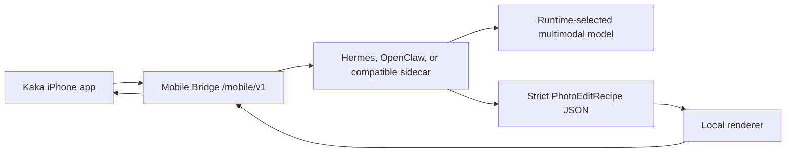

# Kaka

[中文](README.zh-CN.md)

Kaka is a local-first iPhone photo agent client.

It connects an iPhone to a user-owned agent runtime such as Hermes, OpenClaw, or a compatible Mobile Bridge, sends photos to the local Mac runtime, receives deterministic **Master** and **Social** edits, and keeps model-provider credentials off the phone.

> Status: early MVP / active development. The core client, mock bridge, local recipe renderer path, UI prototypes, and Runtime Kit scaffold exist. The consumer-ready Hermes/OpenClaw installation flow is still being packaged.

## Why Kaka

Most AI photo apps either send photos to a cloud app directly or generate new pixels that can damage faces, products, text, logos, and small details.

Kaka takes a narrower first step:

- iPhone captures, uploads, previews, saves, and shares.
- The local runtime chooses its own multimodal model.
- The model reads the photo and outputs a strict edit recipe.
- The Mac validates the recipe and renders edits locally.
- Phase 1 uses parameterized photo improvement, not generative image replacement.

The goal is a simple camera loop: take or choose a photo, make it look more professional, compare the result, then save or share.

## Product Loop

1. Connect Kaka iPhone to a local runtime.
2. Take a photo or choose one from the library.
3. Pick a scene pack such as natural, portrait, product, or social.
4. Send the photo to the local Mobile Bridge.
5. Runtime analyzes the image with its configured multimodal model.
6. Runtime returns a strict local edit recipe.
7. Mac renders **Master** and **Social** variants.
8. iPhone shows before/after review, save, and iOS share sheet.

## Architecture



The iPhone stores only the runtime endpoint and mobile bearer token. Model keys, provider routing, recipe generation, rendering, task state, and output assets stay on the user's Mac/runtime side.

## Current Components

| Path | Purpose |
| --- | --- |
| `Sources/AgentPocketCore` | Swift client models, pairing, uploads, task polling, downloads |
| `Sources/AgentPocketUI` | SwiftUI connection, capture, result, save/share flows |
| `ios/AgentPocket` | iOS app target |
| `mock_bridge` | Local Mobile Bridge server and QA tooling |
| `photo-pack` | Photo agent profile, skill, and local recipe adapters |
| `runtime-kit` | Explicit-start bridge launcher and Hermes/OpenClaw packaging scaffold |
| `docs` | Architecture, API, setup, UI prototypes, implementation plans |

## Local Development

Run Swift tests:

```bash
swift test
```

Run the Runtime Kit doctor:

```bash
PYTHONPATH=runtime-kit:mock_bridge python3 -m kaka_mobile_runtime_kit doctor
```

Run targeted Python tests:

```bash
PYTHONDONTWRITEBYTECODE=1 \
PYTHONPATH=runtime-kit:mock_bridge \
python3 -m pytest -p no:cacheprovider runtime-kit/tests mock_bridge/tests/test_photo_pack_provider.py -q
```

Start the local bridge for Simulator-only development:

```bash
PYTHONPATH=runtime-kit:mock_bridge python3 -m kaka_mobile_runtime_kit start
```

Start the bridge for a physical iPhone on the same trusted LAN:

```bash
PYTHONPATH=runtime-kit:mock_bridge python3 -m kaka_mobile_runtime_kit start \
  --lan \
  --bonjour \
  --bonjour-host "$(ipconfig getifaddr en0)" \
  --runtime hermes \
  --hermes-profile dev-lead
```

The long commands above are for development transparency. The intended consumer UX is a Hermes/OpenClaw **Kaka Mobile Bridge** toggle with QR pairing and optional Bonjour discovery.

## Runtime Kit Direction

Kaka should not require normal users to paste bridge commands. The target setup flow is:

1. Install a Hermes/OpenClaw plugin or skill.
2. Enable **Kaka Mobile Bridge** inside the runtime UI.
3. Show QR and optionally advertise on the local network.
4. Open Kaka on iPhone and connect.

Safety boundaries:

- Installing a plugin or skill must not auto-start a LAN listener.
- Default bridge binding is local loopback.
- LAN and Bonjour are explicit opt-ins.
- Provider API keys never move to iPhone.
- Pairing tokens should be short-lived and revocable.

See [docs/kaka-runtime-kit-plan.md](docs/kaka-runtime-kit-plan.md).

## Photo Editing Direction

Phase 1 focuses on parameterized edits:

- crop and reframe
- exposure and contrast
- shadows and highlights
- white balance
- vibrance
- denoise and sharpen
- subject emphasis
- conservative upscale when needed

The photo is not converted into a giant pixel JSON file. JSON is used for the bounded edit recipe. The local renderer applies that recipe and returns edited image assets.

## Roadmap

- Finish Simulator and real iPhone local-recipe receipts.
- Package Runtime Kit as a real Hermes plugin flow.
- Add OpenClaw sidecar or native integration.
- Improve production pairing, revocation, and retention controls.
- Port the refined HTML UI direction into native SwiftUI.
- Add more local renderer backends such as Core Image, ImageMagick, OpenCV, or libvips.

## Security And Privacy

Kaka is designed around a local-first credential boundary:

- iPhone never stores model-provider API keys.
- The runtime owns model choice and provider credentials.
- Photos and rendered variants are handled by the user's runtime and its retention policy.
- Local discovery does not mint long-lived credentials by itself.

See [SECURITY.md](SECURITY.md).

## License

MIT License. See [LICENSE](LICENSE).
