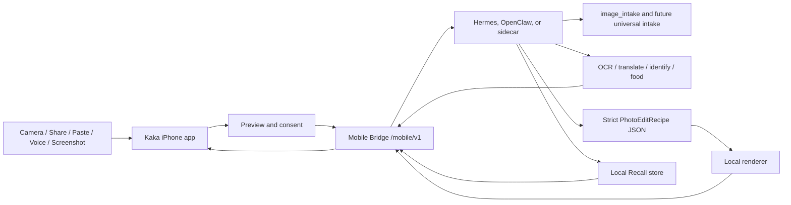

# Kaka

Languages: English | [简体中文](README.zh-CN.md)

Kaka is a local-first iPhone front end for user-owned agent runtimes. It lets the phone act as a trusted capture, share, voice, and consent surface while Hermes, OpenClaw, or a compatible Mobile Bridge runtime keeps model credentials, tool execution, memory, and retention policy on the user's Mac/runtime side.

The current implementation focuses on image intake: connect an iPhone to a local runtime, capture or choose an image, let the runtime classify it and suggest skills, then continue in an image conversation for OCR, translation, identification, food estimates, or parameterized photo editing.

The product direction is **Pocket Agents**: Kaka should grow from a camera loop into a voice-first inbox for local agents, with Share to Kaka, screenshot Q&A, permissioned context snapshots, explicit Recall controls, and runtime-owned long-running work.

> Status: early MVP / active development. The Swift client, Mobile Bridge contract, mock bridge, `image_intake`, runtime-routed vision path, local photo recipe path, Runtime Kit scaffold, iOS app target, tests, and UI/UX prototypes are in this repository. The consumer-ready Hermes/OpenClaw plugin flow is still being packaged.

## Why Kaka

Most AI photo and assistant apps push user data and model-provider credentials into a cloud app. Kaka takes a narrower local-first path:

- The iPhone captures, previews, saves, shares, and asks for consent.
- The runtime owns provider keys, model choice, tool calls, task state, Recall data, and retention rules.
- Images go through `image_intake`, which returns a summary and suggested skills.
- Users can tap a suggested skill or type a request in the image conversation.
- OCR, translation, identification, food estimates, and photo enhancement are runtime capabilities, not phone-stored secrets.
- Photo editing starts with strict `PhotoEditRecipe` JSON and local rendering, not generative pixel replacement.

The near-term goal is a reliable loop: capture or share something, let Kaka explain what it can do, then continue with the local agent by tap, text, or voice.

## Current Product Loop

1. Pair Kaka on iPhone with a local runtime.
2. Capture a photo or choose one from the library.
3. Upload the asset through Mobile Bridge.
4. Start `image_intake`.
5. Show the image summary and suggested skills.
6. Route the user's next tap or typed request to photo-edit or vision tasks.
7. Show results in an image conversation, then save or share.

## Pocket Agents Direction

Kaka can expand beyond the camera without becoming an unsafe autonomous phone controller. The recommended next capabilities are:

- **Share to Kaka Inbox** for text, links, screenshots, PDFs, images, audio notes, and small files.
- **Voice Walkie-talkie** for push-to-talk commands, visible transcripts, short spoken replies, and confirmation cards.
- **Permissioned Context Snapshot** for task-scoped time, source, coarse location, network, battery, motion, and optional calendar availability.
- **Screenshot Q&A and UI guidance** so the runtime can explain screens and suggest next steps without controlling other apps.
- **Recall** with explicit `Remember`, `Use Once`, and `Forget` choices.

See [docs/pocket-agents-direction.md](docs/pocket-agents-direction.md) for the full product analysis and roadmap.

## Architecture



The iPhone stores only the runtime endpoint and mobile bearer token. Model-provider keys, routing, task execution, image analysis, rendered outputs, future Recall records, and approvals that outlive the app session stay on the runtime side.

## Repository Layout

| Path | Purpose |
| --- | --- |
| `Sources/AgentPocketCore` | Swift client models, pairing, uploads, task polling, task events, skill models |
| `Sources/AgentPocketUI` | SwiftUI connection, capture, image conversation, result, save/share, and skill suggestion UI |
| `ios/AgentPocket` | iOS app target and extension wiring |
| `mock_bridge` | Local Mobile Bridge server, deterministic fixtures, QA tools, and tests |
| `runtime-kit` | Bridge launcher, Hermes/OpenClaw packaging scaffold, runtime vision endpoint, CLI, tests |
| `photo-pack` | Photo agent profile, photo-edit skill, and local recipe adapters |
| `docs` | API docs, privacy docs, development plans, Pocket Agents direction, and UI/UX prototypes |

## Implemented And Prototyped Features

- QR and Bonjour-oriented pairing model for a local Mobile Bridge.
- Image capture/library flow with upload, task polling, progress events, result download, save, and share.
- `image_intake` task shape with summaries and suggested Kaka skills.
- Swift skill routing for scan, identify, translate, food, photo enhancement, and conversation follow-up.
- Runtime-owned vision path through `runtime_http` plus a deterministic development server.
- Local-first parameterized photo edit recipes and renderer-oriented adapters.
- Runtime Kit commands for explicit local/LAN bridge startup.
- UI prototypes for the original photo loop and the Pocket Agents direction:
  - [docs/ui/kaka-pocket-agents-prototype.html](docs/ui/kaka-pocket-agents-prototype.html)
  - [docs/ui/kaka-pocket-agents-presentation.html](docs/ui/kaka-pocket-agents-presentation.html)
  - [docs/ui/kaka-pocket-agents-voice-first-concept.html](docs/ui/kaka-pocket-agents-voice-first-concept.html)

## Local Development

Run Swift tests:

```bash
swift test
```

Run the Runtime Kit doctor:

```bash
PYTHONPATH=runtime-kit:mock_bridge python3 -m kaka_mobile_runtime_kit doctor
```

Run targeted Python tests:

```bash
PYTHONDONTWRITEBYTECODE=1 \
PYTHONPATH=runtime-kit:mock_bridge \
python3 -m pytest -p no:cacheprovider runtime-kit/tests mock_bridge/tests/test_photo_pack_provider.py -q
```

Start the local bridge for Simulator development:

```bash
PYTHONPATH=runtime-kit:mock_bridge python3 -m kaka_mobile_runtime_kit start
```

Start the bridge for a physical iPhone on the same trusted LAN:

```bash
PYTHONPATH=runtime-kit:mock_bridge python3 -m kaka_mobile_runtime_kit start \
  --lan \
  --bonjour \
  --bonjour-host "$(ipconfig getifaddr en0)" \
  --runtime hermes \
  --hermes-profile dev-lead
```

Route image-conversation OCR, translate, identify, and food skills to a runtime-owned vision endpoint:

```bash
PYTHONPATH=runtime-kit:mock_bridge python3 -m kaka_mobile_runtime_kit start \
  --lan \
  --bonjour \
  --bonjour-host "$(ipconfig getifaddr en0)" \
  --runtime hermes \
  --hermes-profile dev-lead \
  --vision-provider runtime_http \
  --vision-endpoint http://127.0.0.1:<agent-port>/kaka/vision
```

Development-only vision endpoint:

```bash
PYTHONPATH=runtime-kit python3 -m kaka_mobile_runtime_kit.vision_server \
  --host 127.0.0.1 \
  --port 8787
```

Use it with `--vision-endpoint http://127.0.0.1:8787/kaka/vision` while Hermes/OpenClaw model integration is still being built.

## Runtime Kit Direction

Kaka should not require normal users to paste bridge commands. The target setup flow is:

1. Install a Hermes/OpenClaw plugin or skill.
2. Enable **Kaka Mobile Bridge** inside the runtime UI.
3. Show a short-lived QR code and optionally advertise on the local network.
4. Open Kaka on iPhone and connect.

Safety boundaries:

- Installing a plugin or skill must not auto-start a LAN listener.
- Default bridge binding is local loopback.
- LAN and Bonjour are explicit opt-ins.
- Provider API keys never move to iPhone.
- Pairing tokens should be short-lived and revocable.

See [docs/kaka-runtime-kit-plan.md](docs/kaka-runtime-kit-plan.md).

## Photo Editing Direction

Phase 1 focuses on parameterized edits:

- crop and reframe
- exposure and contrast
- shadows and highlights
- white balance
- vibrance
- denoise and sharpen
- subject emphasis
- conservative upscale when needed

The photo is not converted into a giant pixel JSON file. JSON describes a bounded edit recipe. The local renderer applies that recipe and returns edited image assets.

## Roadmap

- Finish Simulator and real-iPhone local-recipe receipts.
- Package Runtime Kit as a real Hermes plugin flow.
- Add OpenClaw sidecar or native integration.
- Ship Share to Kaka Inbox as the first universal-intake slice.
- Add voice-first follow-up with visible transcript and confirmation states.
- Add permissioned Context Snapshot and explicit Recall controls.
- Improve production pairing, revocation, retention, and local TLS.
- Port refined HTML UI direction into native SwiftUI.
- Add more local renderer backends such as Core Image, ImageMagick, OpenCV, or libvips.

## Security And Privacy

Kaka is designed around a local-first credential boundary:

- iPhone never stores model-provider API keys.
- The runtime owns model choice and provider credentials.
- User inputs are explicit and visible before submission.
- Photos and rendered variants are handled by the user's runtime and its retention policy.
- Local discovery does not mint long-lived credentials by itself.
- Future Recall is opt-in: remember, use once, or forget.

See [SECURITY.md](SECURITY.md).

## License

MIT License. See [LICENSE](LICENSE).
