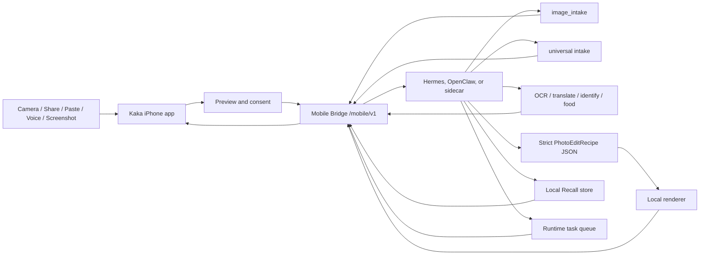

# Kaka

Languages: English | [简体中文](README.zh-CN.md)

Kaka is a local-first iPhone front end for user-owned agent runtimes. It turns the phone into a trusted capture, share, paste, voice, inbox, and consent surface while Hermes, OpenClaw, or a compatible Mobile Bridge runtime owns model credentials, model routing, tool execution, memory, task state, and retention policy.

> Status: early MVP / active development. The Swift client, iOS app target, Share Extension target, Mobile Bridge contract, mock bridge, Runtime Kit scaffold, local recipe path, runtime-owned vision path, tests, and UI/UX prototypes are in this repository. The full phase-by-phase history lives in [docs/development-history.md](docs/development-history.md).

## Why Kaka

Most AI phone assistants and photo apps move user data and provider credentials into a cloud service. Kaka keeps a narrower local-first boundary:

- The iPhone captures, previews, shares, asks for consent, and displays results.
- The runtime owns provider keys, model choice, tool calls, task state, Recall data, and retention rules.
- Inputs are visible and user-initiated before submission.
- Images go through `image_intake`, which returns a summary and suggested skills.
- Shared text, URLs, images, and PDFs can be captured into an App Group Inbox before the main app submits them.
- Recall is explicit: `Remember`, `Use Once`, or `Forget`.
- Photo editing starts with strict `PhotoEditRecipe` JSON and local rendering, not generative pixel replacement.

The product goal is a reliable pocket-agent loop: capture or share something, let Kaka explain what it can do, continue with the local agent by tap, text, or voice, and decide what should be remembered.

## What Works Now

- **Image intake** — pair with a local runtime, capture or choose a photo, upload through Mobile Bridge, run `POST /mobile/v1/tasks/image-intake`, get a summary plus suggested skills, and continue in an image conversation (OCR, translate, identify, food, parameterized photo edit).
- **Share to Kaka Inbox** — an iOS Share Extension accepts text, web URLs, images, and PDFs, stores payloads in the shared App Group container as `KakaInboxItem`s, and fails closed; the main app owns visible submission. Explicit Paste and Files import, pending-item review details, confirmed discard, and action feedback banners are built on the same Inbox.
- **Universal intake** — `POST /mobile/v1/tasks/intake` for text, URL, image, screenshot, and PDF with source metadata, optional user instruction, optional context snapshot, and structured suggestions.
- **Context Snapshot** — a task-scoped, permission-aware snapshot (time, timezone, locale, source surface, coarse network/battery, one-shot motion and calendar-availability labels) sent only when the user opts in and the runtime advertises support; denied permissions never block intake.
- **Recall** — explicit actions (`Remember` / `Use Once` / `Forget`), browse, search, export, and delete through `/mobile/v1/recall/*`; Runtime Kit provides durable SQLite persistence behind `--runtime-store-path`, policy-labeled JSON export, and deterministic semantic search with provider-backed adapter support.
- **Voice and runtime tasks** — real push-to-talk follow-up with on-device transcription and an editable transcript (no raw audio upload, no hidden listening), voice-to-Inbox drafts and instructions, runtime task list/cancel/approval models, foreground App Intents, and a Live Activity pipeline with WidgetKit Lock Screen and Dynamic Island presentation.
- **Pairing and trust** — short-lived QR pairing with token revocation, Bonjour discovery, local HTTPS with a non-secret TLS public-key pin carried into saved connections.

## Architecture



The iPhone stores only the runtime endpoint, mobile bearer token, local Inbox payloads, and user-visible UI state. Model-provider keys, routing, task execution, production memory, rendered outputs, and approvals that outlive the app session stay on the runtime side.

## Repository Layout

| Path | Purpose |
| --- | --- |
| `Sources/AgentPocketCore` | Swift client models for pairing, uploads, image intake, universal intake, Context Snapshot, Recall, runtime tasks, and Mobile Bridge requests |
| `Sources/AgentPocketUI` | SwiftUI connection, capture, image conversation, Inbox, Context Snapshot preview, Recall, voice draft, and task inbox surfaces |
| `ios/AgentPocket` | iOS app target, entitlements, debug handoff surfaces |
| `ios/KakaShareExtension` | Share Extension target for text, URL, image, and PDF capture |
| `ios/AgentPocketTaskActivityWidget` | WidgetKit Live Activity target for Lock Screen and Dynamic Island task state |
| `mock_bridge` | Local Mobile Bridge server, deterministic runtime behavior, QA tooling, and tests |
| `runtime-kit` | Bridge launcher, Hermes/OpenClaw packaging scaffold, runtime vision endpoint, CLI, tests |
| `photo-pack` | Photo agent profile, photo-edit skill, and local recipe adapters |
| `docs` | API docs, privacy docs, development plans, Pocket Agents direction, and UI/UX prototypes |

Key documents: [docs/mobile-bridge-api.md](docs/mobile-bridge-api.md) (the phone↔runtime contract and single source of truth), [docs/agent-pocket-setup.md](docs/agent-pocket-setup.md) (setup), [docs/pocket-agents-direction.md](docs/pocket-agents-direction.md) (product direction), [docs/development-history.md](docs/development-history.md) (full phase log).

## Local Development

Run Swift tests:

```bash
swift test
```

Run Runtime Kit, mock bridge, photo pack, and iOS source tests:

```bash
PYTHONDONTWRITEBYTECODE=1 \
PYTHONPATH=runtime-kit:mock_bridge \
python3 -m pytest -p no:cacheprovider runtime-kit/tests mock_bridge/tests photo-pack/tests ios/tests -q
```

Start the local bridge for Simulator development:

```bash
PYTHONPATH=runtime-kit:mock_bridge python3 -m kaka_mobile_runtime_kit start
```

Start the bridge with a local SQLite store:

```bash
PYTHONPATH=runtime-kit:mock_bridge python3 -m kaka_mobile_runtime_kit start \
  --repo-root . \
  --runtime sidecar \
  --runtime-store-path ~/.kaka/mobile-runtime.sqlite3
```

Start the bridge for a physical iPhone on the same trusted LAN:

```bash
PYTHONPATH=runtime-kit:mock_bridge python3 -m kaka_mobile_runtime_kit start \
  --lan \
  --bonjour \
  --bonjour-host "$(ipconfig getifaddr en0)" \
  --runtime hermes \
  --hermes-profile dev-lead
```

Then open `ios/AgentPocket.xcodeproj`, run the app, and pair by QR or Bonjour. See [docs/agent-pocket-setup.md](docs/agent-pocket-setup.md) for vision endpoints, QA tooling, and troubleshooting, and [runtime-kit/README.md](runtime-kit/README.md) for the host packaging and host adapter CLI surfaces.

## Runtime Kit Direction

Kaka should not require normal users to paste bridge commands. The target setup flow is:

1. Install a Hermes/OpenClaw plugin or skill.
2. Enable **Kaka Mobile Bridge** inside the runtime UI.
3. Show a short-lived QR code and optionally advertise on the local network.
4. Open Kaka on iPhone and connect.

Safety boundaries:

- Installing a plugin or skill must not auto-start a LAN listener; default binding is local loopback, and LAN/Bonjour are explicit opt-ins.
- Provider API keys never move to iPhone.
- Ordinary users should not write adapter code, export environment variables, or paste Runtime Kit command chains; host extensions own adapter discovery and lifecycle wiring internally.
- The phone connects to agents only through Mobile Bridge `/mobile/v1`; host shell rendering and host action execution use Mac/runtime-side Runtime Kit contracts, and proprietary Hermes/OpenClaw private API implementations stay outside this repository.
- Production QR payloads are short-lived and single-use, and mobile tokens are revocable.
- Share Extension capture must not silently upload content.

See [docs/kaka-runtime-kit-plan.md](docs/kaka-runtime-kit-plan.md).

## Status And Roadmap

Current focus: an end-to-end real-use loop — pair a physical iPhone with a real local runtime, exercise capture/share/voice daily, and harden what breaks.

The Host Extension productization track (an installable Hermes Plugin / OpenClaw Skill) is specified and contract-complete in Runtime Kit, but the external install drill (P3.7) remains **blocked** on real host-owned package materials; see [docs/kaka-host-extension-external-materials.md](docs/kaka-host-extension-external-materials.md). While blocked, development continues on repo-owned product slices instead of additional installer wrappers.

The complete phase log (P2.x–P3.x, with the boundaries each slice did and did not change) is in [docs/development-history.md](docs/development-history.md).

## Security And Privacy

Kaka is designed around a local-first credential boundary:

- iPhone never stores model-provider API keys.
- The runtime owns model choice and provider credentials.
- User inputs are explicit and visible before submission.
- Share Extension payloads are captured locally first, then submitted by visible main-app action.
- Context Snapshot is task-scoped, previewed with readable permission rows, and never collected in the background.
- Recall is opt-in: remember, use once, or forget.
- Production Recall and task persistence stays on the runtime side; the phone requests browse/search/export/delete and task actions through Mobile Bridge.
- Photos and rendered variants are handled by the user's runtime and its retention policy.
- Local discovery does not mint long-lived credentials by itself.

See [SECURITY.md](SECURITY.md) and [docs/agent-pocket-privacy.md](docs/agent-pocket-privacy.md).

## License

MIT License. See [LICENSE](LICENSE).
