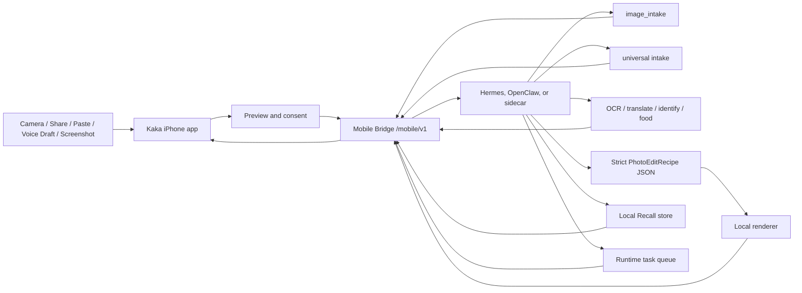

# Kaka

Languages: English | [简体中文](README.zh-CN.md)

Kaka is a local-first iPhone front end for user-owned agent runtimes. It turns the phone into a trusted capture, share, voice-draft, inbox, and consent surface while Hermes, OpenClaw, or a compatible Mobile Bridge runtime owns model credentials, model routing, tool execution, memory, task state, and retention policy.

The project began as an image-intake MVP: pair an iPhone with a local runtime, capture or choose an image, run `image_intake`, receive suggested skills, and continue in an image conversation for OCR, translation, identification, food estimates, or parameterized photo editing.

The latest codebase now includes the first **Pocket Agents Phase A** foundation: Share to Kaka Inbox capture, universal intake contracts, minimal context snapshots, explicit Recall actions, runtime task inbox models, and a transcript-first voice follow-up skeleton. Real microphone recording, Speech transcription, spoken replies, production Recall persistence, and consumer-ready Hermes/OpenClaw plugin packaging are still planned work.

> Status: early MVP / active development. The Swift client, iOS app target, Share Extension target, Mobile Bridge contract, mock bridge, Runtime Kit scaffold, local recipe path, runtime-owned vision path, tests, and UI/UX prototypes are in this repository.

## Why Kaka

Most AI phone assistants and photo apps move user data and provider credentials into a cloud service. Kaka keeps a narrower local-first boundary:

- The iPhone captures, previews, shares, asks for consent, and displays results.
- The runtime owns provider keys, model choice, tool calls, task state, Recall data, and retention rules.
- Inputs are visible and user-initiated before submission.
- Images go through `image_intake`, which returns a summary and suggested skills.
- Shared text, URLs, images, and PDFs can be captured into an App Group Inbox before the main app submits them.
- Recall is explicit: `Remember`, `Use Once`, or `Forget`.
- Photo editing starts with strict `PhotoEditRecipe` JSON and local rendering, not generative pixel replacement.

The product goal is a reliable pocket-agent loop: capture or share something, let Kaka explain what it can do, continue with the local agent by tap, text, or voice, and decide what should be remembered.

## What Works Now

### Image Intake

1. Pair Kaka on iPhone with a local runtime.
2. Capture a photo or choose one from the library.
3. Upload the asset through Mobile Bridge.
4. Start `POST /mobile/v1/tasks/image-intake`.
5. Show the image summary and suggested Kaka skills.
6. Route the user's next tap or typed request to photo-edit or vision tasks.
7. Show results in an image conversation, then save or share.

### Share To Kaka Inbox

Kaka now includes an iOS Share Extension target:

- accepts text, web URLs, images, and PDFs from the iOS share sheet
- stores supported payloads in the shared App Group container
- records each payload as a `KakaInboxItem`
- fails closed if capture cannot complete
- avoids hidden background upload or retry

The main app owns visible submission from the Inbox into the runtime.

### Universal Intake

The Mobile Bridge client and mock bridge include the first universal-intake contract:

- `POST /mobile/v1/tasks/intake`
- accepted kinds: text, URL, image, screenshot, PDF
- source metadata such as `share_extension`
- optional user instruction
- optional `context_snapshot`
- structured `UniversalIntakeResult` with suggestions

This generalizes the image-intake shape without breaking the current image-specific path.

### Context Snapshot

Kaka has a minimal task-scoped Context Snapshot contract and preview UI. The initial collector sends explicit fields such as timestamp, timezone, locale, and source surface. Rich collectors for battery, network, motion, location, and calendar availability remain planned.

### Recall

The codebase includes explicit Recall D.0 actions:

- `POST /mobile/v1/recall/actions`
- `GET /mobile/v1/recall/items`
- `DELETE /mobile/v1/recall/items/{id}`
- Swift models and client builders
- mock bridge in-memory behavior
- visible confirmation-oriented UI models

Long-term production storage, search, export, retrieval-index deletion, and durable runtime persistence are next steps.

### Voice And Runtime Tasks

Kaka includes a transcript-first voice follow-up draft model and UI skeleton. It does not yet record microphone audio or run Speech transcription. Runtime task list, cancel, and approval models are also present so long-running local-agent work can become visible and controllable.

## Pocket Agents Direction

Kaka can expand beyond the camera without becoming an unsafe autonomous phone controller. The recommended direction is:

- **Share to Kaka Inbox** for text, links, screenshots, PDFs, images, audio notes, and small files.
- **Voice Walkie-talkie** for push-to-talk commands, visible transcripts, short spoken replies, and confirmation cards.
- **Permissioned Context Snapshot** for task-scoped time, source, coarse location, network, battery, motion, and optional calendar availability.
- **Screenshot Q&A and UI guidance** so the runtime can explain screens and suggest next steps without controlling other apps.
- **Recall** with explicit remember, use-once, forget, browse, search, export, and delete controls.

See [docs/pocket-agents-direction.md](docs/pocket-agents-direction.md) and [docs/kaka-pocket-agents-next-development-plan.md](docs/kaka-pocket-agents-next-development-plan.md).

## Architecture



The iPhone stores only the runtime endpoint, mobile bearer token, local Inbox payloads, and user-visible UI state. Model-provider keys, routing, task execution, production memory, rendered outputs, and approvals that outlive the app session stay on the runtime side.

## Repository Layout

| Path | Purpose |
| --- | --- |
| `Sources/AgentPocketCore` | Swift client models for pairing, uploads, image intake, universal intake, Context Snapshot, Recall, runtime tasks, and Mobile Bridge requests |
| `Sources/AgentPocketUI` | SwiftUI connection, capture, image conversation, Inbox, Context Snapshot preview, Recall, voice draft, and task inbox surfaces |
| `ios/AgentPocket` | iOS app target, entitlements, debug handoff surfaces |
| `ios/KakaShareExtension` | Share Extension target for text, URL, image, and PDF capture |
| `mock_bridge` | Local Mobile Bridge server, deterministic runtime behavior, QA tooling, and tests |
| `runtime-kit` | Bridge launcher, Hermes/OpenClaw packaging scaffold, runtime vision endpoint, CLI, tests |
| `photo-pack` | Photo agent profile, photo-edit skill, and local recipe adapters |
| `docs` | API docs, privacy docs, development plans, Pocket Agents direction, and UI/UX prototypes |

## Implemented And Prototyped Features

- QR and Bonjour-oriented pairing model for a local Mobile Bridge.
- Image capture/library flow with upload, task polling, progress events, result download, save, and share.
- `image_intake` task shape with summaries and suggested Kaka skills.
- Swift skill routing for scan, identify, translate, food, photo enhancement, and conversation follow-up.
- Runtime-owned vision path through `runtime_http` plus a deterministic development server.
- Local-first parameterized photo edit recipes and renderer-oriented adapters.
- Share Extension target and App Group Inbox item store.
- Universal intake request/result models and mock bridge endpoint.
- Minimal Context Snapshot payload and preview state.
- Recall action models, client methods, mock endpoints, and UI state.
- Runtime task list, cancel, and approval models.
- UI prototypes for the original photo loop and Pocket Agents direction:
  - [docs/ui/kaka-pocket-agents-prototype.html](docs/ui/kaka-pocket-agents-prototype.html)
  - [docs/ui/kaka-pocket-agents-presentation.html](docs/ui/kaka-pocket-agents-presentation.html)
  - [docs/ui/kaka-pocket-agents-voice-first-concept.html](docs/ui/kaka-pocket-agents-voice-first-concept.html)

## Local Development

Run Swift tests:

```bash
swift test
```

Run Runtime Kit and mock bridge tests:

```bash
PYTHONDONTWRITEBYTECODE=1 \
PYTHONPATH=runtime-kit:mock_bridge \
python3 -m pytest -p no:cacheprovider runtime-kit/tests mock_bridge/tests photo-pack/tests ios/tests -q
```

Run the Runtime Kit doctor:

```bash
PYTHONPATH=runtime-kit:mock_bridge python3 -m kaka_mobile_runtime_kit doctor
```

Validate iOS plist and entitlement files:

```bash
plutil -lint \
  ios/KakaShareExtension/Info.plist \
  ios/KakaShareExtension/KakaShareExtension.entitlements \
  ios/AgentPocket/AgentPocket.entitlements \
  ios/AgentPocket.xcodeproj/project.pbxproj
```

Start the local bridge for Simulator development:

```bash
PYTHONPATH=runtime-kit:mock_bridge python3 -m kaka_mobile_runtime_kit start
```

Start the bridge for a physical iPhone on the same trusted LAN:

```bash
PYTHONPATH=runtime-kit:mock_bridge python3 -m kaka_mobile_runtime_kit start \
  --lan \
  --bonjour \
  --bonjour-host "$(ipconfig getifaddr en0)" \
  --runtime hermes \
  --hermes-profile dev-lead
```

Route image-conversation OCR, translate, identify, and food skills to a runtime-owned vision endpoint:

```bash
PYTHONPATH=runtime-kit:mock_bridge python3 -m kaka_mobile_runtime_kit start \
  --lan \
  --bonjour \
  --bonjour-host "$(ipconfig getifaddr en0)" \
  --runtime hermes \
  --hermes-profile dev-lead \
  --vision-provider runtime_http \
  --vision-endpoint http://127.0.0.1:<agent-port>/kaka/vision
```

Development-only vision endpoint:

```bash
PYTHONPATH=runtime-kit python3 -m kaka_mobile_runtime_kit.vision_server \
  --host 127.0.0.1 \
  --port 8787
```

Use it with `--vision-endpoint http://127.0.0.1:8787/kaka/vision` while Hermes/OpenClaw model integration is still being built.

## Runtime Kit Direction

Kaka should not require normal users to paste bridge commands. The target setup flow is:

1. Install a Hermes/OpenClaw plugin or skill.
2. Enable **Kaka Mobile Bridge** inside the runtime UI.
3. Show a short-lived QR code and optionally advertise on the local network.
4. Open Kaka on iPhone and connect.

Safety boundaries:

- Installing a plugin or skill must not auto-start a LAN listener.
- Default bridge binding is local loopback.
- LAN and Bonjour are explicit opt-ins.
- Provider API keys never move to iPhone.
- Pairing tokens should be short-lived and revocable.
- Share Extension capture must not silently upload content.

See [docs/kaka-runtime-kit-plan.md](docs/kaka-runtime-kit-plan.md).

## Roadmap

- Finish Recall D.1 browse, search, export, and deletion receipts.
- Add production runtime persistence for Recall and runtime task state.
- Add real push-to-talk recording, transcript review, and spoken replies.
- Expand Context Snapshot collectors for battery, network, motion, location, and calendar availability.
- Add safe App Intents, Live Activity, widget, and Action Button surfaces after task approvals stabilize.
- Package Runtime Kit as a consumer-ready Hermes/OpenClaw plugin flow.
- Improve production pairing, revocation, retention, and local TLS.
- Port refined HTML UI direction into native SwiftUI.
- Add more local renderer backends such as Core Image, ImageMagick, OpenCV, or libvips.

## Security And Privacy

Kaka is designed around a local-first credential boundary:

- iPhone never stores model-provider API keys.
- The runtime owns model choice and provider credentials.
- User inputs are explicit and visible before submission.
- Share Extension payloads are captured locally first, then submitted by visible main-app action.
- Context Snapshot is task-scoped and previewed.
- Recall is opt-in: remember, use once, or forget.
- Photos and rendered variants are handled by the user's runtime and its retention policy.
- Local discovery does not mint long-lived credentials by itself.

See [SECURITY.md](SECURITY.md) and [docs/agent-pocket-privacy.md](docs/agent-pocket-privacy.md).

## License

MIT License. See [LICENSE](LICENSE).
