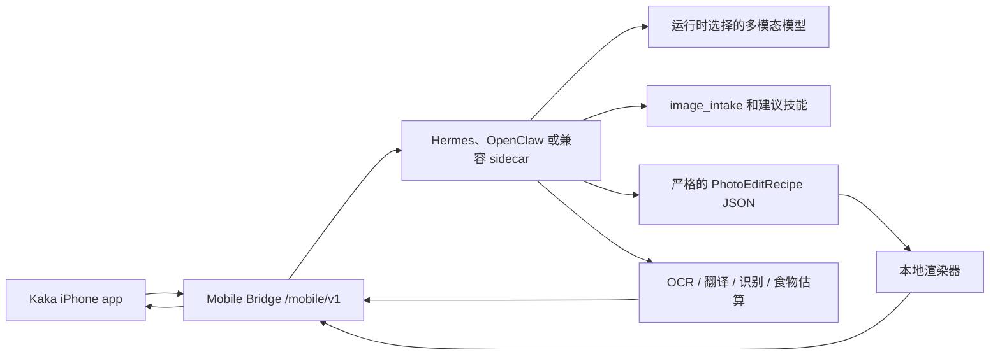

# Kaka

[English](README.md)

Kaka 是一个本地优先的 iPhone 智能体入口。

它把 iPhone 连接到用户自己的本机智能体运行时，例如 Hermes、OpenClaw，或兼容 Mobile Bridge 的 sidecar。手机负责拍照、系统分享、显式粘贴、收件箱、语音追问、预览、保存、Recall 控制和用户确认；本机 Mac 运行时负责图片理解、技能选择、结构化修图 recipe、本地渲染、OCR、翻译、识别、食物估算、记忆和任务状态等能力。

> 当前状态：早期 MVP / 持续开发中。核心 Swift 客户端、iOS app target、Share Extension、显式 Paste-to-Inbox Courier、显式 Files-to-Inbox import、发送前需确认的本地 pending Inbox discard、可见 Inbox action feedback、发送前 pending item 本地详情、mock bridge、本地 recipe 修图路径、local renderer backend readiness 与 capability-gate planning、权限化 Context Snapshot、Recall D.1 基础、Recall 结果 review provenance、语义 Recall 检索、provider-backed Recall 检索 adapter、production Recall retrieval packaging readiness 和 material intake review、Runtime Task Inbox、安全 App Intent 前台 handoff、Action Button 可见 review handoff、Live Activity 任务状态管线、WidgetKit 锁屏和 Dynamic Island 展示、真实 push-to-talk 语音追问、UI 原型、Runtime Kit SQLite 持久化、runtime settings/status、面向 Hermes/OpenClaw plugin shell 的 `settings-preview`、`package-preview`、`host-package-preview`、`consumer_ui` 渲染合同、`process_ownership` 运行时侧进程归属合同、P2.9 `host-adapter-run` Mac/runtime 侧动作面和静态 manifest，以及生产可用的短期 QR 配对与 mobile token revoke 脚手架已经存在。P3.1 的真实落地边界是 host-private command bridge contract：Runtime Kit 可以调用宿主提供的命令；Hermes/OpenClaw 的 proprietary 私有 API 实现不内置在本仓库中。P3.2 已完成，用运行时侧 `host-private-adapter-conformance` 验证宿主拥有的命令，而不是把分发或 proprietary binary 放进 Kaka。P3.3 已完成，在 `host-package-preview.private_adapter_package` 中描述宿主拥有的命令发现、分发/更新 channel、签名策略和 conformance gate；手机仍然只走 `/mobile/v1`。

P3.4a 新增 `host-shell-pilot-report`，用于记录第一次外部 Hermes/OpenClaw
宿主壳试点的准入回执。P3.4b 允许该 report 按显式参数/config、运行时环境变量、
manifest entrypoint、well-known path 的顺序发现宿主拥有的 command。P3.4c 新增
host private adapter 作者指南和经过 schema 校验的 JSON examples，供外部宿主团队实现真实
command。P3.4d 保持 `host-shell-pilot-report` 的 verified boolean gate 不变，
但允许宿主可选提供审计 refs：`distribution.evidence.native_channel_ref`、
`distribution.evidence.signature_subject`、`distribution.evidence.notarization_team_id`、
`distribution.evidence.update_feed_ref`、`drills.evidence.install_receipt_ref`、
`drills.evidence.update_receipt_ref`、`drills.evidence.failure_recovery_receipt_ref`
和 `drills.evidence.release_notes_ref`。P3.4e 新增 `host-shell-pilot-handoff`，
作为机器可读的外部 pilot handoff bundle：它包住原 receipt，检查 deliverables
和 audit refs 是否齐全，可以变成 `ready_to_submit`，但仍报告
`p3_4_complete: false`，因为最终 P3.4 完成仍由外部宿主试点拥有。P3.4f
新增 `host-shell-pilot-preflight`，作为只读本机 report；当宿主壳和 command
发现输入存在时可变成 `ready_for_conformance`，但不会调用私有 command，也不会运行
conformance。P3.4g 新增 `host-shell-pilot-runbook`，作为只读外部 pilot 操作
runbook，输出 brief、ordered steps、command artifacts、evidence requirements
和 acceptance gates，帮助宿主团队按顺序执行 preflight、conformance、report 和
handoff。P3.4h 新增 `host-shell-pilot-artifact-review`，只读审查已经生成的
preflight、conformance、receipt 和 handoff JSON artifacts 是否齐全、一致、可进入外部 review。
P3.4i 新增 `host-shell-pilot-request`，生成给 Hermes/OpenClaw 宿主团队的只读材料请求包，
明确需要提供的 command binary、action matrix、audit refs 和 Runtime Kit JSON artifacts。
P3.4j 新增 `host-shell-pilot-evidence-manifest`，只读读取并 hash 本地 pilot JSON artifacts，
用于外部 archive review，但不创建 archive。
Runtime Kit 只验证和记录准入证据；
这些 refs 不会自动设置 verified booleans，Runtime Kit 也不会下载、读取或验证
refs 指向的外部材料。refs 只属于 runtime 侧 pilot receipt metadata，不暴露给手机
`/mobile/v1` API，且不得包含 secrets、raw logs、private keys、provider keys、
tokens 或 credentials。Runtime Kit 不拥有、构建、签名、分发、安装、更新或内置
proprietary Hermes/OpenClaw private adapter binary。发现不到真实外部 command 时
仍然是 `not_ready`。本地 fake fixture conformance 只能是 `synthetic_only`，
不能标记 P3.4 完成。P3.4 发布完成仍然需要仓库外、由宿主拥有的真实
`hermes-kaka-host-api` 或 `openclaw-kaka-host-api` binary。

P3.5 已新增可安装 Host Extension 的 Runtime Kit 合同：普通用户安装 Hermes
Plugin 或 OpenClaw Skill/sidecar，在宿主 UI 中启用 **Kaka Mobile Bridge**，
然后扫码或通过 Bonjour 配对。`hermes-kaka-host-api` /
`openclaw-kaka-host-api` 仍由宿主拥有，但在合同中被表达为由插件/Skill 内置或内部发现；
显式 command path、`HERMES_KAKA_HOST_API` 和 `OPENCLAW_KAKA_HOST_API`
只作为开发和外部 pilot fallback，不应该成为普通用户流程。

P3.6 Runtime Kit slice 已把这些宿主拥有的分发事实收敛成只读
`host-extension-readiness` 合同，用于判断真实 Plugin/Skill package 是否准备好进入
外部安装 drill，同时仍然不要求普通用户写 command 或设置环境变量。

当前产品安装方向是：稳定用户路径应该是可安装的 Hermes Plugin 或 OpenClaw
Skill/sidecar。用户安装扩展，在宿主的 Kaka Mobile Bridge 面板里显式启用
bridge，显示短期 QR 或选择 Bonjour，然后让 Kaka iPhone 通过 `/mobile/v1`
配对。普通用户不应该写 adapter code、导出 `HERMES_KAKA_HOST_API` /
`OPENCLAW_KAKA_HOST_API`，或粘贴 Runtime Kit 命令链。

这条决策的后续实施路线已整理到
[docs/kaka-host-extension-plugin-skill-roadmap.md](docs/kaka-host-extension-plugin-skill-roadmap.md)。
后续开发需要继续区分三层：普通用户安装的 Hermes/OpenClaw 宿主原生扩展、
Runtime Kit 生成器，以及只给宿主工程师使用的 Codex developer automation。

截至 2026-06-11 的实施建议是：如果下一步继续做安装体验，应朝宿主原生
Plugin/Skill package 推进，而不是把普通用户引导去安装 Codex plugin 或 Codex
skill。Codex plugin/skill 可以作为 Hermes/OpenClaw 工程团队的脚手架和校验自动化，
但必须保持 source-only、显式安装、只面向宿主团队。普通用户故事仍然是：安装
Hermes Plugin 或 OpenClaw Skill，在宿主 UI 里启用 Kaka Mobile Bridge，扫码或选择
Bonjour，然后让 Kaka iPhone 只通过 `/mobile/v1` 使用本机运行时。

后续计划里如果再次出现“做成插件/skill”的需求，应先翻译成宿主原生
Plugin/Skill package 需求，而不是 Codex onboarding 需求。普通用户不应该安装
Codex marketplace plugin、不应该把 `SKILL.md` 复制到 `~/.codex/skills`、不应该写
adapter code，也不应该配置 `--private-adapter-command`。如果以后确实需要 Codex
自动化，它只能生成宿主团队开发源码，并且要有测试或回执证明：不写 user-home、不更新
marketplace、不启动 bridge、不调用 private adapter、不改变手机 `/mobile/v1` API。

外部 P3.7 仍然需要收集
[docs/kaka-host-extension-external-materials.md](docs/kaka-host-extension-external-materials.md)
列出的真实宿主材料。2026-06-07 的 readiness audit 显示 Hermes 和 OpenClaw
都还是 `blocked`：目前还没有真实 install command、update channel、扩展内部
adapter location、宿主 UI entry point、signed package ref、signature ref、
P3.2 conformance report ref 和 P3.4 evidence manifest ref。在这些输入补齐前，
下一次安装方向交付应该由 Hermes/OpenClaw owner 提供一个 sanitized host package
candidate bundle：package ref、宿主 UI entry point、disabled-by-default 证据、
扩展内部 adapter command location、安装/配对/更新/卸载 drill receipts、
conformance/evidence refs 和 release notes。先用 P3.28
`host-extension-material-intake` review 这份 bundle，再写和执行 P3.7。
仓库内安装体验/devkit 支撑路径已经包括 P3.12 Host Extension Starter Kit、P3.13
Host Extension installable package handoff、P3.15 Host Plugin/Skill Devkit、
P3.18 Host Codex developer plugin source、P3.19 Host Extension install
experience acceptance、P3.28 Host Extension material intake 和 P3.31 Host
Extension User Quickstart：
[docs/superpowers/plans/2026-06-07-kaka-pocket-agents-host-extension-starter-kit.md](docs/superpowers/plans/2026-06-07-kaka-pocket-agents-host-extension-starter-kit.md)。
[docs/superpowers/plans/2026-06-07-kaka-pocket-agents-host-extension-installable-package-handoff.md](docs/superpowers/plans/2026-06-07-kaka-pocket-agents-host-extension-installable-package-handoff.md)。
[docs/superpowers/plans/2026-06-07-kaka-pocket-agents-host-plugin-skill-developer-kit.md](docs/superpowers/plans/2026-06-07-kaka-pocket-agents-host-plugin-skill-developer-kit.md)。
[docs/superpowers/plans/2026-06-11-kaka-pocket-agents-host-extension-user-quickstart.md](docs/superpowers/plans/2026-06-11-kaka-pocket-agents-host-extension-user-quickstart.md)。
P3.13 把 starter kit 输出推进成宿主团队可接手的 Hermes Plugin / OpenClaw
Skill 包材料，但签名、更新 channel、proprietary private adapter 实现、
conformance evidence 和最终分发仍由 Hermes/OpenClaw 宿主团队拥有。P3.15
在这些合同之上提供 template-only developer materials index，面向宿主工程团队，
不是普通用户安装面。

下一步实施建议：继续把这条路径当成 Host Extension 产品来打磨。普通用户路径
应该是安装 plugin/skill，在宿主侧启用 Kaka Mobile Bridge，通过 QR 或 Bonjour
配对，并始终只走 `/mobile/v1`。手动 adapter command、
`HERMES_KAKA_HOST_API`、`OPENCLAW_KAKA_HOST_API`、Runtime Kit 命令链和 Codex
automation templates 只保留给宿主团队开发或外部 pilot。如果后续真的做 Codex
plugin 或 Codex skill，它也只应该自动化宿主团队的脚手架、校验和 release gate；
普通用户仍然安装宿主原生 Hermes Plugin 或 OpenClaw Skill/sidecar。若真实宿主
package facts 到位，就推进 P3.7；若仍阻塞，P3.31 是允许的 quickstart/user-journey
验收补强，但不能新增安装 wrapper；如果不是安装方向，则选择独立仓库内产品切片。
C.1b network-only Context Snapshot 已完成。P3.16
本地 renderer backend readiness 和 P3.17 photo-edit capability truth 已经作为
仓库内产品切片落地，不要再重复增加 adapter wrapper。

P3.18 已落成宿主工程师使用的 Codex developer plugin source generator，
而不是普通用户安装器。source generator 只能写入显式 `--output-dir`，不能写
`~/plugins`、`~/.codex/skills`、`~/.agents/plugins` 或更新 marketplace；Hermes
和 OpenClaw 输出应使用 runtime-specific 目录，避免互相覆盖；并且必须证明手机仍然
只通过 `/mobile/v1` 通信。真正面向普通用户的发布证明仍然是宿主原生 Hermes Plugin /
OpenClaw Skill 安装 drill，等待外部 package materials 到位后推进。

P3.28 Host Extension material intake 现已实现：
`host-extension-material-intake --manifest /path/to/materials.json` 只读取宿主团队提供的本地
package facts 和 install-drill refs manifest，做 schema/secret-like 检查，嵌入
P3.6 `host-extension-readiness`，并输出 review receipt；它不安装、不签名发布、
不 fetch refs、不启动 bridge、不调用 private adapter，也不把 Codex automation
变成普通用户 onboarding。P3.7 仍然要等这些宿主材料通过 review 后，再执行真实外部
install drill。

P3.19 Host Extension install experience acceptance 已经把现有
`host-extension-install-package` 输出加强为验收级 handoff：新增 host UI acceptance
metadata、生成 `host-ui/acceptance.json`、ordered install-drill steps、evidence
receipt refs、TLS/readiness/evidence/Codex developer source release gates，以及
static manifest/schema drift protection。它不新增 CLI、不安装包、不签名发布、不启动
bridge、不暴露 private host APIs，也不把 Codex automation 变成普通用户安装器。

最新安装体验细化是 P3.31 Host Extension User Quickstart：在宿主原生
Plugin/Skill handoff 上补普通用户 quickstart 文案和用户旅程验收 artifact，
同时继续避免把 Runtime Kit 或 Codex 自动化变成公众安装路径。

P3.14 已作为仓库内 Runtime Kit 安全切片落地：`retention-purge` 是 runtime
侧显式 dry-run/apply 命令，会输出 `kaka.runtime_retention_purge_receipt.v1`
回执，只删除 `SQLiteRuntimeStore` 里过期的终态 task history，保留 active
tasks。P3.22 已补上 mock bridge 内存 input/output 资产的 `role` 和
`created_at`，让显式 `retention-purge` 可以在回执里列出 eligible/deleted
资产，并且只在 runtime 侧 apply 时删除；没有时间戳的资产仍作为 untracked
保留。P3.24 已新增 Runtime Kit SQLite-backed input/output asset storage：配置
`--runtime-store-path` 时，mock bridge 上传资产和 photo-edit 输出可以跨 app 重启保留，
并且只通过 runtime 侧显式 `retention-purge` apply 删除旧资产；回执仍只列 asset ID。
Recall 删除仍然只通过显式 `Forget` 或 delete action。P3.14/P3.22/P3.24 不新增
自动 cleanup、不新增手机 purge endpoint、不新增手机侧 settings 写接口、不改 Swift
UI、不新增 provider 调用、不扩展 task result detail/variants 持久化，也不暴露 raw
asset bytes、SQLite path 或 private host API。
P3.25 store-backed task result detail persistence 已完成：store-backed
photo-edit 完成结果在 bridge 重启后仍可被用户打开。P3.25 只把安全 result
manifest 写入 runtime task metadata，raw bytes 继续放在 `runtime_assets`，
variant download link 从 `asset_id` 运行时重建，task list 保持 summary-only，
completed task events 只暴露 `variant_count`；不新增安装 wrapper、手机 purge
endpoint、自动 cleanup、Swift UI、Recall 写入/清理、provider 调用、host package
改动、路径泄漏或手机侧 settings 写入。
P3.26 Recall retrieval material intake 已完成：Runtime Kit 新增只读
`recall-retrieval-material-intake`，读取宿主/runtime 提供的本地 materials
manifest，过滤 secret-like 字段和值，嵌入 P3.21 readiness snapshot，并在材料
完整时返回 `accepted_for_external_retrieval_packaging_review`。它不 fetch refs、
不验证签名、不调用 provider、不改变 `/mobile/v1/recall/search`，也不代表生产
检索实现已经完成。
P3.15 现在已经把 Hermes/OpenClaw 宿主团队的安装/验证开发包收敛为
template-only Host Plugin/Skill Devkit；Codex developer automation 只作为模板材料，
普通用户最终安装的仍然是宿主原生 Hermes Plugin 或 OpenClaw Skill，而不是手动
adapter scaffold。
P3.16 新增运行时侧 `local-renderer-backend-readiness`，通过 synthetic
`recipe_local` probe 验证当前本地参数化 renderer 能产出预期结果；P3.17 进一步把
默认 `recipe_local` 的 `photo_edit.return_variants_max` 对齐为 `2`，对应当前
**Master** 和 **Social** 两个输出。P3.17b 已把默认 `recipe_local` 的
`photo_edit.accepted_mime_types` 收窄为 JPEG-only；通用 asset upload、vision、
image intake 和 universal intake 仍保持更宽边界。P3.27 新增
`local-renderer-backend-capability-manifest`，记录当前 Pillow/`recipe_local`
合同，并把 Core Image、ImageMagick、OpenCV、libvips 标记为 future-gated
候选；它不安装依赖、不导入或执行未来后端、不改变手机 capability，也不改变
`/mobile/v1`。

在外部 Host Extension 材料仍阻塞时，P3.30 **Voice-to-Inbox Draft** 已实现：
它复用现有 push-to-talk 语音组件，让用户在 Inbox
里录音或编辑转写文本，保存为待处理的 text Inbox item，再由用户显式 review
并点击 `Send`。P3.30 不上传原始音频、不隐藏录音、不自动提交 runtime、不自动写
Recall，也不再新增一个安装 wrapper。

P3.32 **Inbox Voice Instruction** 已作为下一步语音优先 Inbox 细化落地：
已有的 universal-intake Inbox 行可以打开同一个语音采集 sheet，把用户确认后的转写文本
保存到 `KakaInboxItem.note`，并且仍然必须等用户点击可见的 `Send` 后才会提交给
runtime。现有 universal intake 提交流程会把这段 note 作为 `note` 和
`user_instruction` 发送；不新增 Mobile Bridge endpoint，不上传原始音频，不自动提交
runtime，不自动写 Recall，不新增 App Intent 录音路径，也不改变 Host Extension
packaging。

P3.33 **Inbox Instruction Polish** 已在 P3.32 之上落地：已有 Inbox 指令现在会被明确标记，
可以通过同一个可见语音 sheet 编辑，也可以在提交前清除；发送前预览文案会提示用户
`Send` 会附带这条指令。底层 runtime 路径仍然是现有 universal intake 的 `note` /
`user_instruction` 文本字段；P3.33 不新增音频上传、不新增 Mobile Bridge endpoint、
不自动提交、不自动写 Recall、不新增 App Intent 录音路径，也不改变 Host Extension
packaging。

P3.34 **Inbox Instruction Templates** 已在 P3.33 之上落地：universal-intake
Inbox 行现在会显示确定性的本地指令 chips：Summarize、Extract Actions、Translate
和 Ask Follow-up。点击 chip 只会把对应模板文本写入 `KakaInboxItem.note`；用户仍然
需要 review 并点击可见的 `Send`，runtime 才会收到现有 `note` /
`user_instruction` 文本。P3.34 不新增 endpoint、不上传音频、不自动提交、不自动写
Recall、不新增 App Intent 录音、不调用 provider，也不改变 Host Extension packaging。

P3.36b **Explicit Paste-to-Inbox Courier** 已落地：Inbox 顶部提供可见的
Paste / 粘贴按钮，只在用户点击时读取一次剪贴板文本，去除首尾空白后把 http/https
链接保存为待处理 `.url`，其它文本保存为待处理 `.text`，并标记
`sourceSurface = "paste"`。用户仍然需要 review 并点击可见的 `Send`，runtime 才会
通过现有 universal intake 路径收到内容。P3.36b 不后台读取剪贴板、不启动时读取、
不抓取 URL、不导入 binary/file paste、不自动提交、不自动写 Recall、不新增
Mobile Bridge endpoint，也不改变 Host Extension packaging。

P3.37 **Inbox Result Review Provenance** 已落地：Inbox 项目可见 `Send`
完成后，结果 banner 会显示来源和 Context Snapshot 选择状态，并保留手机侧安全的
`InboxSubmissionContext`。用户在 banner 中显式点击 Remember、Use Once 或
Forget 时，现有 Recall action 会同时携带 `source_task_id` 和
`source_inbox_item_id`。P3.37 不自动写 Recall、不新增 endpoint、不改变 runtime
schema、不调用 provider、不改变 Host Extension packaging，也不执行 P3.7 安装 drill；
P3.37 本身不增加 Files picker。

后续 Host Extension 实施 handoff 见
[docs/kaka-host-extension-next-implementation.md](docs/kaka-host-extension-next-implementation.md)。

P3.38 **Explicit Files-to-Inbox Import** 已落地：主 app Inbox 提供可见
Files 按钮，只导入用户显式选择的一个受支持 PDF 或图片，把文件复制到现有
Inbox payload store，记录 `sourceSurface = "file_picker"`，并且仍然等待用户点击
可见 Inbox `Send` 后才提交 runtime。它不自动上传、不自动提交、不自动写
Recall、不扫描文件夹、不新增 Mobile Bridge endpoint、不新增 App Intent submit
路径、不改变 Host Extension，也不执行 P3.7。

P3.39 **Inbox Pending Item Discard** 已落地：每个 pending Inbox 行现在有可见
`Discard` / `丢弃` 按钮，可在 runtime 提交前只删除这个本地 Inbox item；关联
`SharedPayloads` payload 仍走现有 store 删除路径清理。它不上传、不创建 runtime
task、不触发 Recall action、不新增 Mobile Bridge endpoint、不新增 App Intent、不改变
Host Extension、不扫描文件夹，也不执行 P3.7。

P3.40 **Inbox Discard Confirmation** 已落地：行级 `Discard` / `丢弃`
会先打开可见确认弹层，只有用户确认后才调用现有本地 discard 路径；取消或关闭不会删除
pending item/payload。它不上传、不创建/取消 runtime task、不触发 Recall
action/delete、不新增 Mobile Bridge endpoint、不新增 App Intent、不改变 Host
Extension、不扫描文件夹、不删除原始 Files/Photos 来源，也不执行 P3.7。

P3.41 **Inbox Action Feedback Banner** 已落地：Inbox 现在会把现有
`InboxViewModel.state` 和 `progressText` 渲染为可见本地反馈，用于失败的 Inbox
操作和发送中的进度；失败反馈可在本地关闭。它不新增 retry、不取消 runtime task、
不自动提交、不触发 Recall action/write/delete、不新增 Mobile Bridge endpoint、
不新增 App Intent、不改变 Host Extension、不删除源文件，也不执行 P3.7。

P3.42 **Inbox Pending Item Review Details** 已落地：每个 pending Inbox 行现在可在
可见 `Send` 前展开本地只读详情，展示已有 source/type metadata、截断 text 或 URL
摘录、文件名/类型、本地副本状态、已保存 instruction、route、可选 locale/profile
以及 Context Snapshot 是否会随本次发送。它不计算文件大小、不读取 payload bytes、不
fetch URL、不解析 PDF/OCR、不总结内容、不自动提交、不写 Recall、不新增 Mobile
Bridge 字段、不新增 App Intent、不改变 Host Extension、不扫描文件夹、不删除源文件，
也不执行 P3.7。

在外部材料还没到位时，P3.8 已新增只读 `local-tls-readiness` 合同，让
Hermes/OpenClaw runtime shell 可以用非秘密本地 TLS metadata gate 生产 QR/LAN
配对；它不生成证书、不修改 Keychain、不读取 private key，也不改变手机
`/mobile/v1` API。

## 为什么做 Kaka

很多 AI 修图产品要么直接把照片交给云端应用，要么通过生成式改图重新生成像素，容易损坏人脸、产品、文字、Logo 和细节。

Kaka 的第一版更克制：

- iPhone 只负责拍照、连接、上传、展示、保存和分享。
- 本机运行时先理解图片并建议可用技能。
- 用户可以点建议技能，也可以直接输入想做的事。
- OCR、翻译、识别、食物估算和修图都通过运行时拥有的能力执行。
- 修图路径使用严格的本地 `PhotoEditRecipe`，Mac 本地验证并渲染结果。
- Phase 1 做参数化照片优化，不做生成式换图。

目标是一个非常简单的相机闭环：拍照或选图，让 Kaka 判断可以帮什么，然后在图片对话里继续处理。

更大的产品方向是 **Pocket Agents**：Kaka 成为本地智能体在手机上的语音优先入口。手机负责拍照、系统分享、截图、粘贴、语音和用户授权的上下文快照；用户自己的本机运行时负责推理、工具调用、记忆和长任务执行。详见 [docs/pocket-agents-direction.md](docs/pocket-agents-direction.md)。

## 核心流程

1. iPhone 连接到本机运行时。
2. 拍照或从相册选择照片。
3. 把照片发送给 Kaka。
4. 运行时执行 `image_intake`，返回图片摘要和建议技能。
5. 用户点一个建议技能，或输入自己的请求。
6. 运行时执行修图、OCR、翻译、识别或食物估算等任务。
7. iPhone 在图片对话中展示结果；修图结果可进入 **Master** / **Social** 对比页。
8. 用户保存结果或通过 iOS 系统分享。

## 架构



iPhone 只保存运行时 endpoint、移动端 bearer token、本地 Inbox payload 和用户可见 UI 状态。模型密钥、provider 路由、图片理解、recipe 生成、图像渲染、生产 Recall、任务状态和结果资产都留在用户自己的 Mac/运行时侧。

当前 Runtime Kit 持久化执行切片已经在运行时侧接入 SQLite store，用于 Recall 记录、检索索引删除回执、运行时任务记录和 task events。开发期通过 `--runtime-store-path` 显式 opt in store-backed bridge 行为；不传该选项时，mock bridge 仍可使用确定性的内存状态来跑测试。

## 当前模块

| 路径 | 作用 |
| --- | --- |
| `Sources/AgentPocketCore` | Swift 客户端模型、配对、上传、通用 intake、Recall、任务轮询和下载 |
| `Sources/AgentPocketUI` | SwiftUI 连接、拍摄、Inbox、Recall、Tasks、结果、保存和分享流程 |
| `ios/AgentPocket` | iOS app target 和系统入口接线 |
| `ios/KakaShareExtension` | iOS Share Extension |
| `ios/AgentPocketTaskActivityWidget` | WidgetKit Live Activity 锁屏和 Dynamic Island 展示 |
| `mock_bridge` | 本地 Mobile Bridge server 和 QA 工具 |
| `photo-pack` | Photo agent profile、skill 和本地 recipe adapter |
| `runtime-kit` | 显式启动的 bridge launcher，以及 Hermes/OpenClaw 封装脚手架 |
| `docs` | 架构、API、设置、UI 原型和实施计划 |

## Pocket Agents 方向

Kaka 可以从相机继续扩展，但不应该一开始做不受控的手机遥控器。推荐路线是：

- **Share 或 Paste 到 Kaka 收件箱**：从任意 App 分享文字、链接、截图、PDF、图片或小文件给 Kaka；显式粘贴只做一次性文本/链接导入。
- **语音 Walkie-talkie**：显式点击录音和停止，补充指令，听取短回复，并通过 P3.30 把语音转写保存为 Inbox 草稿。
- **权限化 Context Snapshot**：用户同意后，把时间、来源、保守设备状态、一次性 motion 标签、位置精度标签和可选日历忙闲窗口作为一次性任务上下文发给智能体。
- **截图问答和界面指导**：分享截图后，让智能体解释界面、报错或下一步操作，而不是直接控制其它 App。
- **Recall 个人资料库**：只在用户明确选择 `Remember` 时写入长期记忆，并提供 `Use Once`、`Forget`、浏览、搜索、带 artifact policy 的 JSON 导出和删除回执。

当前已经落地的 Pocket Agents 基础包括系统分享进入 Kaka 收件箱、权限化 Context Snapshot、Recall D.1 基础、语义 Recall 检索、带 `kaka.recall_export.v1` artifact policy 的 JSON-first Recall 导出、production Recall retrieval packaging readiness、Runtime Task Inbox、安全 App Intent 前台 handoff、Action Button 可见 review handoff、Live Activity 任务状态投影、WidgetKit 锁屏和 Dynamic Island 展示、真实 push-to-talk 语音追问，以及通过 `--runtime-store-path` 启用的 Runtime Kit SQLite 持久化和 runtime settings/status。Context Snapshot 只在用户勾选且 runtime 支持时作为单次任务上下文发送，每次任务会重新预览；权限拒绝不会阻塞 intake。P3.23 让 Inbox preview 把 `permission_denied`、`not_requested`、`unavailable`、粗略精度、网络、电量、位置和日历哨兵值显示成人可读行，并在用户已开启 Context 且仍在采集时避免静默不带 context 发送；P3.29 在不改变 `/mobile/v1` 的前提下新增一次性 motion/current calendar busy-window 采样和 mock bridge allowlist。原始 payload 值保持兼容。Recall export 只导出用户可读的 item ID、summary、created timestamp 和 provenance，不是 SQLite/database dump，也不包含 embeddings、retrieval-index rows、provider secrets、tokens、SQLite path、hidden prompts、raw provider responses 或 task logs。P3.21 的 `recall-retrieval-readiness` 只收集生产检索打包所需的非秘密 refs，不选择 provider、不生成 embeddings、不调用 provider、不把 endpoint/key 暴露给 iPhone，也不改变 `/mobile/v1/recall/search`。语音 B.1 只在用户显式按下时录音，用 iOS Speech 在设备端转写，用户可编辑 transcript，经 Mobile Bridge 发送文本，返回 summary 可朗读；B.1 不上传原始麦克风音频，也不做隐藏监听。E.1 的系统入口只打开 Kaka 到 Inbox 或 Tasks 的可见 review 界面；E.1b 的 WidgetKit 展示只消费 task ID、客户端生成的泛化 title、phase 和 approval-needed，审批和取消仍回到 Kaka 内完成；E.1c 的 Action Button 支持复用同一前台 handoff，只打开 Inbox 或 Tasks 可见界面。

`settings-preview` / `package-preview` / `host-package-preview` / `consumer_ui` 已经扩展出 P2.8 host packaging handoff 和 `process_ownership` 运行时侧合同，覆盖分发元数据、安装策略、安全命令 artifacts、安装、登录启动、更新、卸载、日志、健康检查、端口冲突修复和监督动作。P2.9 新增 `host-adapter-run`，作为 Mac/runtime 侧执行动作面；手机连接 Hermes/OpenClaw 智能体仍然只通过 Kaka Mobile Bridge `/mobile/v1`，不通过私有宿主 API。`mock` adapter 用于 conformance/local QA；P3.1 `private` adapter 是宿主私有命令桥合同，通过 `--private-adapter-command` 接入 Hermes/OpenClaw 自己的 proprietary 实现。未配置命令时返回 structured unavailable；配置命令后 Runtime Kit 使用 `shell=False`、stdin/stdout JSON 和结构化失败语义调用宿主命令。P3.2 的 `host-private-adapter-conformance` 仍然只在 Mac/runtime 侧运行，用同一条 P3.1 private adapter 路径验证 install、login item、update、uninstall、logs、health、port repair 和 supervision；分发、命令发现和 proprietary binary 仍由宿主 shell 拥有。P3.3/P3.4b 在 `host-package-preview.private_adapter_package` 与 `host-shell-pilot-report` 中记录和使用默认命令名，并按 `--private-adapter-command`/`private_adapter_command`、env、manifest entrypoint、well-known path 顺序发现宿主 command；找不到真实外部 command 时 pilot receipt 仍是 `not_ready`。P3.5 的产品化方向是让 Hermes Plugin / OpenClaw Skill 内置或内部发现该 command，普通用户不写 adapter、不导出环境变量、不粘贴 Runtime Kit 命令链。mutating action 需要 explicit approval，install 不自启、不创建 login item。C.1b 已完成一次性 coarse network path；P3.29 已完成一次性 motion/current calendar busy-window，仍不发送运动历史或日历详情。详见 [docs/pocket-agents-direction.md](docs/pocket-agents-direction.md)。

## 本地开发

运行 Swift 测试：

```bash
swift test
```

运行 Runtime Kit 检查：

```bash
PYTHONPATH=runtime-kit:mock_bridge python3 -m kaka_mobile_runtime_kit doctor
```

运行目标 Python 测试：

```bash
PYTHONDONTWRITEBYTECODE=1 \
PYTHONPATH=runtime-kit:mock_bridge \
python3 -m pytest -p no:cacheprovider runtime-kit/tests mock_bridge/tests/test_photo_pack_provider.py -q
```

为 Simulator 本地测试启动 bridge：

```bash
PYTHONPATH=runtime-kit:mock_bridge python3 -m kaka_mobile_runtime_kit start
```

开发期可以显式指定本地 SQLite store：

```bash
PYTHONPATH=runtime-kit:mock_bridge python3 -m kaka_mobile_runtime_kit start \
  --repo-root . \
  --runtime sidecar \
  --runtime-store-path ~/.kaka/mobile-runtime.sqlite3
```

`--runtime-store-path` 是 runtime launcher/server 选项，不是 iPhone 发送的 Mobile Bridge API 字段。iPhone 仍然只调用 `/mobile/v1`；Mac/运行时侧负责 Recall 存储、JSON export 内容、删除回执、任务状态和保留策略。

为同一可信局域网里的真机 iPhone 启动 bridge：

```bash
PYTHONPATH=runtime-kit:mock_bridge python3 -m kaka_mobile_runtime_kit start \
  --lan \
  --bonjour \
  --bonjour-host "$(ipconfig getifaddr en0)" \
  --runtime hermes \
  --hermes-profile dev-lead
```

这些长命令只是开发阶段的透明诊断方式。Runtime Kit 现在也提供 `settings-preview`、`package-preview`、`host-package-preview`、`host-extension-preview`、`consumer_ui`、`process_ownership` 与 P2.9/P3.1 `host-adapter-run` JSON 合同，供 Hermes/OpenClaw plugin shell 渲染 **Kaka Mobile Bridge** 开关、二维码、Bonjour、store path、Recall provider、配对模式、revoke、信任状态选择，以及安装、登录启动、更新、卸载、日志、健康检查、端口冲突修复和监督动作。P3.5 已把这些合同补成可安装 Host Extension 的产品化 contract；普通用户只安装插件/Skill 并扫码，不需要写 adapter code 或设置环境变量。`host-adapter-run` 是 Mac/runtime 侧动作面，不是手机 API；`mock` adapter 用于 conformance/local QA，`private` adapter 只通过宿主扩展内置或显式开发配置的宿主命令接入。

P2.8/P3.3 host packaging handoff 示例：

```bash
PYTHONPATH=runtime-kit python3 -m kaka_mobile_runtime_kit host-package-preview \
  --runtime hermes \
  --distribution-source local_checkout \
  --distribution-channel development \
  --package-version development
```

该 preview 现在会嵌入 `private_adapter_package`，schema version 是
`kaka.host_private_adapter_package.v1`。它只描述宿主拥有的命令包，例如
`hermes-kaka-host-api` / `openclaw-kaka-host-api`，以及
`private_adapter_command`、`HERMES_KAKA_HOST_API` /
`OPENCLAW_KAKA_HOST_API`、`host_private_adapter.command` 和
`~/Library/Application Support/<Runtime>/Kaka/` 等发现路径；P3.4b 的
`host-shell-pilot-report` 也按显式参数/config、env、manifest entrypoint、
well-known path 的顺序发现命令，找不到真实外部 command 时仍为 `not_ready`。更新必须由用户显式批准，
下载和签名由宿主 shell 负责，install/update ready 之前需要
`kaka.host_private_adapter_conformance.v1` conformance 证据。Kaka 不拥有、
分发或内置 Hermes/OpenClaw proprietary command binary。

P2.9 host adapter run 示例：

```bash
PYTHONPATH=runtime-kit python3 -m kaka_mobile_runtime_kit host-adapter-run \
  --runtime hermes \
  --adapter mock \
  --action-id run_health_check \
  --installed \
  --bridge-enabled
```

mutating action 示例必须带 explicit approval：

```bash
PYTHONPATH=runtime-kit python3 -m kaka_mobile_runtime_kit host-adapter-run \
  --runtime hermes \
  --adapter mock \
  --action-id install_runtime_package \
  --approved
```

P3.1 private host command bridge 示例：

```bash
PYTHONPATH=runtime-kit python3 -m kaka_mobile_runtime_kit host-adapter-run \
  --runtime hermes \
  --adapter private \
  --private-adapter-command "/path/to/hermes-kaka-host-api" \
  --action-id run_health_check \
  --installed \
  --bridge-enabled
```

手机连接智能体只需要本地 Mobile Bridge `/mobile/v1` API；宿主 shell 渲染设置和流程使用 Runtime Kit preview JSON/CLI 合同；原生安装、登录项、更新、卸载、日志、健康检查、修复和监督通过 Mac/runtime 侧 `host-adapter-run` 对接。当前 `mock` adapter 只做 conformance/local QA，`private` adapter 调用显式配置的宿主命令；Runtime Kit 使用 `shell=False`、stdin JSON request、stdout JSON response，并把缺失命令、非零退出、非法 JSON/schema 或 timeout 映射为结构化安全失败。iPhone 不调用该命令，也不能看到 private adapter 细节。

P3.2 host-private adapter conformance 示例：

```bash
PYTHONPATH=runtime-kit python3 -m kaka_mobile_runtime_kit host-private-adapter-conformance \
  --runtime hermes \
  --private-adapter-command "/path/to/hermes-kaka-host-api"
```

这个命令只属于 Mac/runtime 侧。它通过 P3.1 `host-adapter-run --adapter private`
行为验证宿主拥有的命令是否覆盖 install、login item、update、uninstall、
logs、health、port repair 和 supervision。通过 conformance 不代表 Kaka 拥有
或分发 Hermes/OpenClaw proprietary binary；真实分发仍是宿主 manifest/package
流程的责任。

## Runtime Kit 方向

Kaka 不应该要求普通用户粘贴复杂命令。目标首次连接流程是：

1. 安装 Hermes/OpenClaw plugin 或 skill。
2. 在运行时 UI 中启用 **Kaka Mobile Bridge**。
3. 显示二维码，并可选开启本地网络发现。
4. 在 iPhone 上打开 Kaka 并连接。

安全边界：

- 安装 plugin/skill 不会自动启动 LAN 服务。
- 默认 bridge 只绑定本机 loopback。
- LAN 和 Bonjour 必须由用户显式开启。
- Provider API key 不进入 iPhone。
- Runtime-owned Recall/任务持久化、进程生命周期控制、conformance 和宿主私有命令包 metadata 已经有 Runtime Kit `settings-preview`、`package-preview`、`host-package-preview`、`host-extension-preview`、`private_adapter_package`、`consumer_ui`、`process_ownership`、`host-adapter-run` 和 `host-private-adapter-conformance` plugin-shell 合同；原生 Hermes/OpenClaw UI 应渲染这些合同，而不是把设置搬到 iPhone。P3.1/P3.2/P3.3 private adapter 只接入、验证并描述宿主命令包，不表示本仓库内置或分发 Hermes/OpenClaw 官方私有 API。P3.5 已把宿主命令表达为插件/Skill 内部实现细节，避免普通用户手动配置 command path 或环境变量。
- 配对 token 应该短期有效并且可撤销。

详见 [docs/kaka-runtime-kit-plan.md](docs/kaka-runtime-kit-plan.md)。

## 修图方向

Phase 1 聚焦参数化修图：

- 裁切与重新构图
- 曝光和对比度
- 阴影和高光
- 白平衡
- 色彩活力
- 降噪和锐化
- 主体强调
- 必要时做保守放大

照片不会被转换成巨大的像素 JSON 文件。JSON 只用于描述受约束的修图 recipe；真正的图像修改由本地渲染器完成。

## 路线图

- 完成 Simulator 和真机 iPhone 的本地 recipe 流程 receipt。
- 已完成 P3.1：把 `host-adapter-run --adapter private` 绑定到宿主提供的 command bridge，用于分发、安装、登录项、更新、卸载、日志、健康检查、修复和监督；Hermes/OpenClaw proprietary 实现由宿主命令接入，不内置在本仓库。
- 已完成 P3.2：用运行时侧 `host-private-adapter-conformance` 验证宿主拥有的 Hermes/OpenClaw private adapter command。
- 已完成 P3.3：在 `host-package-preview` 中嵌入 `private_adapter_package`，描述宿主命令发现、分发/更新 metadata、签名策略和 conformance gate，同时继续保持 proprietary command binary 由宿主拥有。
- 已完成 P3.4a：新增 `host-shell-pilot-report` 证据收集，用于第一次外部 host-shell pilot；本地 `synthetic_only` readiness 不能标记 P3.4 完成。
- 已完成 P3.4b：`host-shell-pilot-report` 可按显式配置、运行时 env、manifest entrypoint、well-known path 发现宿主 command；找不到真实外部 command 时仍为 `not_ready`。
- 已完成 P3.4c：新增 host private adapter 作者指南和 schema-checked request/response/receipt examples，辅助外部 Hermes/OpenClaw command 作者实现真实 binary。
- 已完成 P3.4d：`host-shell-pilot-report` 可记录可选 distribution/drill evidence refs，但不改变 verified boolean gates，也不暴露给 phone `/mobile/v1`。
- 已完成 P3.4e：新增 `host-shell-pilot-handoff` 机器可读外部 pilot handoff bundle，同时保持最终 P3.4 完成由外部宿主拥有。
- 已完成 P3.4f：新增只读 `host-shell-pilot-preflight`，在 conformance 前检查宿主壳和 command 发现输入。
- 已完成 P3.4g：新增只读 `host-shell-pilot-runbook`，在 conformance/report/handoff 前生成宿主 pilot 执行步骤、命令 artifacts、证据要求和 acceptance gates。
- 已完成 P3.4h：新增只读 `host-shell-pilot-artifact-review`，审查已生成的 preflight/conformance/receipt/handoff JSON artifacts 是否齐全、一致、可进入外部 review。
- 已完成 P3.4i：新增只读 `host-shell-pilot-request`，在 preflight/conformance 前生成宿主团队需要提供哪些材料的机器可读 request bundle。
- 已完成 P3.4j：新增只读 `host-shell-pilot-evidence-manifest`，hash 本地 pilot JSON artifacts，并在不创建 archive 的前提下判断是否可进入外部归档 review。
- 计划 P3.4：用仓库外真实宿主命令 binary 做 Hermes/OpenClaw host-shell dogfood/release pilot。
- 已完成 P3.5：新增 `host-extension-preview`、`host-extension-preview.schema.json` 和 Hermes/OpenClaw manifest metadata，把 Hermes Plugin / OpenClaw Skill 表达为可安装 Host Extension，宿主 command 由扩展内置或内部发现，手动 command/env 只作为开发或 pilot fallback。
- 已完成 P3.6：新增只读 `host-extension-readiness` 合同，收集真实 Plugin/Skill install command、update channel、extension-internal adapter location、host UI entry point、signed package ref、signature/notarization ref、P3.2 conformance report ref 和 P3.4 evidence manifest ref。
- 下一步 P3.7 入口条件：先选择 Hermes 或 OpenClaw，补齐 [docs/kaka-host-extension-external-materials.md](docs/kaka-host-extension-external-materials.md) 中的宿主材料，重新运行 `host-extension-readiness` 直到返回 `ready_for_external_install_drill`，然后再执行外部 Plugin/Skill 安装 drill。
- 已完成 P3.8：新增只读 `local-tls-readiness` 合同，收集 certificate label/ref、public-key fingerprint、expiry、trust store ref 和 renewal procedure ref；不生成证书、不修改 Keychain、不读取 private key、不启动 bridge，也不改变 `/mobile/v1`。
- 已完成 P3.9：按 [docs/superpowers/plans/2026-06-07-kaka-pocket-agents-retention-policy-controls.md](docs/superpowers/plans/2026-06-07-kaka-pocket-agents-retention-policy-controls.md) 实施运行时侧保留策略 controls，覆盖 `input_assets_days`、`output_assets_days` 和 `task_history_days`。Runtime Kit 现在会在 `settings-preview`、`package-preview`、`start --dry-run`、生成的 server command、mock bridge capabilities 和只读 runtime settings 中传播这些值；不做自动清理、不新增手机写设置接口，也不改 Swift UI。
- 已完成 P3.10a：按 [docs/superpowers/plans/2026-06-07-kaka-pocket-agents-local-https-serving.md](docs/superpowers/plans/2026-06-07-kaka-pocket-agents-local-https-serving.md) 实现 Runtime Kit 使用宿主自有证书文件的本地 HTTPS serving。Swift/iOS trust 与 pinning 单独作为 P3.10b。
- 已完成 P3.12：按 [docs/superpowers/plans/2026-06-07-kaka-pocket-agents-host-extension-starter-kit.md](docs/superpowers/plans/2026-06-07-kaka-pocket-agents-host-extension-starter-kit.md) 新增 Host Extension Starter Kit，让 Hermes/OpenClaw 宿主团队生成安全的 Plugin/Skill starter package，而不是要求普通用户写 adapter code 或导出环境变量。
- 已完成 P3.11：把连接、配对、已保存连接恢复、本地网络、TLS/certificate 和宿主拥有的恢复指导移植到原生 SwiftUI，同时继续保持运行时设置由 Hermes/OpenClaw 拥有，并避免在普通用户文案里暴露 host/private API 细节。计划文档：[docs/superpowers/plans/2026-06-07-kaka-pocket-agents-native-connection-recovery-ui.md](docs/superpowers/plans/2026-06-07-kaka-pocket-agents-native-connection-recovery-ui.md)。
- 已完成 P3.13：新增 `host-extension-install-package`，把 P3.12 starter kit 推进成 Hermes Plugin / OpenClaw Skill 的宿主安装包 handoff；不签名、不发布、不安装、不调用 private host API，也不把 private host API 暴露给 Kaka iPhone。计划文档：[docs/superpowers/plans/2026-06-07-kaka-pocket-agents-host-extension-installable-package-handoff.md](docs/superpowers/plans/2026-06-07-kaka-pocket-agents-host-extension-installable-package-handoff.md)。
- 已完成 P3.14：按 [docs/superpowers/plans/2026-06-07-kaka-pocket-agents-runtime-retention-enforcement-purge-receipts.md](docs/superpowers/plans/2026-06-07-kaka-pocket-agents-runtime-retention-enforcement-purge-receipts.md) 新增 runtime 侧显式 `retention-purge` dry-run/apply 回执。Runtime Kit 现在会输出 `kaka.runtime_retention_purge_receipt.v1`，只清理 `SQLiteRuntimeStore` 中过期的终态 task history，保留 active tasks 和 Recall，并避免自动 cleanup job、手机侧 purge API 或 runtime settings 写接口。P3.22 在同一个显式 runtime 侧 purge 边界上补充 timestamp-aware mock bridge input/output asset 回执组。
- 已完成 P3.15：新增 `host-plugin-skill-devkit`，面向 Hermes/OpenClaw 宿主团队生成 template-only developer materials bundle。它索引现有 starter/package/readiness/conformance/evidence 合同，可写出 adapter template、Codex automation template、release gate 和 install drill 边界材料；普通用户安装面仍然是宿主原生 Hermes Plugin 或 OpenClaw Skill，不是 adapter command 或 Codex plugin。
- 已完成 P3.18：生成宿主团队使用的 Codex developer plugin source，且只能写到显式 output directory。它用于帮助 Hermes/OpenClaw 工程师 scaffold、validate、review Host Extension materials；不会安装 Codex plugin、更新 marketplace、写入用户 home install roots、启动 bridge、调用 private adapter，也不能替代宿主原生 Plugin/Skill 用户路径。
- 已完成 P3.19：加强 `host-extension-install-package`，新增 host UI acceptance metadata、生成 `host-ui/acceptance.json`、ordered install-drill steps、evidence receipt refs、TLS/readiness/evidence/Codex developer source release gates 和 static manifest/schema drift protection；不新增 CLI，也不新增普通用户 Codex 安装路径。
- 已完成 P3.20：把 Recall export 标记为 `kaka.recall_export.v1`，并附带 artifact policy 与闭合 Runtime Kit schema，确保导出仍是 JSON-first 用户 Recall metadata，而不是 database dump；不新增自动导出、云同步、embeddings/index rows、provider secrets、tokens、SQLite path、hidden prompts、raw provider responses 或 task logs。
- 已完成 P3.21：新增 `recall-retrieval-readiness`，作为生产 Recall retrieval packaging 的只读 Runtime Kit readiness 合同。它收集 adapter package、runtime UI、signature、conformance、privacy review、fallback drill 和 release notes 等非秘密 refs；不调用 provider、不 fetch refs、不把 provider endpoint/key 暴露给 iPhone、不返回 raw embeddings/index rows/provider responses、不把检索内部信息写入 Recall export，也不改变 `/mobile/v1/recall/search`。
- 已完成 P3.26：新增 `recall-retrieval-material-intake`，作为生产 Recall retrieval materials 的只读 intake/review 合同。它读取本地 host/runtime-owned refs manifest，阻断缺失或 secret-like 材料，嵌入 P3.21 readiness 结果，并保持 provider 调用、ref fetching、签名验证、embeddings、index rows、provider responses、Recall export 和 `/mobile/v1/recall/search` 不变。
- 已完成 P3.22：扩展 `retention-purge`，让带时间戳的 mock bridge input/output 资产进入 eligible/deleted 回执组，并且只在 runtime 侧显式 apply 时删除。上传资产和 photo-edit 输出现在带内存态 `role`/`created_at` metadata；无时间戳资产仍作为 untracked 保留。P3.22 本身不新增自动 cleanup、Mobile Bridge purge endpoint、手机侧 settings 写入、Swift UI、SQLite asset table、Recall purge，也不把 raw asset bytes 写入回执。
- 已完成 P3.24：按 [docs/superpowers/plans/2026-06-07-kaka-pocket-agents-sqlite-asset-storage-retention.md](docs/superpowers/plans/2026-06-07-kaka-pocket-agents-sqlite-asset-storage-retention.md) 新增 Runtime Kit SQLite-backed input/output asset storage 和 retention purge。配置 `--runtime-store-path` 时，mock bridge 上传资产和 photo-edit 输出会写入 `runtime_assets`，可跨 app 重启下载，并且只在 runtime 侧显式 `retention-purge` apply 时删除旧资产；`/mobile/v1/assets` response shape 不变，不新增 `/mobile/v1/runtime/purge`，不自动 cleanup，不把 raw bytes、SQLite path、provider endpoint、token 或 task variants 写入回执。
- 已完成 P3.25：按 [docs/superpowers/plans/2026-06-11-kaka-pocket-agents-store-backed-task-result-detail.md](docs/superpowers/plans/2026-06-11-kaka-pocket-agents-store-backed-task-result-detail.md) 实施 store-backed completed photo-edit task detail 恢复。只持久化安全 result metadata，从 asset ID 重建 variant download link，task list 继续保持 summary-only，completed task events 只暴露 `variant_count`，不新增安装行为或手机拥有的 retention controls。
- 已完成 P3.23：按 [docs/superpowers/plans/2026-06-07-kaka-pocket-agents-context-snapshot-permission-ux.md](docs/superpowers/plans/2026-06-07-kaka-pocket-agents-context-snapshot-permission-ux.md) 改进 Context Snapshot permission UX。Inbox preview 现在会把权限拒绝、未请求、不可用、粗略精度、网络、电量、位置和日历哨兵值显示成人可读行，并在用户已开启 Context 且仍在采集时只暂时禁用发送；不改变原始 payload 值，不新增权限 prompt、后台采集、Mobile Bridge 字段、runtime API、Recall 写入、provider 调用或 entitlement。
- 已完成 C.1b：按 [docs/superpowers/plans/2026-06-07-kaka-pocket-agents-context-snapshot-network-path.md](docs/superpowers/plans/2026-06-07-kaka-pocket-agents-context-snapshot-network-path.md) 新增一次性 coarse Context Snapshot network path probe。它只返回 `wifi`、`cellular`、`offline`、`constrained`、`unknown` 或 `unavailable`，不发送 SSID、BSSID、carrier、IP address、hostnames、interface names 或持续网络监控数据。
- 已完成 P3.29：按 [docs/superpowers/plans/2026-06-11-kaka-pocket-agents-context-snapshot-motion-calendar.md](docs/superpowers/plans/2026-06-11-kaka-pocket-agents-context-snapshot-motion-calendar.md) 新增权限门控的一次性 Context Snapshot motion/calendar 采样。Motion 只返回 `stationary`、`walking`、`running`、`driving`、`unknown` 或权限/不可用哨兵；日历只返回未来 30 分钟的 `free`、`busy`、`busy_soon`、`write_only` 或权限/不可用哨兵；不隐式弹权限、不后台采集、不发送运动历史或日历事件详情、不新增 Mobile Bridge 字段、不写 Recall，也不改变 `/mobile/v1`。
- 已完成 P3.16：新增 `local-renderer-backend-readiness`，作为 Runtime Kit 只读 readiness 合同和 schema。它会运行临时 synthetic `recipe_local` 本地渲染 probe，输出 `kaka.local_renderer_backend_readiness.v1` / `ready_for_local_recipe_flow`；不新增手机 API、不调用云端图片 provider、不持久化 probe 资产、不启动 bridge、不绑定 LAN、不发 Bonjour、不读取 provider secrets。
- 已完成 P3.27：新增 `local-renderer-backend-capability-manifest`，作为 Runtime Kit 只读本地 renderer backend capability 规划 manifest。它记录当前 Pillow/`recipe_local` 真相，把 Core Image、ImageMagick、OpenCV、libvips 标记为 future-gated candidates，并且不安装/导入/执行这些后端、不增加依赖、不改变手机 capability、不新增 Mobile Bridge endpoint，也不改变 `/mobile/v1`。
- 已完成 P3.28：新增 `host-extension-material-intake`，作为 Runtime Kit 只读 Host Extension materials review 命令。它读取本地 `kaka.host_extension_materials.v1` manifest，嵌入 P3.6 readiness，阻断缺失或 secret-like package facts/install-drill refs，输出 `kaka.host_extension_material_intake.v1`，并且不安装、不签名发布、不 fetch refs、不启动 bridge、不调用 private adapter、不写 Codex user-home，也不改变 `/mobile/v1`。
- 已完成 P3.17：把默认 `recipe_local` 的 photo-edit capability truth 对齐为 `return_variants_max: 2`，对应当前 **Master** 和 **Social** 两个输出。
- 已完成 P3.17b：把默认 `recipe_local` 的 `photo_edit.accepted_mime_types` 收窄为 `["image/jpeg"]`，同时保持通用 asset upload、vision、image intake 和 universal intake 更宽边界。
- 已完成 P3.37：按 [docs/superpowers/plans/2026-06-11-kaka-pocket-agents-inbox-result-review-provenance.md](docs/superpowers/plans/2026-06-11-kaka-pocket-agents-inbox-result-review-provenance.md) 增加 Inbox Result Review Provenance。成功的 Inbox 结果现在会展示来源/Context review 文案，显式 Recall action 会通过现有请求保留 task 和 Inbox 双 provenance；不自动写 Recall、不新增 endpoint、不改变 Host Extension，也不执行 P3.7；P3.37 本身不增加 Files picker。
- 已完成 P3.38：按 [docs/superpowers/plans/2026-06-11-kaka-pocket-agents-explicit-files-to-inbox-import.md](docs/superpowers/plans/2026-06-11-kaka-pocket-agents-explicit-files-to-inbox-import.md) 增加 Explicit Files-to-Inbox Import。主 app Inbox 现在有可见 Files 按钮，会把一个受支持 PDF 或图片复制到 `SharedPayloads`，创建 `sourceSurface = "file_picker"` 的 pending Inbox item，并且仍需可见 Inbox `Send`；不自动上传/提交/Recall，不扫描文件夹，不新增 Mobile Bridge endpoint，不新增 App Intent submit 路径，不改变 Host Extension，也不执行 P3.7。
- 已完成 P3.39：按 [docs/superpowers/plans/2026-06-11-kaka-pocket-agents-inbox-pending-item-discard.md](docs/superpowers/plans/2026-06-11-kaka-pocket-agents-inbox-pending-item-discard.md) 增加 Inbox Pending Item Discard。每个 pending Inbox 行现在可见 `Discard` / `丢弃`；点击后只通过 `KakaInboxStoring.remove(id:)` 删除选中的本地 item，并清理该 item 的 `SharedPayloads` payload；不上传、不创建 runtime task、不触发 Recall action、不新增 Mobile Bridge endpoint、不新增 App Intent、不改变 Host Extension、不扫描文件夹，也不执行 P3.7。
- 已完成 P3.40：按 [docs/superpowers/plans/2026-06-11-kaka-pocket-agents-inbox-discard-confirmation.md](docs/superpowers/plans/2026-06-11-kaka-pocket-agents-inbox-discard-confirmation.md) 增加 Inbox Discard Confirmation。行级 `Discard` / `丢弃` 现在会先打开可见确认弹层，只有确认后才调用现有本地 discard 路径；取消或关闭会保留 pending item，且不上传、不创建/取消 runtime task、不触发 Recall action/delete、不新增 Mobile Bridge endpoint、不新增 App Intent、不改变 Host Extension、不扫描文件夹、不删除原始 Files/Photos 来源，也不执行 P3.7。
- 已完成 P3.41：按 [docs/superpowers/plans/2026-06-11-kaka-pocket-agents-inbox-action-feedback-banner.md](docs/superpowers/plans/2026-06-11-kaka-pocket-agents-inbox-action-feedback-banner.md) 增加 Inbox Action Feedback Banner。Inbox 现在会显示失败操作和发送进度的本地反馈，失败反馈可关闭；不新增 retry、不取消 runtime task、不自动提交、不触发 Recall action/write/delete、不新增 Mobile Bridge endpoint、不新增 App Intent、不改变 Host Extension、不删除源文件，也不执行 P3.7。
- 已完成 P3.42：按 [docs/superpowers/plans/2026-06-11-kaka-pocket-agents-inbox-pending-item-review-details.md](docs/superpowers/plans/2026-06-11-kaka-pocket-agents-inbox-pending-item-review-details.md) 增加 Inbox Pending Item Review Details。Pending 行现在可在可见 `Send` 前展开本地只读详情；不 fetch URL、不读文件内容、不解析 PDF/OCR、不自动提交、不写/删 Recall、不新增 Mobile Bridge endpoint、不新增 App Intent、不改变 Host Extension、不删除源文件，也不执行 P3.7。
- 下一步规则：如果真实宿主 package facts 已经可用，先用 P3.28 `host-extension-material-intake` review host package candidate bundle，再用通过 review 的材料解锁 P3.7 外部安装 drill。若材料仍不可用，P3.35 Host-Native Plugin/Skill Installation Blueprint 已经完成，不要再新增普通用户 Codex plugin/skill、命令 wrapper 或 repository-only 安装 wrapper。P3.36a Inbox Voice Capture Context Copy、P3.36b Explicit Paste-to-Inbox Courier、P3.37 Inbox Result Review Provenance、P3.38 Explicit Files-to-Inbox Import、P3.39 Inbox Pending Item Discard、P3.40 Inbox Discard Confirmation、P3.41 Inbox Action Feedback Banner 和 P3.42 Inbox Pending Item Review Details 都已完成；后续请选择另一个单独授权的产品改进。不要把手动 adapter setup 变成普通用户 onboarding，也不要重复 P3.26/P3.28 material intake。
- 后续只能在满足 P3.27 manifest gates 和 P3.16 readiness proof 后，才增加 Core Image、ImageMagick、OpenCV、libvips 等本地渲染后端。

## 安全与隐私

Kaka 的设计核心是本地优先的凭证边界：

- iPhone 不保存模型 provider API key。
- 运行时负责模型选择和 provider 凭证。
- 生产 Recall 和任务持久化留在运行时侧；iPhone 只通过 Mobile Bridge 请求浏览、搜索、导出、删除和任务操作。
- 照片和结果资产由用户自己的运行时及其保留策略管理。
- 本地网络发现本身不会生成长期凭证。

详见 [SECURITY.md](SECURITY.md)。

## License

MIT License. See [LICENSE](LICENSE).
