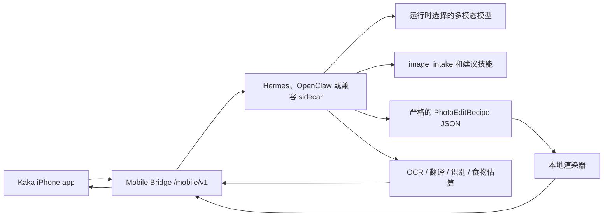

# Kaka

[English](README.md)

Kaka 是一个本地优先的 iPhone 视觉智能体入口。

它把 iPhone 连接到用户自己的本机智能体运行时，例如 Hermes、OpenClaw，或兼容 Mobile Bridge 的 sidecar。手机负责拍照、上传、预览、保存和分享；本机 Mac 运行时负责图片理解、技能选择、结构化修图 recipe、本地渲染、OCR、翻译、识别或食物估算等能力。

> 当前状态：早期 MVP / 持续开发中。核心 Swift 客户端、mock bridge、本地 recipe 修图路径、UI 原型和 Runtime Kit 脚手架已经存在；面向普通用户的一键 Hermes/OpenClaw 安装体验仍在封装。

## 为什么做 Kaka

很多 AI 修图产品要么直接把照片交给云端应用，要么通过生成式改图重新生成像素，容易损坏人脸、产品、文字、Logo 和细节。

Kaka 的第一版更克制：

- iPhone 只负责拍照、连接、上传、展示、保存和分享。
- 本机运行时先理解图片并建议可用技能。
- 用户可以点建议技能，也可以直接输入想做的事。
- OCR、翻译、识别、食物估算和修图都通过运行时拥有的能力执行。
- 修图路径使用严格的本地 `PhotoEditRecipe`，Mac 本地验证并渲染结果。
- Phase 1 做参数化照片优化，不做生成式换图。

目标是一个非常简单的相机闭环：拍照或选图，让 Kaka 判断可以帮什么，然后在图片对话里继续处理。

更大的产品方向是 **Pocket Agents**：Kaka 成为本地智能体在手机上的语音优先入口。手机负责拍照、系统分享、截图、粘贴、语音和用户授权的上下文快照；用户自己的本机运行时负责推理、工具调用、记忆和长任务执行。详见 [docs/pocket-agents-direction.md](docs/pocket-agents-direction.md)。

## 核心流程

1. iPhone 连接到本机运行时。
2. 拍照或从相册选择照片。
3. 把照片发送给 Kaka。
4. 运行时执行 `image_intake`，返回图片摘要和建议技能。
5. 用户点一个建议技能，或输入自己的请求。
6. 运行时执行修图、OCR、翻译、识别或食物估算等任务。
7. iPhone 在图片对话中展示结果；修图结果可进入 **Master** / **Social** 对比页。
8. 用户保存结果或通过 iOS 系统分享。

## 架构



iPhone 只保存运行时 endpoint 和移动端 bearer token。模型密钥、provider 路由、图片理解、recipe 生成、图像渲染、任务状态和结果资产都留在用户自己的 Mac/运行时侧。

## 当前模块

| 路径 | 作用 |
| --- | --- |
| `Sources/AgentPocketCore` | Swift 客户端模型、配对、上传、任务轮询、下载 |
| `Sources/AgentPocketUI` | SwiftUI 连接、拍摄、结果、保存和分享流程 |
| `ios/AgentPocket` | iOS app target |
| `mock_bridge` | 本地 Mobile Bridge server 和 QA 工具 |
| `photo-pack` | Photo agent profile、skill 和本地 recipe adapter |
| `runtime-kit` | 显式启动的 bridge launcher，以及 Hermes/OpenClaw 封装脚手架 |
| `docs` | 架构、API、设置、UI 原型和实施计划 |

## Pocket Agents 方向

Kaka 可以从相机继续扩展，但不应该一开始做不受控的手机遥控器。推荐路线是：

- **Share to Kaka 收件箱**：从任意 App 分享文字、链接、截图、PDF、图片或小文件给 Kaka。
- **语音 Walkie-talkie**：按住说话、补充指令、听取短回复。
- **权限化 Context Snapshot**：用户同意后，把时间、来源、粗略位置、运动状态、网络、电量和可选日历空闲状态作为一次性任务上下文发给智能体。
- **截图问答和界面指导**：分享截图后，让智能体解释界面、报错或下一步操作，而不是直接控制其它 App。
- **Recall 个人资料库**：只在用户明确选择 `Remember` 时写入长期记忆，并提供 `Use Once` 和 `Forget`。

第一条可执行路线应该是：系统分享进入 Kaka 收件箱，然后用语音继续追问或确认。详见 [docs/pocket-agents-direction.md](docs/pocket-agents-direction.md)。

## 本地开发

运行 Swift 测试：

```bash
swift test
```

运行 Runtime Kit 检查：

```bash
PYTHONPATH=runtime-kit:mock_bridge python3 -m kaka_mobile_runtime_kit doctor
```

运行目标 Python 测试：

```bash
PYTHONDONTWRITEBYTECODE=1 \
PYTHONPATH=runtime-kit:mock_bridge \
python3 -m pytest -p no:cacheprovider runtime-kit/tests mock_bridge/tests/test_photo_pack_provider.py -q
```

为 Simulator 本地测试启动 bridge：

```bash
PYTHONPATH=runtime-kit:mock_bridge python3 -m kaka_mobile_runtime_kit start
```

为同一可信局域网里的真机 iPhone 启动 bridge：

```bash
PYTHONPATH=runtime-kit:mock_bridge python3 -m kaka_mobile_runtime_kit start \
  --lan \
  --bonjour \
  --bonjour-host "$(ipconfig getifaddr en0)" \
  --runtime hermes \
  --hermes-profile dev-lead
```

这些长命令只是开发阶段的透明诊断方式。真正面向用户的目标体验，是 Hermes/OpenClaw 里有一个 **Kaka Mobile Bridge** 开关，用户打开后扫码或通过 Bonjour 连接。

## Runtime Kit 方向

Kaka 不应该要求普通用户粘贴复杂命令。目标首次连接流程是：

1. 安装 Hermes/OpenClaw plugin 或 skill。
2. 在运行时 UI 中启用 **Kaka Mobile Bridge**。
3. 显示二维码，并可选开启本地网络发现。
4. 在 iPhone 上打开 Kaka 并连接。

安全边界：

- 安装 plugin/skill 不会自动启动 LAN 服务。
- 默认 bridge 只绑定本机 loopback。
- LAN 和 Bonjour 必须由用户显式开启。
- Provider API key 不进入 iPhone。
- 配对 token 应该短期有效并且可撤销。

详见 [docs/kaka-runtime-kit-plan.md](docs/kaka-runtime-kit-plan.md)。

## 修图方向

Phase 1 聚焦参数化修图：

- 裁切与重新构图
- 曝光和对比度
- 阴影和高光
- 白平衡
- 色彩活力
- 降噪和锐化
- 主体强调
- 必要时做保守放大

照片不会被转换成巨大的像素 JSON 文件。JSON 只用于描述受约束的修图 recipe；真正的图像修改由本地渲染器完成。

## 路线图

- 完成 Simulator 和真机 iPhone 的本地 recipe 流程 receipt。
- 把 Runtime Kit 封装成真正的 Hermes plugin 体验。
- 增加 OpenClaw sidecar 或原生集成。
- 在图片闭环被证明后，原型化 Share to Kaka 收件箱和语音追问。
- 完善生产级配对、token 撤销和照片保留策略。
- 把 HTML UI 方向逐步移植到原生 SwiftUI。
- 增加 Core Image、ImageMagick、OpenCV、libvips 等本地渲染后端。

## 安全与隐私

Kaka 的设计核心是本地优先的凭证边界：

- iPhone 不保存模型 provider API key。
- 运行时负责模型选择和 provider 凭证。
- 照片和结果资产由用户自己的运行时及其保留策略管理。
- 本地网络发现本身不会生成长期凭证。

详见 [SECURITY.md](SECURITY.md)。

## License

MIT License. See [LICENSE](LICENSE).
