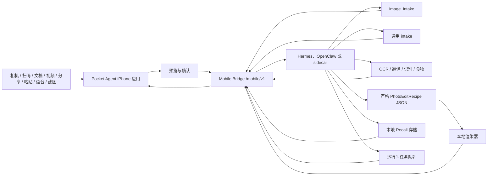

# Pocket Agent

[English](README.md)

Pocket Agent 是一个本地优先的 iPhone 智能体入口。

它把 iPhone 连接到用户自己的本机智能体运行时，例如 Hermes、OpenClaw，或兼容 Mobile Bridge 的 sidecar。手机负责拍照、扫码、文档扫描、短视频 intake、系统分享、显式粘贴、收件箱、语音追问、预览、保存、Recall 控制和用户确认；本机运行时负责模型凭证、模型路由、工具执行、图片理解、结构化修图 recipe、本地渲染、记忆和任务状态。

> 当前状态：早期 MVP / 持续开发中。Swift 客户端、iOS app target、Share Extension、Mobile Bridge 契约、mock bridge、Runtime Kit 脚手架、本地 recipe 修图路径、runtime 侧视觉路径、测试和 UI/UX 原型都在本仓库中。完整的阶段开发史见 [docs/development-history.md](docs/development-history.md)（英文）。

## 为什么是 Pocket Agent

多数 AI 手机助手和照片应用会把用户数据和模型凭证搬进云服务。Pocket Agent 坚持更窄的本地优先边界：

- iPhone 负责采集、预览、分享、征求确认、展示结果。
- 运行时拥有 provider key、模型选择、工具调用、任务状态、Recall 数据和保留规则。
- 任何输入在提交前都是用户可见、用户发起的。
- 图片走 `image_intake`，返回摘要和建议技能。
- 分享的文本、URL、图片、PDF 先进入 App Group 收件箱，由主应用可见地提交。
- Recall 是显式的：`记住`、`用一次`、`遗忘`。
- 修图从严格的 `PhotoEditRecipe` JSON 和本地渲染开始，不做生成式像素替换。

产品目标是一个可靠的口袋智能体闭环：拍下或分享一样东西，让 Pocket Agent 说明它能做什么，通过点按、文字或语音继续，并由用户决定什么应该被记住。

## 当前能力

- **图像 intake** — 与本地运行时配对，拍照或选图，经 Mobile Bridge 上传，运行 `POST /mobile/v1/tasks/image-intake`，获得摘要和建议技能，并在图像会话中继续（OCR、翻译、识别、食物估算、参数化修图）。
- **Local Agent Lens** — Capture 首页提供 Scan、Document、Video、Record、Inbox、Activity 六个手机原生入口。扫码只显示明确下一步动作，文档扫描和短视频先生成可见 Inbox 草稿，Action Button/Shortcuts 只把 Pocket Agent 带到前台对应页面。
- **分享到 Pocket Agent 收件箱** — iOS Share Extension 接受文本、网页 URL、图片和 PDF，以历史命名的 `KakaInboxItem` 形式存入共享 App Group 容器，失败即关闭；主应用拥有可见的提交动作。显式粘贴、Files 导入、发送前详情审阅、确认后丢弃和操作反馈横幅都建立在同一个收件箱上。
- **通用 intake** — `POST /mobile/v1/tasks/intake` 支持文本、URL、图片、截图、PDF 和短视频，带来源元数据、可选用户指令、可选 context snapshot 和结构化建议。
- **Context Snapshot** — 任务级、权限感知的快照（时间、时区、locale、来源、粗粒度网络/电量、一次性运动和日历可用性标签），仅在用户开启且运行时声明支持时发送；权限被拒绝不会阻塞 intake。
- **Recall** — 通过 `/mobile/v1/recall/*` 提供显式操作（记住/用一次/遗忘）、浏览、搜索、导出和删除；Runtime Kit 在 `--runtime-store-path` 之后提供 SQLite 持久化、带策略标签的 JSON 导出和确定性语义搜索（支持 provider-backed adapter）。
- **语音与运行时任务** — 真实 push-to-talk 追问，端上转写、可编辑转写文本（不上传原始音频、无隐藏监听），语音到收件箱的草稿和指令，运行时任务列表/取消/审批模型，前台 App Intents，以及 WidgetKit 锁屏和灵动岛的 Live Activity 任务状态管线。
- **配对与信任** — 短时效 QR 配对与 token 撤销、Bonjour 发现、本地 HTTPS 并把非机密的 TLS 公钥指纹固定进已保存连接。

## 架构



iPhone 只存运行时端点、mobile bearer token、本地收件箱载荷和用户可见的 UI 状态。模型 provider key、路由、任务执行、生产记忆、渲染产物以及跨会话的审批都留在运行时侧。

## 仓库结构

| 路径 | 用途 |
| --- | --- |
| `Sources/AgentPocketCore` | 配对、上传、图像/通用 intake、Context Snapshot、Recall、运行时任务和 Mobile Bridge 请求的 Swift 客户端模型 |
| `Sources/AgentPocketUI` | 连接、采集、图像会话、收件箱、Context Snapshot 预览、Recall、语音草稿和任务收件箱的 SwiftUI 界面 |
| `ios/AgentPocket` | iOS 应用 target、entitlements、调试 handoff 界面 |
| `ios/KakaShareExtension` | 历史命名的 Share Extension target，用于文本、URL、图片、PDF 采集 |
| `ios/AgentPocketTaskActivityWidget` | 锁屏与灵动岛任务状态的 WidgetKit Live Activity target |
| `mock_bridge` | 本地 Mobile Bridge 服务器、确定性运行时行为、QA 工具和测试 |
| `runtime-kit` | 桥接启动器、Hermes/OpenClaw 打包脚手架、运行时视觉端点、CLI 和测试 |
| `photo-pack` | 照片 agent profile、修图技能和本地 recipe adapter |
| `docs` | API 文档、隐私文档、开发计划、Pocket Agent 方向和 UI/UX 原型 |

关键文档：[docs/mobile-bridge-api.md](docs/mobile-bridge-api.md)（手机↔运行时契约，唯一事实源）、[docs/agent-pocket-setup.md](docs/agent-pocket-setup.md)（环境搭建）、[docs/pocket-agents-direction.md](docs/pocket-agents-direction.md)（产品方向）、[docs/development-history.md](docs/development-history.md)（完整阶段日志）。

## 本地开发

运行 Swift 测试：

```bash
swift test
```

运行 Runtime Kit、mock bridge、photo pack 和 iOS 源码测试：

```bash
PYTHONDONTWRITEBYTECODE=1 \
PYTHONPATH=runtime-kit:mock_bridge \
python3 -m pytest -p no:cacheprovider runtime-kit/tests mock_bridge/tests photo-pack/tests ios/tests -q
```

启动用于模拟器开发的本地桥接：

```bash
PYTHONPATH=runtime-kit:mock_bridge python3 -m kaka_mobile_runtime_kit start
```

带本地 SQLite 存储启动：

```bash
PYTHONPATH=runtime-kit:mock_bridge python3 -m kaka_mobile_runtime_kit start \
  --repo-root . \
  --runtime sidecar \
  --runtime-store-path ~/.kaka/mobile-runtime.sqlite3
```

为同一可信局域网内的真机启动：

```bash
PYTHONPATH=runtime-kit:mock_bridge python3 -m kaka_mobile_runtime_kit start \
  --lan \
  --bonjour \
  --bonjour-host "$(ipconfig getifaddr en0)" \
  --runtime hermes \
  --hermes-profile dev-lead
```

然后打开 `ios/AgentPocket.xcodeproj`，运行应用，通过 QR 或 Bonjour 配对。视觉端点、QA 工具和排障见 [docs/agent-pocket-setup.md](docs/agent-pocket-setup.md)；宿主打包与 host adapter CLI 见 [runtime-kit/README.md](runtime-kit/README.md)。

## Runtime Kit 方向

Pocket Agent 不应要求普通用户粘贴桥接命令。目标安装流程是：

1. 安装 Hermes/OpenClaw 插件或 Skill。
2. 在运行时 UI 中启用 **Pocket Agent Mobile Bridge**。
3. 显示短时效 QR 码，并可选择在本地网络广播。
4. 在 iPhone 上打开 Pocket Agent 并连接。

安全边界：

- 安装插件或 Skill 不得自动启动 LAN 监听；默认绑定本地回环，LAN 和 Bonjour 是显式 opt-in。
- Provider API key 永远不进入 iPhone。
- 普通用户不应写 adapter 代码、导出环境变量或粘贴 Runtime Kit 命令链；宿主扩展在内部拥有 adapter 发现和生命周期接线。
- 手机只通过 Mobile Bridge `/mobile/v1` 连接智能体；宿主壳渲染与宿主动作执行使用 Mac/runtime 侧的 Runtime Kit 契约，Hermes/OpenClaw 专有私有 API 实现保持在本仓库之外。
- 生产 QR 载荷短时效且一次性，mobile token 可撤销。
- Share Extension 采集不得静默上传内容。

详见 [docs/kaka-runtime-kit-plan.md](docs/kaka-runtime-kit-plan.md)。

## 状态与路线图

当前焦点：端到端真实使用闭环——真机 iPhone 与真实本地运行时配对，日常使用采集/分享/语音路径，修复真实使用暴露的问题。

Host Extension 产品化路线（可安装的 Hermes Plugin / OpenClaw Skill）在 Runtime Kit 侧契约已完备，但外部安装演练（P3.7）仍**阻塞**在真实的宿主自有打包材料上，见 [docs/kaka-host-extension-external-materials.md](docs/kaka-host-extension-external-materials.md)。阻塞期间，开发继续推进仓库自有的产品切片，而不是再加安装器包装层。

完整的阶段日志（P2.x–P3.x，含每个切片改变与未改变的边界）在 [docs/development-history.md](docs/development-history.md)。

## 安全与隐私

Pocket Agent 围绕本地优先的凭证边界设计：

- iPhone 永远不存模型 provider 的 API key。
- 运行时拥有模型选择和 provider 凭证。
- 用户输入在提交前是显式且可见的。
- Share Extension 载荷先本地落盘，再由主应用可见动作提交。
- Context Snapshot 是任务级的、带可读权限行预览，绝不后台采集。
- Recall 是 opt-in：记住、用一次或遗忘。
- 生产 Recall 和任务持久化留在运行时侧；手机通过 Mobile Bridge 请求浏览/搜索/导出/删除和任务操作。
- 照片和渲染产物由用户的运行时及其保留策略处理。
- 本地发现本身不会铸造长期凭证。

详见 [SECURITY.md](SECURITY.md) 和 [docs/agent-pocket-privacy.md](docs/agent-pocket-privacy.md)。

## 许可证

MIT License。见 [LICENSE](LICENSE)。
