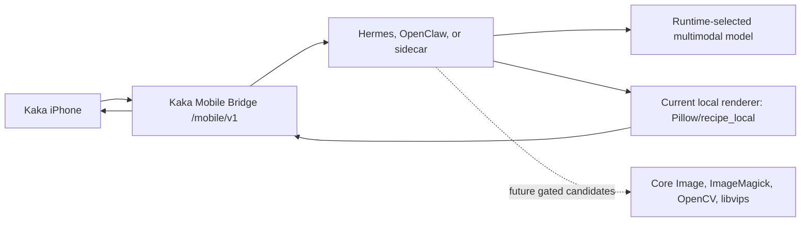

# Kaka Runtime Kit Plan

Updated: 2026-06-11

## Decision

Kaka should not ask normal users to paste a long terminal command for first connection. The product path should be:

1. Install a Hermes/OpenClaw plugin or skill.
2. Open the runtime UI and enable **Kaka Mobile Bridge**.
3. Kaka iPhone discovers the bridge through Bonjour or scans the displayed QR.
4. iPhone stores only the Mobile Bridge endpoint and mobile token.

The private adapter command is not a user-facing setup step. In production it
belongs inside the host extension package: Hermes should ship it as part of a
Hermes Plugin, and OpenClaw should ship it as part of an OpenClaw Skill or
sidecar. Explicit `--private-adapter-command`, `HERMES_KAKA_HOST_API`, and
`OPENCLAW_KAKA_HOST_API` are developer/pilot fallback paths only.

The follow-up productization roadmap for this plugin/skill direction is
`docs/kaka-host-extension-plugin-skill-roadmap.md`.

The latest non-installation follow-up while real Hermes/OpenClaw package
materials remain blocked is now implemented:
`docs/superpowers/plans/2026-06-11-kaka-pocket-agents-local-renderer-backend-capability-manifest.md`.
That P3.27 slice records the current Pillow/`recipe_local` renderer truth and
future Core Image/ImageMagick/OpenCV/libvips gates; it does not add another
Host Extension wrapper, install dependencies, execute future backends, or change
the phone/private-host API split.

The latest installation-focused follow-up while real Hermes/OpenClaw package
materials remain blocked is now implemented:
`docs/superpowers/plans/2026-06-11-kaka-pocket-agents-host-extension-material-intake.md`.
That P3.28 slice adds `host-extension-material-intake`, a read-only Runtime Kit
intake/review path for host-owned Plugin/Skill package facts and install-drill
refs. It embeds P3.6 `host-extension-readiness`, blocks missing or secret-like
values, and is not an installer, signer, publisher, bridge starter, private
adapter runner, Codex ordinary-user install path, or `/mobile/v1` change.

The current repository now includes `runtime-kit/` as the development scaffold for that path. It now exposes `settings-preview`, `package-preview`, `host-package-preview`, `host-extension-preview`, `host-extension-readiness`, `host-extension-starter-kit`, `host-extension-install-package`, `host-plugin-skill-devkit`, `host-codex-developer-plugin-source`, `local-renderer-backend-readiness`, `local-tls-readiness`, `retention-purge`, `recall-retrieval-readiness`, `recall-retrieval-material-intake`, `host-adapter-run`, and derived `consumer_ui` plus `process_ownership` JSON contracts for Hermes/OpenClaw plugin shells, short-lived production QR pairing, mobile token revocation, trusted local TLS metadata, runtime-side retention policy controls, explicit purge receipts, static disabled-by-default shell manifests, and packaging schemas. The public renderer, process lifecycle, P2.8 host packaging handoff, P2.9 host adapter action result, P3.5 Host Extension productization contract, P3.6 Host Extension distribution readiness contract, P3.8 local TLS metadata readiness contract, P3.9 retention policy controls, P3.10a local HTTPS serving, P3.10b iOS trust/pinning integration, P3.11 native connection/recovery UI polish, P3.12 Host Extension Starter Kit, P3.13 Host Extension installable package handoff, P3.14 runtime retention purge receipts, P3.15 Host Plugin/Skill Devkit, P3.16 local renderer backend readiness, P3.17 photo-edit variant truth, P3.17b photo-edit MIME truth, P3.18 Host Codex developer plugin source, P3.19 Host Extension install experience acceptance, P3.20 Recall export artifact policy, P3.21 Recall retrieval packaging readiness, P3.22 asset retention timestamped purge, and P3.24 SQLite asset storage retention are in place. `host-adapter-run` is a Mac/runtime-side execution surface; the `mock` adapter is for conformance/local QA, while the `private` adapter returns unavailable until a host-owned command is supplied and then calls that command through the P3.1 stdin/stdout JSON bridge. P3.6 collects host-owned distribution facts without installing packages or binding proprietary private APIs into Kaka. P3.11 is a SwiftUI/AgentPocketUI phone polish slice only; it renders phone-safe recovery guidance and does not add Runtime Kit commands or phone-side private host APIs. P3.12 gives Hermes/OpenClaw host teams a safe Runtime Kit scaffold for generating plugin/skill starter packages instead of making ordinary users write adapter code or export environment variables. P3.13 turns that starter direction into package-shaped host-team handoff materials, but signing, publishing, update channels, proprietary adapter code, conformance evidence, and final distribution remain host-owned. P3.14 turns retention policy controls into an explicit runtime-owned purge receipt flow with dry-run/apply semantics, schema validation, idempotent terminal-task cleanup, and no phone-side purge or settings write. P3.22 follows up by adding reliable in-memory role/timestamp metadata for mock bridge input/output assets so explicit apply can delete eligible assets while untimestamped assets remain preserved as untracked. P3.24 adds Runtime Kit SQLite-backed input/output asset persistence and store-backed purge integration without changing `/mobile/v1/assets`. P3.15 turns the P3.12/P3.13 host-team path into a template-only devkit/index command without creating a third install package or ordinary-user Codex plugin; future Codex developer plugins or skills remain host-team automation, not the public installer. P3.16 proves the current `recipe_local` renderer with a synthetic runtime-side probe, P3.17 aligns default `photo_edit.return_variants_max` to `2` for the current Master/Social outputs, P3.17b narrows default `photo_edit.accepted_mime_types` to `["image/jpeg"]` while keeping generic upload, vision, image intake, and universal intake broader, P3.18 materializes host-team Codex developer plugin source without installing Codex plugins, updating marketplaces, writing user-home install roots, or changing `/mobile/v1`, P3.19 strengthens the existing install-package handoff with host UI acceptance, ordered install drill, evidence receipt refs, and release gates without adding another CLI, P3.20 labels Recall export as `kaka.recall_export.v1` with a closed schema so it remains user-readable metadata rather than a runtime database dump, P3.21 adds a read-only production Recall retrieval packaging readiness contract plus outbound provider-provenance allowlisting without changing `/mobile/v1/recall/search`, and P3.26 adds a local Recall retrieval materials manifest intake/review contract without fetching refs or invoking providers. The completed agent-executable plans are `docs/superpowers/plans/2026-06-05-kaka-pocket-agents-production-pairing-hardening.md`, `docs/superpowers/plans/2026-06-06-kaka-pocket-agents-hermes-openclaw-consumer-runtime-ui.md`, `docs/superpowers/plans/2026-06-06-kaka-pocket-agents-runtime-process-ownership.md`, `docs/superpowers/plans/2026-06-06-kaka-pocket-agents-consumer-host-packaging-distribution.md`, `docs/superpowers/plans/2026-06-06-kaka-pocket-agents-host-adapter-binding.md`, `docs/superpowers/plans/2026-06-07-kaka-pocket-agents-host-extension-packaging-pairing-ux.md`, `docs/superpowers/plans/2026-06-07-kaka-pocket-agents-host-extension-distribution-readiness.md`, `docs/superpowers/plans/2026-06-07-kaka-pocket-agents-host-extension-starter-kit.md`, `docs/superpowers/plans/2026-06-07-kaka-pocket-agents-host-extension-installable-package-handoff.md`, `docs/superpowers/plans/2026-06-07-kaka-pocket-agents-native-connection-recovery-ui.md`, `docs/superpowers/plans/2026-06-07-kaka-pocket-agents-runtime-retention-enforcement-purge-receipts.md`, `docs/superpowers/plans/2026-06-07-kaka-pocket-agents-host-plugin-skill-developer-kit.md`, `docs/superpowers/plans/2026-06-07-kaka-pocket-agents-local-renderer-readiness.md`, `docs/superpowers/plans/2026-06-07-kaka-pocket-agents-photo-edit-capability-truth.md`, `docs/superpowers/plans/2026-06-07-kaka-pocket-agents-photo-edit-mime-truth.md`, `docs/superpowers/plans/2026-06-07-kaka-pocket-agents-host-codex-developer-plugin-source.md`, `docs/superpowers/plans/2026-06-07-kaka-pocket-agents-host-extension-install-experience-acceptance.md`, `docs/superpowers/plans/2026-06-07-kaka-pocket-agents-recall-export-artifact-policy.md`, `docs/superpowers/plans/2026-06-07-kaka-pocket-agents-recall-retrieval-packaging-readiness.md`, `docs/superpowers/plans/2026-06-07-kaka-pocket-agents-asset-retention-timestamped-purge.md`, `docs/superpowers/plans/2026-06-07-kaka-pocket-agents-sqlite-asset-storage-retention.md`, and the P3.8/P3.9/P3.10a/P3.10b Runtime Kit implementations recorded in the roadmap.

P3.15 is now the repo-owned Host Plugin/Skill devkit slice. It improves host
extension installation by turning P3.12/P3.13 artifacts into a template-only
developer materials index for Hermes/OpenClaw teams: contract index, command
files, acceptance gates, ordinary-user boundary metadata, adapter templates, and
optional Codex automation templates. The ordinary-user install surface remains
the host-native Hermes Plugin or OpenClaw Skill/sidecar. If real external
Hermes/OpenClaw package facts arrive, use them to unlock P3.7. If those facts
remain blocked, P3.18 has now landed as host-team Codex developer plugin source
generation, P3.19 has strengthened the install-package handoff acceptance
artifacts, P3.20 has landed as the Recall export artifact policy slice, and
P3.21 has landed as production Recall retrieval packaging readiness. P3.22 has
landed as timestamp-aware mock bridge asset retention purge receipts. P3.24 has
landed as SQLite-backed input/output asset storage and explicit store-backed
retention purge for configured runtime stores. P3.25 has landed as store-backed
task result detail persistence: it persists only phone-safe photo-edit result
manifests, keeps raw bytes in `runtime_assets`, rebuilds download links from
asset IDs, keeps task lists summary-only, exposes only `variant_count` in
completed task events, and filters secret-like recipe metadata. In all cases,
ordinary users still install the host-native Hermes Plugin or OpenClaw
Skill/sidecar.

Additional completed follow-up plans after that historical index are
`docs/superpowers/plans/2026-06-11-kaka-pocket-agents-store-backed-task-result-detail.md`
and
`docs/superpowers/plans/2026-06-11-kaka-pocket-agents-recall-retrieval-material-intake.md`.
P3.26 has landed as Recall retrieval material intake/review: it consumes a
local host/runtime-owned materials manifest, blocks missing or secret-like
refs, embeds the P3.21 readiness snapshot, and still does not fetch refs,
validate signatures, invoke providers, expose provider endpoints/keys, or
change `/mobile/v1/recall/search`.

## P3.24 SQLite Asset Storage Retention

P3.24 is implemented by adding `RuntimeAssetRecord`,
`RuntimeAssetPurgeReceipt`, and a `runtime_assets` table to
`SQLiteRuntimeStore`. Mock bridge upload/download/photo-edit/vision/image
intake/universal-intake metadata/QA paths now use asset helpers: when a runtime
store supports assets, input and output asset bytes are stored in SQLite;
without a store, existing in-memory behavior remains.

The retention boundary stays explicit and runtime-owned. `retention-purge`
combines store-backed assets with P3.22 memory assets, lists only eligible and
deleted asset IDs, and deletes old assets only on `--apply`. P3.24 does not add
automatic cleanup, a Mobile Bridge purge endpoint, phone-side settings writes,
Swift UI, Recall purge, provider calls, host package changes, raw bytes/path
leakage in receipts, or persisted task result detail/variants.

## P3.25 Store-Backed Task Result Detail

P3.25 is implemented as the direct follow-up to P3.24:
`docs/superpowers/plans/2026-06-11-kaka-pocket-agents-store-backed-task-result-detail.md`.

The implementation reuses `RuntimeTaskRecord.metadata` for a phone-safe result
manifest rather than adding a new table. For completed photo-edit tasks,
metadata may include variant ID, variant label, variant asset ID, explanation,
and allowlisted structured recipe/status fields. It filters raw asset bytes,
SQLite paths, provider endpoints, tokens, hidden prompts, raw provider
responses, private host API data, and unconfirmed Context Snapshot content.

Task detail responses rebuild `download_url` from the stored `asset_id`. Task
list responses remain summary-only, and store-backed completed task events
expose only `variant_count` rather than asset IDs or download links. P3.25 does
not add a phone purge endpoint, automatic cleanup, Swift UI, Recall write/purge,
provider call, host package change, or phone-side settings write.

P3.18 is implemented as source generation for host engineers, not as a
new user installer. The Runtime Kit command is
`host-codex-developer-plugin-source`: it previews or writes a real Codex
developer plugin source tree under an explicit output directory only. The
generated source may contain `.codex-plugin/plugin.json`,
`skills/kaka-host-extension-developer/SKILL.md`, references, and a `source.json`
receipt, but Runtime Kit must not install that plugin, update a Codex
marketplace, write `~/plugins`, `~/.codex`, or `~/.agents`, install
Hermes/OpenClaw packages, start the bridge, invoke private adapters, run
conformance, or change the phone `/mobile/v1` API. Runtime-specific source roots
should avoid collisions, for example `kaka-host-extension-developer-hermes` and
`kaka-host-extension-developer-openclaw`.

Immediate follow-up rule: improve this path as a host extension product, not as
a manual command setup. If external Hermes/OpenClaw package facts are available,
run the P3.6 readiness command with those facts and then write P3.7 install
drill execution steps. If those facts are not available, proceed with another
independent in-repository slice without adding phone-side private host APIs or
new user-facing command chains. If the next blocked-period slice is still
installation-focused, use
`docs/kaka-host-extension-install-experience-spec.md` as the P3.19 handoff:
tighten host UI acceptance, package handoff materials, install-drill runbooks,
release gates, or read-only material-intake receipts for the eight P3.6 facts
rather than adding another repository-only wrapper or Codex ordinary-user
installer.

## Next Development Handoff

If the next work is connection or installation focused, keep the target as a
host-native Hermes Plugin or OpenClaw Skill/sidecar:

1. Ask the host owner for the eight P3.6 facts listed in
   `docs/kaka-host-extension-external-materials.md`.
2. Run `host-extension-readiness` with those values.
3. Write and execute P3.7 only after readiness returns
   `ready_for_external_install_drill`.
4. If those facts remain unavailable, do not create a Codex user installer,
   another Runtime Kit wrapper, or a public setup flow based on adapter command
   editing. The only installation-adjacent repo work should be read-only
   material intake, acceptance receipts, or static drift tests for the future
   P3.7 proof.

If the next work is installation focused, review real host-owned package facts
with P3.28 `host-extension-material-intake`, then write and execute P3.7 only
after accepted materials exist. P3.29 has already completed the separately
permissioned Context Snapshot motion/calendar slice, so product-facing follow-up
work should choose the next independent permissioned capability rather than
repeating that scope.

## Implementation Split For Plugin/Skill Delivery

Future contributors should classify every host-installation change before
writing code:

- Ordinary-user Host Extension:
  Hermes Plugin or OpenClaw Skill/sidecar. This is the product users install.
  It owns the native install/update channel, Kaka Mobile Bridge panel,
  extension-internal adapter command, signed package ref, health, revoke,
  repair, logs, and uninstall controls.
- Runtime Kit generator:
  repo-owned commands that emit contracts, starter packages, install-package
  handoff trees, readiness reports, conformance receipts, evidence manifests,
  and developer automation source. These commands may write to an explicit
  output directory for host teams, but they are not public installers.
- Codex developer automation:
  optional host-team-only plugin/skill source that helps engineers scaffold,
  validate, and review the Host Extension materials. It follows `skill-creator`
  and `plugin-creator` structure guidance where useful, but it must not use the
  personal marketplace/user-home install path as part of normal Kaka onboarding.

The next implementation should preserve that split. Do not merge the Codex
developer automation surface with the Hermes/OpenClaw ordinary-user package,
and do not teach users to install Kaka by editing adapter code.

## P3.19 Install Experience Acceptance

P3.19 is implemented by strengthening the existing
`host-extension-install-package` output. Runtime Kit now adds host UI acceptance
metadata, a generated `host-ui/acceptance.json`, ordered install-drill steps,
evidence receipt refs, TLS/readiness/evidence/Codex developer source release
gates, and static manifest/schema drift protection.

P3.19 does not make Runtime Kit a public package manager. It does not add a new
CLI, install packages, sign/publish, start the bridge, expose private host APIs,
or make Codex automation the ordinary-user installer.

## P3.21 Recall Retrieval Packaging Readiness

P3.21 is implemented as a read-only Runtime Kit readiness contract for
production Recall retrieval packaging:
`docs/superpowers/plans/2026-06-07-kaka-pocket-agents-recall-retrieval-packaging-readiness.md`.

The new `recall-retrieval-readiness` command emits
`kaka.recall_retrieval_readiness.v1` for Hermes/OpenClaw host teams preparing
one of three strategies: host-native embeddings, sidecar adapter, or
capability-negotiated hybrid. It collects non-secret refs for adapter package,
runtime settings UI, signature, conformance, privacy review, fallback drill, and
release notes. It does not choose or invoke a provider, fetch refs, expose
provider endpoints/keys to iPhone, return raw embeddings/index rows/provider
responses, include retrieval internals in Recall export, or change
`/mobile/v1/recall/search`.

Implementation also tightens the runtime HTTP provider request boundary:
outbound Recall candidate provenance is allowlisted to source task ID, source
Inbox item ID, and source surface only. Keep future production retrieval work
behind this runtime-owned boundary unless a later plan explicitly changes the
Mobile Bridge contract.

## P3.26 Recall Retrieval Material Intake

P3.26 is implemented as the next repo-owned Recall retrieval packaging support
slice while external host materials remain blocked:
`docs/superpowers/plans/2026-06-11-kaka-pocket-agents-recall-retrieval-material-intake.md`.

The new `recall-retrieval-material-intake` command reads a local
`kaka.recall_retrieval_materials.v1` manifest supplied by the host/runtime team
and emits `kaka.recall_retrieval_material_intake.v1`. It normalizes the seven
P3.21 material refs, blocks missing or secret-like values, embeds the existing
`recall-retrieval-readiness` snapshot, and can report
`accepted_for_external_retrieval_packaging_review` when the manifest is complete
and phone-safe.

This is a review/intake contract, not production retrieval implementation. It
does not fetch refs, validate signatures, invoke providers, generate embeddings,
read provider endpoints or keys, return raw embeddings/index rows/provider
responses, include retrieval internals in Recall export, or change
`/mobile/v1/recall/search`.

## P3.27 Local Renderer Backend Capability Manifest

P3.27 is implemented as a repo-owned local renderer planning slice:
`docs/superpowers/plans/2026-06-11-kaka-pocket-agents-local-renderer-backend-capability-manifest.md`.

The new `local-renderer-backend-capability-manifest` command emits
`kaka.local_renderer_backend_capability_manifest.v1`. It records the current
Pillow/`recipe_local` local renderer contract, links future renderer backend
enablement to the existing P3.16 `local-renderer-backend-readiness` proof, and
marks Core Image, ImageMagick, OpenCV, and libvips as future-gated candidates.

This is a capability planning manifest, not a backend implementation. It does
not install dependencies, import or execute future backends, run shell commands,
persist probe assets, call cloud providers, add Mobile Bridge endpoints, change
phone-facing `photo_edit` capabilities, or change `/mobile/v1`.

## P3.28 Host Extension Material Intake

P3.28 is implemented as the installation-focused review step after P3.27:
`docs/superpowers/plans/2026-06-11-kaka-pocket-agents-host-extension-material-intake.md`.

The new `host-extension-material-intake` command reads a local
`kaka.host_extension_materials.v1` manifest and emits
`kaka.host_extension_material_intake.v1`. It reviews the eight P3.6 package
facts plus install-drill refs, sanitizes secret-like values before calling
`host-extension-readiness`, embeds that readiness report, and returns
`accepted_for_external_install_drill_review` only for complete, non-secret local
materials.

This is a material review contract, not P3.7 execution. It does not install,
sign, publish, fetch refs, start Kaka Mobile Bridge, bind LAN, advertise
Bonjour, mint mobile tokens, invoke private adapters, write Codex user-home
install roots, or change `/mobile/v1`.

## Architecture

The iPhone remains a thin client. The Mac runtime owns:

- model choice
- model/provider credentials
- vision analysis
- strict recipe generation
- recipe validation
- local rendering
- task state and edited asset storage

Kaka Mobile Bridge is the stable boundary between the phone and any compatible runtime.



## Safety Boundary

- Skill/plugin install must not auto-start a server.
- Default bind is loopback only.
- LAN and Bonjour are explicit user choices.
- Start-at-login is an opt-in setting, default off.
- Pairing codes are short-lived in production.
- Mobile bearer tokens are revocable.
- Provider API keys never move to iPhone.
- Doctor/status commands must redact secrets.
- Runtime-side settings previews may show local paths and provider endpoints to the Mac/runtime user, but phone-bound status must not.
- The phone connects only through Kaka Mobile Bridge `/mobile/v1`; it does not call private host APIs.
- Mutating `host-adapter-run` actions require explicit approval.
- Install must not auto-start the bridge or create a login item.
- Ordinary users must not be asked to write adapter code, export environment
  variables, or paste Runtime Kit command chains. The installed host extension
  owns adapter discovery internally.

## Implementation Plan

### Milestone 1: Runtime Kit Scaffold

Status: implemented in this pass.

- Add `runtime-kit/kaka_mobile_runtime_kit`.
- Provide `doctor`, `start`, and `pairing-url` commands.
- Default to `recipe_local`.
- Support `--runtime hermes` and `--runtime openclaw`.
- Refuse Bonjour for iPhone unless a reachable LAN host is explicit.
- Add tests for command construction and safety validation.
- Advertise `/mobile/v1/tasks/vision` for bottom-layer image-conversation skills.
- Support `fixture_vision` for deterministic UI/protocol tests.
- Support `runtime_http` so scan, identify, translate, and food can be routed to a runtime-owned local vision endpoint.

### Milestone 2: Hermes Plugin Packaging

Status: plugin-shell contract, consumer UI renderer model, runtime-side process ownership contract, P2.8 host packaging handoff, P2.9 `host-adapter-run` binding surface, P3.3 private adapter package metadata, P3.5 Host Extension contract, and P3.6 distribution readiness contract implemented. Real private Hermes API implementation remains host-owned and should ship behind the Hermes Plugin command, not inside Kaka.

- Convert the scaffold into an installable Hermes plugin.
- Add a visible **Kaka Mobile Bridge** toggle.
- Add **Show QR**, **Stop**, **Revoke iPhone**, and optional **Start with Hermes**.
- Render the Runtime Kit `settings-preview` / `package-preview` / `host-package-preview` / `host-extension-preview` / `consumer_ui` / `process_ownership` contracts for LAN/Bonjour, production pairing, revocation, trusted local TLS, local Recall/task store path, Recall retrieval provider selection, install, start-at-login, update, uninstall, logs, health checks, port-conflict repair, and supervision.
- Package from Git or registry. No dedicated server is required just to distribute plugin code.

### Milestone 3: OpenClaw Skill Or Sidecar Packaging

Status: plugin-shell contract, consumer UI renderer model, runtime-side process ownership contract, P2.8 host packaging handoff, P2.9 `host-adapter-run` binding surface, P3.3 private adapter package metadata, P3.5 Host Extension contract, and P3.6 distribution readiness contract implemented. Real private OpenClaw API implementation remains host-owned and should ship behind the OpenClaw Skill/sidecar command, not inside Kaka.

- Provide the same `/mobile/v1` contract through OpenClaw native integration or sidecar.
- Keep OpenClaw model/provider credentials inside OpenClaw.
- Publish the same `recipe_local` capability shape.
- Publish a runtime-owned vision endpoint for bottom-layer image-conversation skills instead of relying on `fixture_vision`.
- Render the same Runtime Kit settings/package/host-package/host-extension/consumer UI/process ownership preview for store path, Recall retrieval provider selection, pairing, revocation, trusted local TLS, install, start-at-login, update, uninstall, logs, health checks, port-conflict repair, and supervision.

### Milestone 4: Production Pairing

Status: implemented.

- Preserve development `pair_dev` while adding production `/mobile/v1/pairing/qr` and `/mobile/v1/pairing/qr.html` payloads.
- Add short-lived single-use production pairing codes.
- Add token revocation and runtime-side device/token suffix listing primitives.
- Add trusted local TLS metadata and explicit local-development HTTP policy.
- Defer configurable retention policy controls to Milestone 14 / P3.9 so they
  land as runtime-side host-shell settings rather than production-pairing
  security primitives.

### Milestone 5: Hermes/OpenClaw Consumer Runtime UI Contract

Status: implemented.

- Add `runtime_side_ui.consumer_ui` to `settings-preview` with status badges, primary actions, warnings, empty state, and Process, Connection, Pairing, Local Memory, and Recall Retrieval sections.
- Expose the same consumer UI model from `package-preview` without creating a second settings source.
- Require static Hermes/OpenClaw manifests to declare the `consumer_ui` source, schema version, required sections, and required actions.
- Keep install defaults disabled and no-autostart.

### Milestone 6: Runtime Process Ownership

Status: implemented as a runtime-side contract.

- Add `runtime_side_ui.process_ownership` to `settings-preview` and derive package-preview process ownership from the same source.
- Cover install, start-at-login/start-with-runtime, update, uninstall, logs, health checks, and port-conflict repair as runtime-side actions.
- Keep install defaults disabled, `start_with_runtime` default false, and no-autostart behavior intact.
- Do not create login items or LaunchAgents, do not auto-start the bridge, and do not implement real host-native APIs in this slice.
- Keep process supervision inside Hermes/OpenClaw or the sidecar host, not the iPhone app.

### Milestone 7: Consumer-Ready Host Packaging Handoff

Status: implemented as P2.8 handoff contract.

- Add `host-package-preview` as the JSON handoff contract for Hermes/OpenClaw host-native distribution, install, login item, update, uninstall, log, health, repair, and supervision adapters.
- Require static manifests to declare the host package surface and entrypoint.
- Keep safe command artifacts declarative and non-mutating.
- Do not call private Hermes/OpenClaw host APIs in Runtime Kit.

Example:

```bash
PYTHONPATH=runtime-kit python3 -m kaka_mobile_runtime_kit host-package-preview --runtime hermes --distribution-source local_checkout --distribution-channel development --package-version development
```

### Milestone 8: Host Adapter Binding

Status: implemented as P2.9 testable binding surface.

- Add `host-adapter-run` for Mac/runtime-side action execution results.
- Keep the iPhone connection on Mobile Bridge `/mobile/v1`; do not add phone-owned install/update/uninstall/login-item settings.
- Use `mock` adapter mode for conformance/local QA without mutating the actual host OS.
- Return unavailable from `private` adapter mode until a host-owned command is supplied; real Hermes/OpenClaw private APIs remain behind that command and outside this repository.
- Keep every mutating lifecycle change explicit, reversible, and runtime-side; install does not auto-start or create a login item.

### Milestone 9: External Host Pilot Evidence

Status: P3.4 external waiting.

- Keep P3.4 completion external-host-owned.
- Require a real `hermes-kaka-host-api` or `openclaw-kaka-host-api` command
  outside this repository.
- Run `host-shell-pilot-request`, `host-shell-pilot-preflight`,
  `host-shell-pilot-runbook`, `host-private-adapter-conformance`,
  `host-shell-pilot-report`, `host-shell-pilot-handoff`,
  `host-shell-pilot-artifact-review`, and
  `host-shell-pilot-evidence-manifest`.
- Collect native distribution, signature/notarization, update-feed,
  install/update/failure drill, and release-note evidence refs.
- Do not treat Runtime Kit request/runbook/review/manifest artifacts as release
  completion without the real host-owned command and evidence.

### Milestone 10: Installable Host Extension Productization

Status: implemented as P3.5 Runtime Kit contract.

- Added a Runtime Kit `host-extension-preview` contract that describes the
  ordinary-user install shape for Hermes Plugin and OpenClaw Skill/sidecar.
- Declared host extension metadata and entrypoints in the static Hermes/OpenClaw manifests.
- Added `runtime-kit/packaging/host-extension-preview.schema.json` and manifest schema coverage.
- Bundle or internally discover the private adapter command through the host
  extension; keep explicit command paths and environment variables as
  developer/pilot fallback only.
- Render Enable Bridge, Show QR, optional Bonjour, Revoke iPhone, Health Check,
  Open Logs, Update, and Uninstall inside the host UI.
- Preserve install safety: no bridge autostart, no LAN bind, no Bonjour
  advertisement, no credential minting, and no login item creation during
  plugin/skill install.
- Keep the phone API unchanged on Mobile Bridge `/mobile/v1`.
- Keep P3.2 conformance and P3.4 pilot evidence as stable-release gates.

### Milestone 11: Host Extension Distribution Readiness

Status: implemented as P3.6 Runtime Kit contract.

- Added a read-only `host-extension-readiness` contract that consumes the real
  Hermes Plugin / OpenClaw Skill install command, update channel,
  extension-internal adapter command location, host UI entry point, signed
  package ref, signature/notarization ref, P3.2 conformance report ref, and
  P3.4 evidence manifest ref.
- Returns `blocked` with stable missing-input IDs until those host-owned facts
  exist.
- Returns `ready_for_external_install_drill` only when the host package metadata,
  conformance evidence, and pilot evidence refs are all present.
- Does not install the package, invoke private commands, fetch evidence refs,
  start the bridge, bind LAN, advertise Bonjour, mint credentials, create login
  items, or mark P3.4 complete.
- Hardened `host-extension-preview` schema coverage while implementing P3.6:
  bind `runtime` to `install_shape`, command name, env var, and well-known paths;
  require non-empty and runtime-matched manifest entrypoints; mirror the full
  forbidden phone-safe field allowlist; and keep ordinary-user sources separate
  from developer/pilot fallback sources.

### Milestone 12: External Host Extension Install Drill

Status: external waiting after the 2026-06-07 P3.6 readiness audit.

- Current no-input `host-extension-readiness` reports for both Hermes and
  OpenClaw return `status: "blocked"` and
  `ready_for_external_install_drill: false`.
- Both runtimes are missing the same host-owned inputs: `install_command`,
  `update_channel`, `adapter_command_location`, `host_ui_entrypoint`,
  `signed_package_ref`, `signature_ref`, `conformance_report_ref`, and
  `evidence_manifest_ref`.
- Use `docs/kaka-host-extension-external-materials.md` as the next handoff for
  collecting real Plugin/Skill package facts.
- After one runtime supplies real values, rerun `host-extension-readiness` with
  those values and require `ready_for_external_install_drill` before writing the
  P3.7 agent-executable install drill plan.
- The install drill should verify ordinary-user install, no autostart on
  install, explicit bridge enablement, QR/Bonjour pairing, health check,
  revoke/re-pair, update, failure recovery, log redaction, uninstall, and
  artifact archive readiness.
- If those host-owned materials are unavailable, do not add another Runtime Kit
  wrapper command for this path; shift in-repository work to independent slices
  such as retention controls, local TLS certificate management, Context Snapshot
  C.1b, native SwiftUI polish, or local renderer backends.

### Milestone 13: Local TLS Certificate Readiness

Status: implemented as P3.8 read-only Runtime Kit contract.

- Added `local-tls-readiness` for Hermes/OpenClaw runtime shells to report
  whether local TLS metadata is ready for production pairing.
- The report consumes non-secret certificate metadata only: certificate label,
  certificate ref, public-key SHA-256 fingerprint, expiry timestamp, trust store
  ref, and renewal procedure ref.
- Returns `blocked` with stable missing input IDs until TLS trust state is
  `configured` and all non-secret certificate refs are present.
- Returns `ready_for_production_pairing` only when the readiness metadata is
  complete.
- Does not generate certificates, install trust, modify Keychain, read private
  keys, start the bridge, bind LAN, advertise Bonjour, mint mobile tokens, fetch
  refs, or change the phone API.
- This is not a real TLS server implementation and not Swift certificate
  pinning; those remain separate host-owned slices if needed later.

### Milestone 14: Retention Policy Controls

Status: implemented as P3.9 in-repository Runtime Kit slice.

- Implemented runtime-side retention policy controls for input assets, output
  assets, and task history using
  `docs/superpowers/plans/2026-06-07-kaka-pocket-agents-retention-policy-controls.md`.
- Preserves the existing defaults: input assets `7` days, output assets `30`
  days, and task history `30` days.
- Added Runtime Kit CLI flags and `BridgeConfig` fields for the three policy
  values.
- Renders the controls in `settings-preview.runtime_side_ui.controls` as
  bounded day steppers for Hermes/OpenClaw host shells.
- Preserves non-default values through `settings-preview`, `package-preview`,
  `start --dry-run`, `build_server_command`, the mock bridge server parser,
  capabilities, and `GET /mobile/v1/runtime/settings`.
- Keeps the phone response read-only; does not add `POST` or
  `PUT /mobile/v1/runtime/settings`.
- Does not implement automatic deletion, background cleanup, SQLite migrations,
  Swift UI changes, or retention enforcement in this slice.
- Review boundary: the broader working tree currently includes older Swift/iOS
  and `runtime_store.py` changes. They are not part of Milestone 14 and should be
  isolated or promoted into a separate slice before release staging.

### Milestone 15: Local TLS Serving And Client Trust

Status: P3.10a and P3.10b implemented.

- Implemented P3.10a: Runtime Kit local HTTPS serving using
  `docs/superpowers/plans/2026-06-07-kaka-pocket-agents-local-https-serving.md`.
  This slice accepts host-owned certificate-chain and private-key launch inputs,
  validates them when `--trusted-local-tls` starts the bridge, and wraps the
  local Mobile Bridge socket with `ssl.SSLContext`.
- Implemented P3.10b: Runtime Kit/mock bridge pairing payloads can carry
  `tls_public_key_sha256`; Swift decodes and persists the pin, maps required TLS
  payload mistakes to certificate failures, and uses a pinned `URLSession` trust
  policy for HTTPS pairing, restore, and saved-connection bridge clients.
- Keep certificate creation, trust installation, renewal, and private key
  storage host-owned. Runtime Kit may read certificate files only to serve local
  HTTPS after explicit runtime-side launch configuration.
- Keep private key paths, raw certificates, bearer tokens, and host trust-store
  internals out of phone-visible settings.
- Preserve the local-development HTTP exception when `--trusted-local-tls` is
  absent.

### Milestone 16: Native Connection And Recovery UI Polish

Status: implemented as P3.11 SwiftUI/AgentPocketUI slice.

- Ports the refined connection direction into native SwiftUI.
- Covers expired QR, already-used QR, revoked saved connection, bridge offline,
  local network/Bonjour fallback, TLS/certificate failure, and host-owned
  recovery guidance.
- Renders only phone-safe connection status and user actions in Kaka iPhone; it
  does not move Runtime Kit settings, private adapter details, host package
  controls, command chains, log paths, SQLite paths, bearer-token fields, or
  certificate private-key paths into the phone app.
- Keep the Hermes/OpenClaw host shell as the owner of runtime settings,
  retention policy, process lifecycle, and private adapter wiring.

### Milestone 17: Host Extension Starter Kit

Status: implemented as P3.12. Agent-executable plan:
`docs/superpowers/plans/2026-06-07-kaka-pocket-agents-host-extension-starter-kit.md`.

- Built a Runtime Kit `host-extension-starter-kit` contract with schema
  `kaka.host_extension_starter_kit.v1`.
- Host teams can print a preview or write a safe starter package tree for
  Hermes Plugin / OpenClaw Skill packaging.
- Generated starter artifacts include README, manifest,
  extension-internal adapter command README, runtime contract command files, and
  release-gate metadata.
- The starter kit derives from `host-extension-preview`,
  `host-extension-readiness`, `settings-preview`, `package-preview`, and
  `host-package-preview` so plugin/skill shells do not grow a second settings
  source.
- The ordinary-user flow remains install extension, open host Kaka Mobile Bridge
  panel, explicitly enable, show QR or opt into Bonjour, then pair Kaka iPhone
  through `/mobile/v1`.
- Manual `--private-adapter-command`, `HERMES_KAKA_HOST_API`, and
  `OPENCLAW_KAKA_HOST_API` as developer/pilot fallback only.
- Does not implement or bundle proprietary Hermes/OpenClaw private APIs. Does not
  install packages, start the bridge, bind LAN, advertise Bonjour, create login
  items, mint tokens, invoke private adapter commands, or expose private host
  APIs to the phone.

### Milestone 18: Host Extension Installable Package Handoff

Status: implemented as P3.13. Agent-executable plan:
`docs/superpowers/plans/2026-06-07-kaka-pocket-agents-host-extension-installable-package-handoff.md`.

- Added a Runtime Kit `host-extension-install-package` contract with schema
  `kaka.host_extension_install_package.v1`.
- Reuses P3.12 starter-kit output and existing Host Extension readiness/package
  contracts instead of creating a second source of truth.
- Optionally materializes package-shaped handoff trees for Hermes Plugin and
  OpenClaw Skill/sidecar owners.
- Generated handoff artifacts include host Plugin/Skill manifest files,
  host UI contract files, install-drill runbook, release-gate command files, and
  an extension-internal adapter command README.
- Keeps the ordinary-user flow as install extension, open host Kaka Mobile Bridge
  panel, explicitly enable, show QR or opt into Bonjour, then pair Kaka iPhone
  through `/mobile/v1`.
- Keeps manual `--private-adapter-command`, `HERMES_KAKA_HOST_API`, and
  `OPENCLAW_KAKA_HOST_API` as developer/pilot fallback only.
- Does not sign, publish, install, start the bridge, bind LAN, advertise Bonjour,
  create login items, mint tokens, invoke private adapter commands, run
  conformance, or expose private host APIs to the phone.
- Does not claim P3.7 external install drill readiness or P3.4 host-shell pilot
  completion without real host-owned install, update, signature, conformance,
  and evidence manifest materials.

### Milestone 19: Runtime Retention Enforcement And Purge Receipts

Status: implemented as P3.14. Agent-executable plan:
`docs/superpowers/plans/2026-06-07-kaka-pocket-agents-runtime-retention-enforcement-purge-receipts.md`.

- Added explicit Runtime Kit `retention-purge` with default dry-run and
  explicit `--apply`.
- Added closed schema `kaka.runtime_retention_purge_receipt.v1` on
  `hermes_openclaw_runtime_retention_purge`.
- Added `SQLiteRuntimeStore.purge_task_history(...)` for old terminal task
  records and task events, with active task preservation and idempotent apply.
- Added a shared receipt builder and mock-bridge runtime helper. P3.22 now adds
  timestamped input/output mock asset support on top of this receipt boundary.
- Keeps long-term Recall records outside retention cleanup; Recall remains
  controlled by explicit `Forget` or delete actions.
- Does not add automatic cleanup on server start, schedulers, background jobs,
  login items, install hooks, Swift UI, phone-side settings writes, or a Mobile
  Bridge purge endpoint.
- Keeps runtime store paths, filesystem paths, provider endpoints, secrets,
  bearer tokens, mobile token material, TLS private key paths, raw logs, hidden
  prompts, embeddings, and SQLite rows out of receipts and phone-safe summaries.
- Added TDD coverage for dry-run no-op behavior, apply behavior, idempotence,
  terminal-task-only cleanup, active task preservation, settings-preview
  retention schema drift, no Mobile Bridge API drift, and forbidden field
  sentinels.

### Milestone 20: Host Plugin/Skill Developer Kit

Status: implemented as P3.15. Agent-executable plan:
`docs/superpowers/plans/2026-06-07-kaka-pocket-agents-host-plugin-skill-developer-kit.md`.

- Build on P3.12 `host-extension-starter-kit` and P3.13
  `host-extension-install-package`; does not create a second settings or package
  source.
- Adds `host-plugin-skill-devkit`, a host-team devkit/index command for Hermes
  Plugin and OpenClaw Skill/sidecar packaging.
- Writes only developer materials: contract index, command files, acceptance
  gates, ordinary-user boundary metadata, adapter templates, and template-only
  Codex automation files.
- Does not generate real host Plugin/Skill manifests, real Codex plugin
  manifests, real Codex `SKILL.md`, marketplace entries, or `bin` adapter stubs.
- Includes release-gate command files for readiness, P3.2 conformance, P3.4
  evidence/artifact review, log redaction, install-drill receipts, and package
  signature/update-channel checks.
- Codex automation is template-only for host engineers, not an installed Codex
  plugin/skill and not the ordinary-user installation surface.
- Keep ordinary-user setup as: install Hermes Plugin or OpenClaw Skill, open the
  host Kaka Mobile Bridge panel, explicitly enable, scan QR or discover Bonjour,
  and communicate with Kaka iPhone only through `/mobile/v1`.
- Do not sign, publish, install, start listeners, bind LAN, advertise Bonjour,
  mint tokens, modify Keychain, invoke private adapters, run host package
  managers, or expose private host APIs to the iPhone.

### Milestone 21: Host Codex Developer Plugin Source

Status: implemented as P3.18. Agent-executable plan:
`docs/superpowers/plans/2026-06-07-kaka-pocket-agents-host-codex-developer-plugin-source.md`.

- Adds `host-codex-developer-plugin-source`, a Runtime Kit preview/write
  command that materializes real Codex developer plugin source for
  Hermes/OpenClaw host engineers.
- Writes only under an explicit output directory and runtime-specific source
  root such as `kaka-host-extension-developer-hermes` or
  `kaka-host-extension-developer-openclaw`.
- Generated files may include `.codex-plugin/plugin.json`,
  `skills/kaka-host-extension-developer/SKILL.md`, references, and
  `source.json`.
- Proves `ordinary_user_install: false`, `installs_codex_plugin: false`,
  `updates_marketplace: false`, and `writes_user_home: false`.
- Rejects user-home install roots such as `~/plugins`, `~/.codex/skills`, and
  `~/.agents/plugins`.
- Does not install Codex plugins, update marketplaces, install Hermes/OpenClaw
  packages, start Kaka Mobile Bridge, bind LAN, advertise Bonjour, mint tokens,
  invoke private adapters, run conformance, or change `/mobile/v1`.
- Keeps the public user path as host-native Hermes Plugin or OpenClaw
  Skill/sidecar install.

### Milestone 22: Host Extension Install Experience Acceptance

Status: implemented as P3.19. Agent-executable plan:
`docs/superpowers/plans/2026-06-07-kaka-pocket-agents-host-extension-install-experience-acceptance.md`.

- Adds host UI acceptance metadata to `host-extension-install-package`, including
  disabled-after-install, explicit enable, loopback default, visible LAN/Bonjour
  opt-in, short-lived QR/Bonjour pairing methods, and phone redaction
  exclusions.
- Materializes `host-ui/acceptance.json` alongside the host UI panel contract.
- Extends the install drill with ordered steps for install, explicit enable,
  loopback default, TLS readiness, QR, Bonjour, health, revoke/re-pair, update,
  failure recovery, redacted logs, uninstall, and evidence archive.
- Adds evidence receipt refs for install, update, failure recovery, log
  redaction, uninstall, and evidence manifest.
- Adds release-gate command files for local TLS readiness, P3.4 evidence
  manifest, and P3.18 host Codex developer plugin source in addition to P3.6
  readiness and P3.2 conformance.
- Keeps `host-extension-install-package` as the single implementation surface:
  no new CLI, no package install/sign/publish, no bridge startup, no private
  adapter invocation, and no `/mobile/v1` change.

### Milestone 23: Recall Retrieval Packaging Readiness

Status: implemented as P3.21. Agent-executable plan:
`docs/superpowers/plans/2026-06-07-kaka-pocket-agents-recall-retrieval-packaging-readiness.md`.

- Adds Runtime Kit `recall-retrieval-readiness`, emitting
  `kaka.recall_retrieval_readiness.v1`.
- Supports readiness strategies for `host_native_embeddings`,
  `sidecar_adapter`, and `capability_negotiated_hybrid` without choosing the
  actual production provider implementation.
- Requires non-secret refs for adapter package, runtime settings UI, signature,
  conformance report, privacy review, fallback drill, and release notes before
  reporting production packaging readiness.
- Keeps the phone API unchanged at `/mobile/v1/recall/search`; the iPhone does
  not configure provider endpoints or receive provider keys.
- The report is read-only: it does not invoke providers, generate embeddings,
  fetch refs, start the bridge, bind LAN, mutate runtime settings, or include
  retrieval internals in Recall export.
- Tightens runtime HTTP Recall provider requests so outbound candidate
  provenance is allowlisted to source task ID, source Inbox item ID, and source
  surface only.

### Milestone 24: Asset Retention Timestamped Purge

Status: implemented as P3.22. Agent-executable plan:
`docs/superpowers/plans/2026-06-07-kaka-pocket-agents-asset-retention-timestamped-purge.md`.

- Extends `retention-purge` so timestamped mock bridge input/output assets are
  listed in `eligible.input_asset_ids` / `eligible.output_asset_ids`.
- Deletes eligible in-memory assets only when the runtime explicitly applies the
  purge; dry-run remains non-mutating.
- Records `role: input` plus `created_at` for uploaded assets and
  `role: output` plus `created_at` for photo-edit result assets.
- Preserves untimestamped or invalid-timestamp assets as
  `preserved.untracked_asset_ids`.
- Expands `asset_purge_status` to `complete`,
  `partial_missing_asset_timestamps`, or `skipped_missing_asset_timestamps`.
- P3.22 itself does not add automatic cleanup, Mobile Bridge purge endpoints,
  phone-side retention writes, Swift UI, SQLite asset tables, Recall purge,
  provider changes, or raw asset bytes in receipts.

## Developer Verification

```bash
PYTHONPATH=runtime-kit:mock_bridge python3 -m kaka_mobile_runtime_kit doctor
PYTHONPATH=runtime-kit:mock_bridge python3 -m kaka_mobile_runtime_kit start --dry-run
PYTHONPATH=runtime-kit:mock_bridge python3 -m kaka_mobile_runtime_kit settings-preview --bridge-enabled --lan --bonjour --bonjour-host "$(ipconfig getifaddr en0)"
PYTHONPATH=runtime-kit:mock_bridge python3 -m kaka_mobile_runtime_kit start --dry-run --vision-provider runtime_http --vision-endpoint http://127.0.0.1:8787/kaka/vision
PYTHONPATH=runtime-kit:mock_bridge python3 -m pytest runtime-kit/tests mock_bridge/tests/test_photo_pack_provider.py -q
```
