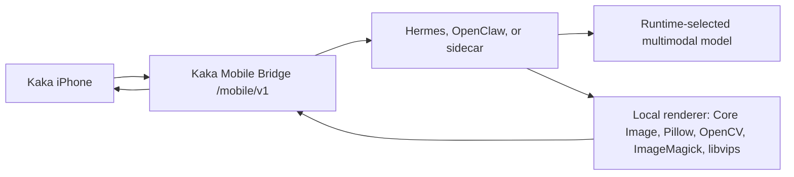

# Kaka Runtime Kit Plan

Updated: 2026-06-02

## Decision

Kaka should not ask normal users to paste a long terminal command for first connection. The product path should be:

1. Install a Hermes/OpenClaw plugin or skill.
2. Open the runtime UI and enable **Kaka Mobile Bridge**.
3. Kaka iPhone discovers the bridge through Bonjour or scans the displayed QR.
4. iPhone stores only the Mobile Bridge endpoint and mobile token.

The current repository now includes `runtime-kit/` as the development scaffold for that path. It is not yet a full public Hermes/OpenClaw package.

## Architecture

The iPhone remains a thin client. The Mac runtime owns:

- model choice
- model/provider credentials
- vision analysis
- strict recipe generation
- recipe validation
- local rendering
- task state and edited asset storage

Kaka Mobile Bridge is the stable boundary between the phone and any compatible runtime.



## Safety Boundary

- Skill/plugin install must not auto-start a server.
- Default bind is loopback only.
- LAN and Bonjour are explicit user choices.
- Start-at-login is an opt-in setting, default off.
- Pairing codes are short-lived in production.
- Mobile bearer tokens are revocable.
- Provider API keys never move to iPhone.
- Doctor/status commands must redact secrets.

## Implementation Plan

### Milestone 1: Runtime Kit Scaffold

Status: implemented in this pass.

- Add `runtime-kit/kaka_mobile_runtime_kit`.
- Provide `doctor`, `start`, and `pairing-url` commands.
- Default to `recipe_local`.
- Support `--runtime hermes` and `--runtime openclaw`.
- Refuse Bonjour for iPhone unless a reachable LAN host is explicit.
- Add tests for command construction and safety validation.

### Milestone 2: Hermes Plugin Packaging

Status: planned.

- Convert the scaffold into an installable Hermes plugin.
- Add a visible **Kaka Mobile Bridge** toggle.
- Add **Show QR**, **Stop**, **Revoke iPhone**, and optional **Start with Hermes**.
- Package from Git or registry. No dedicated server is required just to distribute plugin code.

### Milestone 3: OpenClaw Skill Or Sidecar Packaging

Status: planned.

- Provide the same `/mobile/v1` contract through OpenClaw native integration or sidecar.
- Keep OpenClaw model/provider credentials inside OpenClaw.
- Publish the same `recipe_local` capability shape.

### Milestone 4: Production Pairing

Status: planned.

- Replace development `pair_dev` with short-lived production codes.
- Add token revocation and device list.
- Add trusted local TLS or explicit local-development HTTP policy.
- Add retention policy controls for input and output photos.

## Developer Verification

```bash
PYTHONPATH=runtime-kit:mock_bridge python3 -m kaka_mobile_runtime_kit doctor
PYTHONPATH=runtime-kit:mock_bridge python3 -m kaka_mobile_runtime_kit start --dry-run
PYTHONPATH=runtime-kit:mock_bridge python3 -m pytest runtime-kit/tests mock_bridge/tests/test_photo_pack_provider.py -q
```
