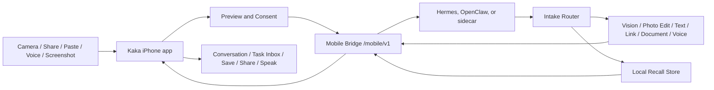

# Kaka Pocket Agents Direction

Updated: 2026-06-13

## Purpose

This document captures the product discussion and current recommendation for evolving Kaka from a single-capture visual agent client into a voice-first Pocket Agents front end.

The near-term implementation truth is now Phase A plus the original camera loop: Kaka focuses on iPhone capture or library selection, `image_intake`, suggested image skills, local vision tasks, local recipe photo editing, Local Agent Lens entry points for Scan/Document/Video/Record/Inbox/Activity, Share Extension inbox capture, real push-to-talk voice follow-up, P3.30 Voice-to-Inbox Draft, P3.32 Inbox Voice Instruction, P3.33 Inbox Instruction Polish, P3.34 Inbox Instruction Templates, P3.36b Explicit Paste-to-Inbox Courier, an opt-in Context Snapshot preview, Recall explicit actions plus result-review provenance, browse/search/export/delete controls, runtime-owned semantic Recall search with provider-backed adapter support, production retrieval packaging readiness, and retrieval materials intake/review, Runtime Kit SQLite persistence for Recall/tasks behind `--runtime-store-path`, runtime settings/status, native runtime packaging scaffolds, Runtime Kit `consumer_ui` and `process_ownership` contracts for Hermes/OpenClaw runtime controls, P2.9 `host-adapter-run` for Mac/runtime-side host action execution, production-capable short-lived QR pairing and mobile token revocation scaffolding, an in-app Runtime Task Inbox foundation, safe foreground App Intent and Action Button review handoff, a Live Activity-safe task-state projection with WidgetKit Lock Screen and Dynamic Island presentation through a user-owned runtime, runtime-side local renderer readiness, phone-facing `photo_edit` capability truth for the current two-variant `recipe_local` renderer, and P3.29 one-shot motion/calendar Context Snapshot sampling.

Pocket Agents remains the next product direction; real host-native Hermes/OpenClaw private adapter APIs, passive context, and production-grade long-running task orchestration remain future phases.

Current UI prototype artifacts:

- presentation visual: `docs/ui/kaka-pocket-agents-presentation.html`
- presentation screenshot: `docs/ui/kaka-pocket-agents-presentation.png`
- `docs/ui/kaka-pocket-agents-prototype.html`
- desktop screenshot: `docs/ui/kaka-pocket-agents-prototype-desktop.png`
- mobile screenshot: `docs/ui/kaka-pocket-agents-prototype-mobile.png`
- app handoff prototype: `docs/ui/kaka-pocket-agents-app-handoff.html`
- app handoff desktop screenshot: `docs/ui/kaka-pocket-agents-app-handoff-desktop.png`
- app handoff mobile screenshot: `docs/ui/kaka-pocket-agents-app-handoff-mobile.png`
- Local Agent Lens reference: `docs/assets/kaka-local-agent-lens-ui-4k.png`
- Local Agent Lens QA receipts: `docs/qa-receipts/local-agent-lens-20260613/`

## Product Thesis

Kaka should become the phone-side front end for local agents.

The phone should own:

- capture from camera, screenshots, share sheet, paste, files, and microphone
- permissioned context collection
- voice interaction
- user confirmation
- result preview, save, share, and recall controls

The local runtime should own:

- model/provider credentials
- model choice and routing
- tool execution
- long-running jobs
- memory and retrieval
- retention policy
- approvals that outlive the current app session

This keeps Kaka aligned with the existing local-first Mobile Bridge boundary: the iPhone is the personal sensor, input, and consent surface; the Mac/runtime is the thinking and execution surface.

P2.9 keeps that boundary intact. The phone connects to Hermes/OpenClaw agents only through Kaka Mobile Bridge `/mobile/v1`, never through private host APIs. `host-adapter-run` is a Mac/runtime-side action surface for install, start-with-runtime, update, uninstall, logs, health, repair, and supervision. Its `mock` adapter is for conformance/local QA, and its `private` adapter returns unavailable until a host-owned command is supplied. Proprietary Hermes/OpenClaw private API implementations remain outside this repository and plug in behind that command. Mutating actions require explicit approval, and install must not auto-start or create a login item.

The user-facing host integration should be a Host Extension, not a manual
adapter exercise. Hermes should expose Kaka as an installable Plugin, and
OpenClaw should expose Kaka as a Skill or sidecar package. The private adapter
command remains host-owned, but in production it should be bundled or internally
discovered by that extension; explicit command paths and
`HERMES_KAKA_HOST_API` / `OPENCLAW_KAKA_HOST_API` are development and pilot
fallbacks only. The ordinary-user promise is: install the plugin/skill, enable
Kaka Mobile Bridge, scan QR or discover Bonjour, and stay on `/mobile/v1`.
The 2026-06-07 P3.6 readiness audit still reports both Hermes and OpenClaw as
blocked until real host-owned install/update/signature/UI/conformance/evidence
materials are supplied; use `docs/kaka-host-extension-external-materials.md` as
the next handoff rather than asking users to configure adapter commands.
P3.8 adds a read-only `local-tls-readiness` contract for production pairing
metadata; it collects non-secret certificate refs and fingerprints without
generating certificates, modifying Keychain, reading private keys, or changing
the phone `/mobile/v1` API.
P3.12 Host Extension Starter Kit now generates a safe Hermes Plugin / OpenClaw
Skill starter package contract and artifact tree so host teams can package Kaka
without turning ordinary users into adapter developers. The starter kit remains
host-side only and does not install packages, start listeners, expose private
host APIs to the phone, or bundle proprietary Hermes/OpenClaw implementation
code.
P3.13 turns the starter-kit output into a host-team installable package handoff
for Hermes Plugin / OpenClaw Skill distribution. It generates package-shaped
host UI, install-drill, release-gate, manifest, and extension-internal adapter
README materials while leaving signing, update channels, proprietary private
adapter implementation, conformance evidence, and final distribution host-owned.
P3.14 is now the completed repo-owned Runtime Kit safety slice for explicit
runtime-side retention purge, dry-run/apply receipts, and schema/tests proving
the phone still cannot trigger cleanup or own retention settings. P3.22 now
extends those receipts to timestamped mock bridge input/output assets while
keeping cleanup explicit and runtime-side. P3.23 now improves Context Snapshot
permission UX by rendering readable preview rows and a preparing state without
changing payload sentinels or adding new permission prompts. P3.29 now adds
permission-gated one-shot motion labels and next-30-minute calendar
availability without changing `/mobile/v1`, prompting implicitly, collecting in
the background, or sending motion history/calendar event details. P3.15 now turns the P3.12/P3.13 host-team handoff into a template-only Host Plugin/Skill
Devkit. The durable product shape is a Hermes Plugin or OpenClaw Skill/sidecar
with an internal adapter command and a native Kaka Mobile Bridge panel. Codex
automation templates may help host teams scaffold and validate those artifacts,
but they are not installed by Runtime Kit and must not become the ordinary-user
install surface.
P3.16 now proves the local `recipe_local` renderer backend through a synthetic
runtime-side readiness probe, and P3.17 aligns the default `photo_edit`
capability with that proof: `return_variants_max` is `2` for the local renderer,
matching `variant_clean_pro` and `variant_social_pop`. P3.27 now adds a local
renderer backend capability manifest so future Core
Image/ImageMagick/OpenCV/libvips work has explicit gates before any dependency,
backend execution, phone capability, or `/mobile/v1` change.
P3.24 now persists store-backed input/output asset bytes in Runtime Kit SQLite
behind `--runtime-store-path`. P3.25 now persists only phone-safe completed
photo-edit result manifests in task metadata, keeps bytes in `runtime_assets`,
rebuilds download links from asset IDs, keeps task lists summary-only, exposes
only `variant_count` in store-backed completed task events, and leaves
installation, private host APIs, Recall writes, provider calls, and phone-owned
retention controls unchanged.

P3.30 **Voice-to-Inbox Draft** is implemented. It reuses
`VoiceCaptureViewModel`, `VoiceCaptureView`, and the existing on-device Speech
transcription path to create a pending text Inbox item from a reviewed
transcript. It does not add a standalone Voice tab, raw audio upload, background
microphone behavior, automatic runtime submission, automatic Recall, or a new
`/mobile/v1` endpoint. P3.36b later adds the narrowed explicit Paste-to-Inbox
path without changing that visible-review boundary.

P3.32 **Inbox Voice Instruction** is implemented. It reuses the same voice sheet
on existing universal-intake Inbox rows, saves the reviewed transcript into
`KakaInboxItem.note`, and still requires the normal visible Inbox `Send` action.
The existing submitter maps that note to `note` and `user_instruction`; this
does not add a Mobile Bridge endpoint, raw audio upload, hidden listening,
automatic runtime submission, automatic Recall, App Intent recording, or Host
Extension packaging.

P3.33 **Inbox Instruction Polish** is implemented. It labels saved instructions,
uses focused presentation copy for add/edit/clear controls, lets users clear
`KakaInboxItem.note` before sending, and shows a send-preview line that the
instruction will be included. The submission boundary stays the same
`note` / `user_instruction` text path after visible Inbox `Send`.

P3.34 **Inbox Instruction Templates** is implemented. Universal-intake Inbox
rows now expose deterministic local chips for Summarize, Extract Actions,
Translate, and Ask Follow-up. Tapping a chip only writes the selected template
text into `KakaInboxItem.note`; the user still reviews and presses visible
`Send` before the runtime receives existing `note` / `user_instruction` text.
P3.34 adds no endpoint, audio upload, automatic submission, automatic Recall,
App Intent recording, provider call, or Host Extension packaging change.

P3.38 **Explicit Files-to-Inbox Import** is implemented as a repo-owned Inbox
product slice while real Host Extension package facts remain blocked. It adds a
visible Files button inside the main app Inbox, accepts one supported PDF or
image selected through the system picker, copies the selected file into the
existing App Group payload store, creates a pending `KakaInboxItem` with
`sourceSurface = "file_picker"`, and still waits for visible Inbox `Send`. It
does not scan folders in the background, auto-upload, auto-submit, auto-Recall,
add a `/mobile/v1` endpoint, add an App Intent submit path, or change Host
Extension packaging.

P3.39 **Inbox Pending Item Discard** is implemented as the next Inbox review
polish slice. It adds a visible row-level Discard control for a pending Inbox
item before `Send`, removes only the selected local `KakaInboxItem` through
`KakaInboxStoring.remove(id:)`, and relies on the existing store removal path to
delete any Kaka-copied `SharedPayloads` payload. It does not upload, submit,
cancel runtime tasks, delete Recall, add a `/mobile/v1` endpoint, add an App
Intent, scan folders, delete the user's original Files/Photos source, or change
Host Extension packaging.

P3.40 **Inbox Discard Confirmation** is implemented as the safety follow-up to
P3.39. The row-level Discard control now opens a visible confirmation dialog,
and only the destructive confirm action calls the existing local discard path.
Cancel or dismissal leaves the pending item and copied payload untouched. It
does not upload, submit, cancel runtime tasks, delete Recall, add a
`/mobile/v1` endpoint, add an App Intent, scan folders, delete the user's
original Files/Photos source, or change Host Extension packaging.

P3.41 **Inbox Action Feedback Banner** is implemented as the next visible
review-loop polish slice. Inbox now renders failed actions and in-flight
submission progress from existing local `InboxViewModel.state` and
`progressText`, and failures can be dismissed locally. It does not retry, submit
automatically, cancel runtime tasks, write or delete Recall, add a
`/mobile/v1` endpoint, add an App Intent, delete source files, or change Host
Extension packaging.

P3.42 **Inbox Pending Item Review Details** is implemented as the next local
pre-`Send` review polish slice. Pending Inbox rows now expose a row-level
Review Details toggle that renders existing item metadata through
`InboxPendingItemReviewPresentation`: source/type, bounded text or URL excerpt,
file name/type, local copied-payload state, saved instruction, route,
locale/profile when present, and Context Snapshot inclusion state. It does not
compute file size, read payload bytes, fetch URLs, parse PDFs/OCR, summarize
content, submit, write/delete Recall, add a `/mobile/v1` endpoint, add an App
Intent, delete source files, or change Host Extension packaging.

M1 **Local Agent Lens / Quiet Lens UI** is implemented as the current main-line
phone-native surface. Capture now opens with a local connection-aware Lens Hub
and six first-mile actions: scanner, document scan, video intake, voice record,
Inbox review, and Activity. Scanner actions remain explicit; document scan and
short video intake create visible Inbox drafts; App Intents, Shortcuts, and
Action Button hand off only to foreground Kaka surfaces; ActivityKit renders
phone-safe phase, approval, progress, and short message fields. This slice does
not add cloud relay, public-internet remote access, VPN/Tailscale dependency,
hidden uploads, background recording, automatic Recall, or Host Extension
installation changes.

Implementation implication: future host-side work should improve the
plugin/skill package, host UI panel, install drill, release gates, and evidence
collection. It should not move runtime settings, private adapter wiring, or
host-private APIs into the iPhone app, and it should not make ordinary users
write adapter code or export environment variables.

Plugin/skill implementation implication: distinguish the host-native install
artifact from developer automation. Hermes Plugin and OpenClaw Skill/sidecar are
the user-facing packages. Runtime Kit commands generate contracts and starter
materials. A Codex developer plugin or Codex skill can help host engineers
scaffold, validate, and review those materials, but it should not be presented
as the normal user install path.

Future-development gate: if a plan proposes a plugin or skill, it must state
which surface it changes. Host-native package work can improve Hermes/OpenClaw
installation, host UI, QR/Bonjour pairing, lifecycle controls, and evidence.
Codex plugin/skill work can only generate or validate host-team developer
source under an explicit output directory. It must not write `~/plugins`,
`~/.codex/skills`, or `~/.agents/plugins`, update a marketplace, start the
bridge, invoke private adapters, or become ordinary-user onboarding.

Implementation implication: P3.18 now generates host-team Codex developer
plugin source only. It uses explicit output directories, runtime-specific source
roots, closed schema validation, and safety flags proving no Codex marketplace
update, no user-home install write, no Hermes/OpenClaw package install, no
bridge startup, no private adapter invocation, no conformance run, and no phone
API change. Real user adoption still depends on the host-native Hermes Plugin /
OpenClaw Skill path and the P3.7 external install drill once host-owned
materials arrive.

Implementation implication for P3.19: use
`docs/kaka-host-extension-install-experience-spec.md` before adding more
installation work. The next install-focused slice should improve the
host-native Plugin/Skill package, host UI acceptance contract, install-drill
runbook, or release gates. It should not convert Codex developer automation or
Runtime Kit command chains into the normal user setup.

Latest install-focused refinement: P3.31 Host Extension User Quickstart
(`docs/superpowers/plans/2026-06-11-kaka-pocket-agents-host-extension-user-quickstart.md`)
extends the existing `host-extension-install-package` output with
ordinary-user quickstart copy and a user-journey acceptance artifact. It keeps
the future implementation on the host-native Hermes Plugin / OpenClaw Skill
path and avoids creating another wrapper, phone-side private host API, or public
Codex install flow.

Latest install-focused refinement: P3.35 Host-Native Plugin/Skill Installation
Blueprint is implemented from
`docs/superpowers/plans/2026-06-11-kaka-pocket-agents-host-native-installation-blueprint.md`.
It extends the existing `host-extension-install-package` handoff with
`installation_blueprint` and `host-ui/installation-blueprint.json`; it does not
add a public installer, public Codex plugin/skill, private host API, or
`/mobile/v1` change.

## External Signals

The research and open-source landscape supports this direction, but also argues for careful scope.

- Smartphone GUI-agent papers such as AppAgent and Mobile-Agent show that multimodal agents can operate mobile apps by observing screens and producing bounded actions. They also show why full autonomy should be treated carefully.
- AndroidWorld gives a reality check: mobile-agent benchmarks are still difficult, so Kaka should start with user-approved intake, guidance, and confirmations instead of unsupervised cross-app control.
- UI-understanding work such as Ferret-UI and OmniParser supports screenshot Q&A and interface guidance as a practical intermediate step.
- High-star tools such as scrcpy, LocalSend, Home Assistant, Termux, and mobile-agent projects show demand for device-to-device control, local automation, file/link movement, and phone-as-compute-node workflows.
- Apple's platform direction favors explicit extension points: Share/Action Extensions, App Intents, Speech, ActivityKit, Core Location, Core Motion, EventKit, and system share sheets. Kaka should use these system surfaces rather than background scraping.

Reference links:

- AppAgent: https://arxiv.org/abs/2312.13771
- Mobile-Agent: https://arxiv.org/abs/2401.16158
- AndroidWorld: https://arxiv.org/abs/2405.14573
- OmniParser: https://github.com/microsoft/OmniParser
- Apple App Extensions: https://developer.apple.com/documentation/technologyoverviews/app-extensions
- Apple App Intents: https://developer.apple.com/documentation/appintents
- Apple Speech: https://developer.apple.com/documentation/speech/
- Apple ActivityKit: https://developer.apple.com/documentation/activitykit

## Candidate Capabilities

### 1. Share To Kaka Inbox

This is the highest-value next expansion after image intake.

Users should be able to share text, links, screenshot images, PDFs, images, and small files into Kaka from any app. Kaka turns each input into an inbox item, asks the runtime to classify it, then offers actions such as summarize, translate, extract tasks, explain visible UI, enhance photo, save to Recall, or continue by voice.

Why it matters:

- It turns Kaka into a system-wide entry point without requiring global app control.
- It fits iOS well through Share/Action Extensions.
- It generalizes the current `image_intake` pattern into universal intake.

Phase A implementation shape:

- iOS Share Extension target `KakaShareExtension`.
- App Group inbox store using `group.dev.kartz.Kaka`.
- Share Extension captures text, URL, image, and PDF-visible file payloads into local JSON plus copied payload files. Screenshots shared from Photos or Files are captured as image payloads in this slice.
- Main-app Files import is a separate explicit surface: the user taps a visible
  Files button, picks one supported PDF or image, and Kaka saves it as a pending
  Inbox item before any runtime submission.
- Main app exposes an Inbox tab while connected to a runtime.
- Text and URL inbox items submit through `POST /mobile/v1/tasks/intake`.
- Shared image payloads, including screenshots represented as images, route through the existing `image_intake` path so image conversation behavior is preserved.
- Shared PDFs are captured locally in the inbox; after a visible main-app Send action, Kaka uploads the PDF as a generic asset and submits it through universal intake with the returned `asset_id`.
- The extension does not silently upload shared content.

### 2. Permissioned Context Snapshot

Context Snapshot is not just recording information. Its job is to tell the agent the user's current situation so it can make better decisions with fewer follow-up questions.

Examples:

- If the user is walking or driving, replies should be shorter and voice-first.
- If the battery is low, Kaka should prefer quick local actions and avoid long background workflows.
- If the calendar has a short free window, the agent can suggest a small task instead of a deep workflow.
- If a screenshot came from a share action, the agent can connect source, time, and current conversation without asking the user to re-explain.
- If the user is near a place where a receipt was captured, Recall can later label it more usefully.

Recommended boundary:

- Make snapshots explicit and per-task by default.
- Show a compact preview of what will be sent.
- Keep coarse location and state labels unless the user asks for precise data.
- Separate `use once` from `remember this`.
- Do not make passive background tracking part of the MVP.

Potential snapshot fields:

- timestamp, locale, timezone
- coarse location label or user-approved precise location
- motion state, such as stationary, walking, driving, or unknown
- network and battery state
- current Kaka conversation and source surface
- optional calendar availability, not full calendar contents by default
- optional user note spoken during capture

### 3. Clipboard And Link Courier

Kaka should not compete with Apple's Universal Clipboard. The value is not moving text between devices; the value is transforming, acting on, and remembering what the user intentionally sends.

Examples:

- Paste copied text into Kaka and ask for rewrite, translation, tone adjustment, or extraction.
- Share a link and ask the runtime to summarize, compare, archive, or add it to Recall.
- Paste an error message from the phone and ask a Mac-side coding agent to investigate.
- Send a copied address, event text, or tracking number to the local runtime for structured handling.

Privacy boundary:

- Use explicit paste controls, share sheet, or user actions.
- Do not poll or read the general pasteboard in the background.
- Treat pasteboard content as sensitive by default.

2026-06-11 sequencing decision: do not use Clipboard/Link Courier as P3.30.
It overlaps with Share Extension link capture and carries pasteboard privacy
ambiguity, so the implementation is narrowed to **P3.36b Explicit
Paste-to-Inbox Courier** rather than a broad clipboard/link feature.

P3.36b is implemented as a visible Inbox Paste action. It reads clipboard text
once, trims it, creates a pending `.text` or http/https `.url` Inbox item with
`sourceSurface = "paste"`, and still requires visible Inbox `Send`. It does not
add background pasteboard reading, app-launch pasteboard access, URL
fetching/previewing, binary/file paste import, automatic submission, automatic
Recall, a new `/mobile/v1` endpoint, or host installation work.

### 4. Voice Walkie-talkie

Voice should be the main interaction style for Pocket Agents.

Recommended MVP:

- push-to-talk inside Kaka
- live transcription or recorded transcription
- short voice replies through system speech synthesis
- transcript always visible and editable before high-impact actions
- runtime confirmation cards for actions like remember, send, delete, or execute

What not to do first:

- no always-on wake word
- no background microphone listener
- no hidden transcription
- no autonomous action from ambiguous speech

This gives the user the feeling of talking to a pocket agent while staying inside iOS permission and trust boundaries.

P3.30 extends B.1 by adding Voice-to-Inbox Draft: from the Inbox, the user
opens the existing voice draft sheet, records or edits a transcript, and saves
that transcript as a pending `.text` Inbox item. The item remains visible and
requires the normal Inbox `Send` action before the runtime receives it.

P3.32 extends the same boundary to existing universal-intake Inbox rows: the
user opens a row-level Voice Instruction action, reviews the transcript, and
saves it into `KakaInboxItem.note`. The note is submitted only through the
existing Inbox `Send` path as `note` and `user_instruction`; images still stay
on `image_intake`, and no audio upload or automatic submit path is added.

### 5. Screenshot Q&A And UI Guidance

Screenshot Q&A is safer and more useful than full cross-app automation on iOS.

Flow:

1. User shares a screenshot to Kaka.
2. Kaka runs screenshot intake.
3. The runtime identifies visible UI, text, controls, and likely task intent.
4. Kaka replies with guidance such as "tap Settings, then Subscriptions" or explains an error message.
5. The user decides whether to follow the guidance.

This pairs well with existing `image_intake` and `vision` work. It can use OCR and UI parsing without requiring Kaka to control other apps.

### 6. Personal Recall

Recall should be local-first, explicit, inspectable, and erasable.

Recommended rule:

- Nothing goes into long-term memory by default.
- Every item starts as an inbox or conversation artifact.
- The user can choose `Remember`, `Use Once`, or `Forget`.

Runtime-side storage should own:

- original artifact or a redacted pointer
- extracted text
- summary
- embeddings or retrieval index
- source type
- permission state
- deletion state
- provenance back to the task that created it

The Runtime Kit persistence execution slice adds a SQLite-backed local store on the Mac/runtime side for Recall records, retrieval-index deletion receipts, runtime task records, and task events. `--runtime-store-path` is the development opt-in for store-backed bridge behavior. The option belongs to the runtime launcher/server, not to Mobile Bridge requests from the iPhone.

iPhone-side UI should own:

- browse/search
- "why is this remembered?"
- delete/forget controls
- export request entrypoint

Export should be explicit and JSON-first: it returns the Recall metadata, summaries, timestamps, and provenance the runtime currently retains. P3.20 labels this export as `kaka.recall_export.v1` and attaches an artifact policy so the package remains user-readable Recall data rather than a SQLite/database dump. Exported item data is limited to item ID, summary, created timestamp, and provenance; embeddings, retrieval-index rows, provider endpoints or keys, bearer/mobile tokens, SQLite paths, hidden prompts, raw provider responses, unrelated task logs, raw asset bytes, and unconfirmed Context Snapshot content stay out of the artifact. `Forget` and `DELETE /mobile/v1/recall/items/{item_id}` should return deletion receipts; `deleted_index_ids` means the runtime removed retrieval-index records associated with the deleted Recall item.

## Proposed Architecture

The current `image_intake` task can become the first specialization of a broader `intake` family. The future API should preserve the same shape: upload or attach an artifact, start an intake task, receive a structured result with suggestions, then let the user choose the next action.

## Recommended Roadmap

### Phase A: Universal Intake And Share To Kaka

Goal: let Kaka receive content from outside the camera flow.

Status as of 2026-06-05: implemented as the first share inbox slice.

Deliverables:

- iOS Share Extension for text, URL, image, and PDF capture; screenshots are captured as images in this slice
- app-side `KakaInboxItem` and App Group-compatible `FileKakaInboxStore`
- runtime-side `intake` protocol and mock bridge endpoint for text, URL, image, and PDF asset intake
- basic action suggestions for text, URL, image, and PDF intake results
- main app Inbox tab for connected runtimes
- tests for plist/entitlements, inbox persistence, bridge submission, and image route preservation

Exit criteria:

- A URL shared from Safari can become an inbox item and submit to `/mobile/v1/tasks/intake`.
- Shared text can submit to `/mobile/v1/tasks/intake` and return summary/action suggestions.
- A screenshot shared as an image keeps the existing `image_intake` route.
- A PDF shared to Kaka is captured into the App Group inbox, then uploads from a visible main-app Send action and submits to `/mobile/v1/tasks/intake` with an `asset_id`.

### Phase B: Voice-first Conversation

Goal: make Kaka feel like a pocket agent rather than a form-based tool.

Status as of 2026-06-11: B.1 real push-to-talk voice is implemented in the image conversation flow, P3.30 Voice-to-Inbox Draft is implemented in the Inbox flow, P3.32 Inbox Voice Instruction is implemented for existing universal-intake Inbox rows, P3.33 Inbox Instruction Polish makes those instructions labeled, editable, clearable, and previewed before send, and P3.34 Inbox Instruction Templates adds deterministic local chips for common note instructions. Kaka records only after an explicit press, transcribes with iOS Speech on device, shows an editable transcript, and uses text-only submission paths. Raw microphone audio stays local and temporary; always-on listening and hidden transcription remain out of scope. Voice-to-Inbox creates a pending text Inbox item from the reviewed transcript; Inbox Voice Instruction and template chips save text into `KakaInboxItem.note`; all still require visible Inbox `Send` before the runtime receives anything.

Deliverables:

- push-to-talk capture: B.1 implemented in the image conversation voice sheet
- transcription state model: B.1 implemented through `VoiceCaptureViewModel`
- text submit to the current image or inbox conversation: B.1 implemented for image conversation; P3.30 implements the Inbox draft path without auto-submitting; P3.32 implements row-level Inbox instruction notes without auto-submitting; P3.33 makes instruction edit/clear and send-preview behavior explicit; P3.34 adds deterministic local instruction templates without auto-submitting
- spoken response for short answers: B.1 implemented through system speech synthesis
- confirmation cards for high-impact actions

Exit criteria:

- User can capture an image, speak a follow-up, review/edit the transcript, submit text, hear a short answer, and see the transcript.
- Potentially destructive or persistent actions still require visible confirmation.

### Phase C: Permissioned Context Snapshot

Goal: give the runtime situational context without background surveillance.

Status as of 2026-06-11: permission-aware slice implemented for Inbox universal intake, with C.1b adding a one-shot coarse network path probe and P3.29 adding permission-gated one-shot current motion plus next-30-minute calendar availability. The preview defaults off, denied or unavailable field statuses do not block intake, and snapshots are sent only when the runtime advertises `supports_context_snapshot`. The collector now adds task-scoped network, battery, motion, location authorization/precision, and calendar availability without sending SSIDs, BSSIDs, carrier names, IP addresses, hostnames, coordinates, motion history, accelerometer samples, routes, speed, confidence, event titles, attendees, notes, locations, descriptions, calendar identifiers, event bodies, or background histories.

Deliverables:

- context preview sheet
- coarse location, time, device state, and source surface fields
- per-task `include_context` control
- bridge payload schema for context
- privacy doc and tests proving denied permissions do not block core intake

Exit criteria:

- User can include a one-time context snapshot with a task.
- Kaka can explain exactly what context was sent.
- No snapshot is written to Recall unless the user confirms.

### Phase D: Recall v0

Goal: let the user explicitly save useful artifacts and retrieve them later.

Status as of 2026-06-11: D.0 explicit actions, D.1 browse/search/export, Runtime Kit SQLite persistence, runtime-owned semantic Recall search, provider-backed retrieval adapter support, P3.20 export artifact policy, P3.21 production retrieval packaging readiness, P3.22 timestamp-aware mock bridge asset purge receipts, P3.24 SQLite-backed asset storage/retention, P3.25 store-backed task result detail persistence, P3.26 Recall retrieval material intake/review, P3.23 Context Snapshot permission UX, P3.29 Context Snapshot motion/calendar, P3.37 Inbox Result Review Provenance, P3.39 Inbox Pending Item Discard, P3.40 Inbox Discard Confirmation, P3.41 Inbox Action Feedback Banner, and P3.42 Inbox Pending Item Review Details are implemented in the current working tree. `remember`, `use_once`, and `forget` have Mobile Bridge contracts, Swift client models, mock bridge endpoints, visible confirmation UI, and an Inbox result entry point. Completed Inbox result banners now show source/context review copy and pass both `source_task_id` and `source_inbox_item_id` into explicit Recall actions. Pending Inbox discard is local-only before `Send`, now confirmation-gated, and is not Recall deletion or runtime task cancellation. Inbox also renders failed action feedback and in-flight submission progress locally without retrying or cancelling runtime work. Pending item Review Details are local-only before `Send` and expose only existing item metadata without fetching URLs, reading files, parsing PDFs/OCR, or changing Mobile Bridge/Recall behavior. The connected app now has a Recall tab backed by queryable item listing, semantic search with fallback, export, and delete responses that include retrieval-index deletion receipts. A bridge launched with `--runtime-store-path` stores Recall content, deletion receipts, task records, task events, and Runtime Kit asset bytes in SQLite; completed photo-edit task detail can be rehydrated from phone-safe metadata, while `/mobile/v1/runtime/settings` reports store and semantic Recall status without moving settings ownership to the phone.

Deliverables:

- runtime-side local memory store: D.0 mock bridge in-memory store implemented; Runtime Kit SQLite store implemented behind `--runtime-store-path`
- inbox/result `Remember`, `Use Once`, and `Forget` actions: D.0 implemented for Inbox results; P3.37 now preserves both task and source Inbox item provenance from the completed result banner
- pending Inbox discard before `Send`: P3.39 implemented as a local-only row action that removes one pending item and any Kaka-copied payload without touching Recall or runtime tasks; P3.40 adds visible confirmation before that local removal executes
- Inbox action feedback: P3.41 renders failed Inbox actions and in-flight submission progress locally without retry, automatic submission, runtime cancel, Recall writes/deletes, or Mobile Bridge changes
- pending item Review Details: P3.42 renders existing local pending item metadata in a row-level details expansion before `Send` without URL fetch, file reads, PDF/OCR parsing, automatic submission, Recall writes/deletes, Mobile Bridge changes, or Host Extension packaging changes
- mobile bridge actions: D.0 implements `POST /mobile/v1/recall/actions`, `GET /mobile/v1/recall/items`, `DELETE /mobile/v1/recall/items/{item_id}`
- standalone iPhone Recall action ViewModel/View for visible confirmation: D.0 implemented
- search and retrieval endpoint: D.1 queryable item list and additive `POST /mobile/v1/recall/search` implemented; provider-backed retrieval adapters, P3.21 read-only production packaging readiness, and P3.26 local materials intake/review are available behind the same runtime-owned boundary
- iPhone Recall browsing UI: D.1 Recall tab implemented beyond the current action entry point
- deletion and export paths: D.1 export endpoint and retrieval-index deletion receipts implemented; runtime index deletion remains runtime-owned
- runtime persistence: Runtime Kit SQLite storage implemented behind `--runtime-store-path` for Recall content, index receipts, JSON export, runtime tasks, task events, input/output assets, explicit retention purge, and phone-safe completed task result metadata

Exit criteria:

- D.0: User can confirm `Remember`, `Use Once`, or `Forget` from an Inbox result, including results produced from shared links and screenshots.
- P3.37: Completed Inbox result review shows source/context copy, and explicit Recall actions include both task and source Inbox provenance when available.
- P3.39/P3.40: User can discard a pending Inbox item before `Send` only after visible confirmation; this removes Kaka's local copy only and does not cancel submitted work or delete Recall.
- P3.41: User can see local failure/progress feedback for Inbox actions, and can dismiss failure feedback without changing the pending queue or runtime state.
- D.1: Text search retrieves remembered items with provenance through the Recall tab.
- D.1: Delete responses identify both content and retrieval index entries removed by the runtime.

### Phase E: Task Inbox, App Intents, And Live Activity

Goal: make local runtime jobs visible and controllable from the phone.

Status as of 2026-06-05: E.0 Runtime Task Inbox foundation, the E.1 system-surface foundation, E.1b WidgetKit Live Activity presentation, and E.1c Action Button review handoff are implemented. Kaka has Swift task summary models, a connected Tasks tab, mock Mobile Bridge endpoints for listing, cancelling, and approving runtime tasks, foreground App Intents and Action Button-reachable shortcuts that open Kaka to Inbox or Tasks review surfaces, and an ActivityKit-safe runtime-task projection. Durable task state and task events are runtime-owned through the Runtime Kit persistence slice.

Deliverables:

- task inbox for running, waiting, failed, and completed jobs: E.0 implemented
- approval cards/actions for runtime work: E.0 approval endpoint and in-app action implemented
- durable task records and event history: Runtime Kit SQLite persistence implemented behind `--runtime-store-path`, owned by the Mac/runtime side
- Live Activity for long-running agent tasks where appropriate: E.1 task-state pipeline and E.1b WidgetKit Lock Screen/Dynamic Island presentation implemented
- App Intents for opening common review surfaces through Siri, Shortcuts, Spotlight, widgets, or Action Button: E.1 foreground Inbox/Tasks handoff and E.1c Action Button review handoff implemented

Exit criteria:

- E.0: Runtime tasks can be viewed from iPhone.
- E.0: User can approve or cancel a task from Kaka.
- E.1: Shortcuts/App Intents can open safe Inbox/Tasks review surfaces without hidden listeners.

### Phase F: Runtime Host Extension Readiness

Goal: make Hermes/OpenClaw installation and runtime settings ordinary-user
friendly without moving host-owned controls into the phone app.

Status as of 2026-06-11: P3.5 Host Extension productization, P3.6 distribution
readiness, P3.8 local TLS metadata readiness, P3.9 runtime-side retention
policy controls, P3.10a local HTTPS serving, P3.10b iOS trust/pinning
integration, P3.11 native connection polish, P3.12 Host Extension Starter Kit,
P3.13 Host Extension installable package handoff, P3.14 runtime retention purge
receipts, P3.15 Host Plugin/Skill Devkit, P3.16 local renderer backend
readiness, P3.17 photo-edit variant truth, P3.17b photo-edit MIME truth, P3.18
Host Codex developer plugin source, P3.19 Host Extension install experience
acceptance, P3.24 SQLite-backed asset storage/retention, P3.25 store-backed
task result detail persistence, P3.26 Recall retrieval material intake/review,
P3.27 local renderer backend capability manifest, and P3.35 Host-Native
Plugin/Skill Installation Blueprint are implemented as Runtime Kit or
phone-safe contracts. P3.7 external install drill is waiting on real host-owned
Plugin/Skill materials.
P3.28 now gives host teams a read-only local material review command:
`host-extension-material-intake --manifest /path/to/materials.json`. It reviews
host-owned package facts plus install-drill refs without installing, signing,
publishing, fetching refs, starting the bridge, invoking private adapters,
changing `/mobile/v1`, or turning Codex automation into ordinary-user
onboarding. If the next work is not installation-focused, choose an independent
repo-owned product slice rather than adding another host-extension wrapper.

Deliverables:

- Host Extension install drill: waits for real Hermes/OpenClaw install command,
  update channel, signed package ref, signature ref, conformance report, and
  evidence manifest
- retention policy controls: completed P3.9 runtime-side controls for input asset,
  output asset, and task-history retention days
- retention enforcement and purge receipts: completed P3.14 explicit
  runtime-side `retention-purge` dry-run/apply action with a closed receipt
  schema, no background cleanup, no phone-triggered purge, terminal-task store
  cleanup, P3.22 timestamp-aware mock bridge input/output asset purge receipts,
  preserved untimestamped assets, and no Recall deletion outside explicit user
  `Forget`/delete actions
- local TLS serving and trust integration: completed P3.10a Runtime Kit local
  HTTPS serving and P3.10b iOS trust/pinning from non-secret
  `tls_public_key_sha256`, while certificate provisioning remains host-owned
- native connection polish: completed P3.11 SwiftUI connection, pairing,
  saved-connection recovery, local network, TLS/certificate, and host-owned
  recovery states based on existing phone-safe contracts
- Host Extension package handoff: completed P3.13 host-team package materials for
  Hermes Plugin / OpenClaw Skill distribution, without moving proprietary host
  APIs or package distribution into Kaka
- Host Plugin/Skill Devkit: completed P3.15 host-team development materials
  index with contract index, command files, acceptance gates, ordinary-user
  boundary metadata, adapter templates, and template-only Codex automation
- Host Codex developer plugin source: completed P3.18 source-only Codex
  developer automation for Hermes/OpenClaw engineers. It writes only under an
  explicit output directory, avoids user-home install roots and marketplaces,
  and does not become the ordinary-user installer
- Host Extension install experience acceptance: completed P3.19
  `host-extension-install-package` hardening with host UI acceptance metadata,
  generated `host-ui/acceptance.json`, ordered install-drill steps, evidence
  receipts, and release gates
- SQLite asset storage and result durability: completed P3.24/P3.25
  store-backed input/output asset persistence, explicit store-backed retention
  purge, and phone-safe completed photo-edit result detail rehydration without
  adding a phone purge endpoint, automatic cleanup, or phone-side settings write
- Recall retrieval packaging support: completed P3.21/P3.26 readiness and
  materials intake/review for local host/runtime-owned retrieval refs, without
  fetching refs, invoking providers, exposing provider endpoints/keys, or
  changing `/mobile/v1/recall/search`
- Local renderer backend readiness: completed P3.16 runtime-side
  `local-renderer-backend-readiness` contract, schema, and CLI. It runs a
  temporary synthetic `recipe_local` render probe and reports
  `ready_for_local_recipe_flow` without adding phone APIs, cloud provider calls,
  persistent asset storage, bridge startup, LAN binding, Bonjour, credential
  inspection, or new renderer dependencies
- Local renderer backend capability manifest: completed P3.27 Runtime Kit
  `local-renderer-backend-capability-manifest` contract, schema, and CLI. It
  records current Pillow/`recipe_local` truth and future Core
  Image/ImageMagick/OpenCV/libvips gates without installing dependencies,
  importing or executing future backends, adding endpoints, changing
  phone-facing capabilities, or changing `/mobile/v1`
- Host Extension material intake: completed P3.28 Runtime Kit read-only intake
  command and schemas for local host-owned Plugin/Skill package facts and
  install-drill refs. It embeds P3.6 readiness, redacts or blocks secret-like
  values, and produces a review receipt for future P3.7 external install-drill
  execution without becoming an installer
- Photo edit capability truth: completed P3.17/P3.17b capability/docs alignment
  so the default `recipe_local` `photo_edit.return_variants_max` is `2` and
  `photo_edit.accepted_mime_types` is `["image/jpeg"]` for the current
  Master/Social local recipe flow
- next repo-owned work should avoid another installation wrapper if external
  P3.7 materials remain blocked. If installation work remains the priority, use
  real-material P3.28 review followed by P3.7, or build only on the completed
  P3.35 Host-Native Plugin/Skill Installation Blueprint boundary. If it is not
  installation work, choose another separately permissioned product-facing
  slice; P3.34 deterministic instruction templates / action chips are now
  implemented

Exit criteria:

- Ordinary users install a Hermes Plugin or OpenClaw Skill, enable Kaka Mobile
  Bridge in the host UI, and pair by QR or Bonjour without writing adapter code
  or setting environment variables.
- Retention windows are visible and configurable in the runtime host shell, while
  the phone only reads them as status.
- Retention cleanup happens only through explicit runtime-owned actions with
  purge receipts; Kaka iPhone does not trigger purge or edit runtime retention
  settings.
- Private adapter commands, package lifecycle actions, and runtime settings stay
  host-owned.
- Host-team developer automation may use Codex skills/plugins, but ordinary
  users install the host-native Hermes Plugin or OpenClaw Skill rather than a
  command-line adapter scaffold.
- P3.19 improved the host-native Plugin/Skill package acceptance artifacts
  without making Codex automation a user setup path.
- A user can describe the setup as "install the Hermes Plugin or OpenClaw Skill,
  enable Kaka Mobile Bridge, scan QR" rather than "write an adapter command."

## Product Boundaries

Do first:

- explicit share, paste, camera, screenshot, and voice input
- local-first runtime execution
- user-visible confirmation
- local Recall with clear controls
- guidance over autonomous cross-app control

Avoid in MVP:

- always-on microphone
- background clipboard reading
- passive location tracking
- automatic reading of all notifications
- autonomous posting, messaging, purchasing, or payment
- unsupervised control of other apps

## First Implementation Slice

The first Pocket Agents slice has expanded from proof-of-concept into a working foundation:

1. Share a URL, text, screenshot image, or image to Kaka.
2. Kaka creates an inbox item.
3. The runtime returns summary plus suggested actions.
4. Image payloads, including screenshots represented as images, continue through the existing image conversation path.
5. Voice follow-up is real push-to-talk with editable on-device transcripts and short spoken replies.
6. `Remember`, `Use Once`, and `Forget` confirmation UI exists, and the Recall tab can browse/search/export/delete D.1 Recall items.
7. Runtime Kit SQLite persistence can keep Recall records, retrieval-index deletion receipts, runtime tasks, and task events when launched with `--runtime-store-path`.

This slice is big enough to prove Pocket Agents, but small enough to stay aligned with the current Mobile Bridge and privacy boundary.

The consumer-visible Hermes/OpenClaw persistence and lifecycle layer now has Runtime Kit plugin-shell contracts through `settings-preview`, `package-preview`, `host-package-preview`, `runtime_side_ui.consumer_ui`, and `runtime_side_ui.process_ownership`, plus disabled-by-default Hermes/OpenClaw shell manifests. That layer keeps search indexes, settings, install/start-at-login/update/uninstall/log/health/repair/supervision actions, and process state runtime-owned, with the iPhone acting only as the visible query, review, and control surface.

The C.1 Context Snapshot collector slice, native Hermes/OpenClaw packaging scaffold, E.1 App Intent/Live Activity-safe task-state foundation, E.1b WidgetKit Live Activity presentation, E.1c Action Button review handoff, production runtime pairing hardening, Hermes/OpenClaw consumer runtime UI contract, P2.7 runtime process ownership contract, P2.8 host packaging handoff contract, P2.9 host adapter binding, P3.1-P3.3 host-private command/package contracts, P3.4a-P3.4j external-pilot support artifacts, P3.5 Host Extension productization contract, and P3.6 Host Extension distribution readiness contract are implemented. P3.6 verifies readiness from host-owned facts: install command, update channel, extension-internal adapter command location, host UI entry point, signed package ref, signature/notarization ref, P3.2 conformance report, and P3.4 evidence manifest. The next development handoff is `docs/kaka-host-extension-external-materials.md`; it turns the current blocked readiness state into a materials checklist and external install drill entry condition. P3.6 does not bind proprietary private APIs into Kaka.

The completed in-repository phone polish slice is P3.11 native connection recovery UI
(`docs/superpowers/plans/2026-06-07-kaka-pocket-agents-native-connection-recovery-ui.md`).
P3.11 improves the phone-side recovery experience using only phone-safe
connection states and copy. P3.13 has improved host-team packaging materials
without claiming that real external Plugin/Skill install evidence is complete.
P3.14 has added explicit runtime retention purge receipts, P3.22 has made
mock bridge input/output asset purge receipts timestamp-aware without adding a
phone purge endpoint, P3.24 has moved input/output asset bytes into Runtime Kit
SQLite when configured, P3.25 has made completed photo-edit result detail
durable through phone-safe task metadata, and P3.23 has made Context Snapshot
permission states readable in the Inbox preview without changing the Mobile
Bridge payload. P3.15 has added a host-team Plugin/Skill devkit without
promoting manual adapter commands to ordinary-user setup. P3.18 has added
source-only Codex developer plugin generation for host engineers, P3.19 has
strengthened the install-package handoff acceptance artifacts, and P3.26 has
added Recall retrieval materials intake/review without implementing production
retrieval or changing the phone API. P3.27 has added local renderer backend
capability planning without implementing future backends or changing the phone
API.

Future development should keep that division: the host extension owns
installation, update, logs, health, runtime settings, private adapter discovery,
and release evidence; Kaka iPhone owns connection status, pairing, visible
recovery guidance, and user consent through `/mobile/v1`.

Follow-up decision for installation work as of 2026-06-11: P3.35 now provides
the host-native Plugin/Skill installation blueprint while real Hermes/OpenClaw
package facts remain unavailable. It specifies package manifests, host UI entry
points, disabled defaults, explicit enable/start, QR/Bonjour, local TLS status,
revoke/re-pair, logs, health, update, repair, uninstall, and P3.7 evidence refs.
It is not a public Codex plugin or Codex skill. Codex automation belongs only to
host engineers as source-generation or validation tooling.

For the next development plan, use this split:

- If real Hermes/OpenClaw package materials exist, write P3.7 external install
  drill steps against `docs/kaka-host-extension-external-materials.md`.
- If installation remains blocked, do not build another wrapper or user-facing
  Codex plugin. P3.31 covers quickstart/user-journey acceptance and P3.35 covers
  the machine-readable installation blueprint on the existing
  `host-extension-install-package` handoff; both keep the host-native
  Plugin/Skill path, `/mobile/v1`, no Codex public install, and no manual
  adapter setup.
- If the next work is not installation-focused, choose the next separately
  permissioned product-facing slice; P3.29 has already completed the Context
  Snapshot motion/calendar step. P3.36a Inbox Voice Capture Context Copy,
  P3.36b Explicit Paste-to-Inbox Courier, and P3.37 Inbox Result Review
  Provenance are now complete. P3.38 Explicit Files-to-Inbox Import is also
  complete as an explicit one-shot Files picker Inbox slice while Host
  Extension materials remain blocked. P3.39 Inbox Pending Item Discard,
  P3.40 Inbox Discard Confirmation, P3.41 Inbox Action Feedback Banner, and
  P3.42 Inbox Pending Item Review Details are also complete as local-only
  pre-`Send` Inbox review slices.
  If installation work must continue while host facts are still missing, prefer
  host-extension material intake or acceptance receipts over another wrapper.

## Open Decisions

- Should the external brand remain Kaka while the category becomes Pocket Agents, or should Pocket Agents become a visible product name?
- Should the first production provider-backed Recall retrieval package use Hermes/OpenClaw-native embeddings, a sidecar adapter, or a capability-negotiated hybrid? P3.21 now supports all three as readiness strategies, but the real production choice remains host/runtime-owned.
- Should the PDF upload size limit remain the Phase A.1 default of 25 MB, or move to runtime capability negotiation?
- Should context snapshots default to off per task, or should Kaka ask once and remember a scoped preference?

Resolved as of 2026-06-05:

- Runtime Kit provides the default local Recall/task store behind `--runtime-store-path`; Hermes/OpenClaw packaging should expose that as a runtime-side setting.
- Voice transcription starts on-device first through iOS Speech; runtime-side transcription can be added later as a separate capability.
- P3.32 keeps Inbox voice instructions phone-owned and text-only: the reviewed
  transcript is saved into `KakaInboxItem.note`, then submitted only by visible
  Inbox `Send` through existing universal intake fields `note` and
  `user_instruction`.
- P3.33 keeps Inbox instruction polish phone-owned: edit, clear, and
  send-preview copy are local UI/ViewModel behavior around `KakaInboxItem.note`,
  not audio transport, new Mobile Bridge fields, or automatic submission.
- P3.34 keeps Inbox instruction templates phone-owned: template chips write
  deterministic text into `KakaInboxItem.note`, and the runtime receives it only
  after visible Inbox `Send` through existing `note` / `user_instruction`.
- Semantic Recall starts with deterministic runtime-owned local scoring behind `POST /mobile/v1/recall/search`; provider-backed retrieval now plugs into the same boundary through an explicit runtime-owned adapter, P3.21 provides a read-only readiness contract for production packaging refs, and P3.26 adds local materials manifest intake/review without fetching refs or invoking providers.
- Runtime Kit `settings-preview` and `package-preview` are the plugin-shell contracts for runtime-side store path, Recall retrieval provider, LAN/Bonjour, QR, start/stop controls, and process lifecycle controls; `/mobile/v1/runtime/settings` remains phone-safe status only.
- Runtime Kit `consumer_ui` is the renderer contract for Hermes/OpenClaw ordinary-user settings controls, `process_ownership` is the runtime-side lifecycle contract for install/start-at-login/update/uninstall/logs/health/port-conflict repair, `host-package-preview` is the P2.8 host packaging handoff contract, and P2.9 `host-adapter-run` is the Mac/runtime-side host action surface. These are derived from the same settings/package preview source of truth and do not move runtime settings onto the iPhone.
- The API surfaces are distinct: Kaka iPhone connects through the local Mobile Bridge `/mobile/v1` API; Hermes/OpenClaw shells render Runtime Kit preview JSON/CLI contracts; host actions execute through Mac/runtime-side `host-adapter-run`; `mock` is conformance/local QA and `private` returns unavailable until a host-owned command is supplied. Real Hermes/OpenClaw private APIs stay behind that command and outside the Kaka repository.
- Context Snapshot collectors are permission-aware, task-scoped, and previewed. C.1b resolves richer network status as a one-shot coarse path probe, and P3.29 resolves current motion plus next-30-minute calendar busy-window labels as one-shot gated probes. Denied permissions do not block intake, no motion history/calendar event detail is sent, and snapshots are not written to Recall without explicit `Remember`.
- Recall export is now policy-labeled as `kaka.recall_export.v1`. The export remains a JSON-first user artifact and not a runtime database dump; future Recall work must keep embeddings, retrieval-index rows, provider secrets, tokens, SQLite paths, hidden prompts, raw provider responses, unrelated task logs, and unconfirmed Context Snapshot content out of exported item data.
- Recall retrieval production packaging is now readiness-gated by `kaka.recall_retrieval_readiness.v1` and material-intake-gated by `kaka.recall_retrieval_material_intake.v1`. The intake command consumes a local `kaka.recall_retrieval_materials.v1` manifest, blocks missing or secret-like materials, and still does not invoke providers, fetch refs, expose provider endpoints/keys to iPhone, or change `/mobile/v1/recall/search`.
- Local photo rendering remains runtime-owned. P3.16 proves the current
  `recipe_local` PIL renderer path through a temporary synthetic render probe;
  P3.17 aligns the default phone-facing `photo_edit` capability to two variants,
  P3.17b narrows only default photo-edit MIME truth to JPEG, and P3.27 records
  future Core Image, ImageMagick, OpenCV, or libvips backend gates without
  adding those dependencies. Future renderer backends should satisfy the P3.27
  manifest gates and P3.16 readiness proof rather than changing the phone API.
- P3.15 installation ergonomics are resolved at the host-extension layer:
  Hermes/OpenClaw ordinary users should install a host-native Plugin/Skill,
  while any Codex skill/plugin automation is only for host-team scaffolding,
  validation, and release-gate work.
