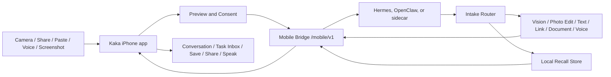

# Kaka Pocket Agents Direction

Updated: 2026-06-04

## Purpose

This document captures the product discussion and current recommendation for evolving Kaka from a single-capture visual agent client into a voice-first Pocket Agents front end.

The near-term implementation truth is still narrower: Kaka currently focuses on iPhone capture or library selection, `image_intake`, suggested image skills, local vision tasks, and local recipe photo editing through a user-owned runtime. Pocket Agents is the next product direction, not a claim that all features are already implemented.

Current UI prototype artifacts:

- presentation visual: `docs/ui/kaka-pocket-agents-presentation.html`
- presentation screenshot: `docs/ui/kaka-pocket-agents-presentation.png`
- `docs/ui/kaka-pocket-agents-prototype.html`
- desktop screenshot: `docs/ui/kaka-pocket-agents-prototype-desktop.png`
- mobile screenshot: `docs/ui/kaka-pocket-agents-prototype-mobile.png`
- app handoff prototype: `docs/ui/kaka-pocket-agents-app-handoff.html`
- app handoff desktop screenshot: `docs/ui/kaka-pocket-agents-app-handoff-desktop.png`
- app handoff mobile screenshot: `docs/ui/kaka-pocket-agents-app-handoff-mobile.png`

## Product Thesis

Kaka should become the phone-side front end for local agents.

The phone should own:

- capture from camera, screenshots, share sheet, paste, files, and microphone
- permissioned context collection
- voice interaction
- user confirmation
- result preview, save, share, and recall controls

The local runtime should own:

- model/provider credentials
- model choice and routing
- tool execution
- long-running jobs
- memory and retrieval
- retention policy
- approvals that outlive the current app session

This keeps Kaka aligned with the existing local-first Mobile Bridge boundary: the iPhone is the personal sensor, input, and consent surface; the Mac/runtime is the thinking and execution surface.

## External Signals

The research and open-source landscape supports this direction, but also argues for careful scope.

- Smartphone GUI-agent papers such as AppAgent and Mobile-Agent show that multimodal agents can operate mobile apps by observing screens and producing bounded actions. They also show why full autonomy should be treated carefully.
- AndroidWorld gives a reality check: mobile-agent benchmarks are still difficult, so Kaka should start with user-approved intake, guidance, and confirmations instead of unsupervised cross-app control.
- UI-understanding work such as Ferret-UI and OmniParser supports screenshot Q&A and interface guidance as a practical intermediate step.
- High-star tools such as scrcpy, LocalSend, Home Assistant, Termux, and mobile-agent projects show demand for device-to-device control, local automation, file/link movement, and phone-as-compute-node workflows.
- Apple's platform direction favors explicit extension points: Share/Action Extensions, App Intents, Speech, ActivityKit, Core Location, Core Motion, EventKit, and system share sheets. Kaka should use these system surfaces rather than background scraping.

Reference links:

- AppAgent: https://arxiv.org/abs/2312.13771
- Mobile-Agent: https://arxiv.org/abs/2401.16158
- AndroidWorld: https://arxiv.org/abs/2405.14573
- OmniParser: https://github.com/microsoft/OmniParser
- Apple App Extensions: https://developer.apple.com/documentation/technologyoverviews/app-extensions
- Apple App Intents: https://developer.apple.com/documentation/appintents
- Apple Speech: https://developer.apple.com/documentation/speech/
- Apple ActivityKit: https://developer.apple.com/documentation/activitykit

## Candidate Capabilities

### 1. Share To Kaka Inbox

This is the highest-value next expansion after image intake.

Users should be able to share text, links, screenshots, PDFs, images, and small files into Kaka from any app. Kaka turns each input into an inbox item, asks the runtime to classify it, then offers actions such as summarize, translate, extract tasks, explain screenshot, enhance photo, save to Recall, or continue by voice.

Why it matters:

- It turns Kaka into a system-wide entry point without requiring global app control.
- It fits iOS well through Share/Action Extensions.
- It generalizes the current `image_intake` pattern into universal intake.

Initial implementation shape:

- Add an iOS Share Extension.
- Store incoming items in an App Group container.
- Open or foreground the main app to submit the item through Mobile Bridge.
- Start with text, URL, image, and screenshot inputs.
- Do not silently upload shared content without visible user intent.

### 2. Permissioned Context Snapshot

Context Snapshot is not just recording information. Its job is to tell the agent the user's current situation so it can make better decisions with fewer follow-up questions.

Examples:

- If the user is walking or driving, replies should be shorter and voice-first.
- If the battery is low, Kaka should prefer quick local actions and avoid long background workflows.
- If the calendar has a short free window, the agent can suggest a small task instead of a deep workflow.
- If a screenshot came from a share action, the agent can connect source, time, and current conversation without asking the user to re-explain.
- If the user is near a place where a receipt was captured, Recall can later label it more usefully.

Recommended boundary:

- Make snapshots explicit and per-task by default.
- Show a compact preview of what will be sent.
- Keep coarse location and state labels unless the user asks for precise data.
- Separate `use once` from `remember this`.
- Do not make passive background tracking part of the MVP.

Potential snapshot fields:

- timestamp, locale, timezone
- coarse location label or user-approved precise location
- motion state, such as stationary, walking, driving, or unknown
- network and battery state
- current Kaka conversation and source surface
- optional calendar availability, not full calendar contents by default
- optional user note spoken during capture

### 3. Clipboard And Link Courier

Kaka should not compete with Apple's Universal Clipboard. The value is not moving text between devices; the value is transforming, acting on, and remembering what the user intentionally sends.

Examples:

- Paste copied text into Kaka and ask for rewrite, translation, tone adjustment, or extraction.
- Share a link and ask the runtime to summarize, compare, archive, or add it to Recall.
- Paste an error message from the phone and ask a Mac-side coding agent to investigate.
- Send a copied address, event text, or tracking number to the local runtime for structured handling.

Privacy boundary:

- Use explicit paste controls, share sheet, or user actions.
- Do not poll or read the general pasteboard in the background.
- Treat pasteboard content as sensitive by default.

### 4. Voice Walkie-talkie

Voice should be the main interaction style for Pocket Agents.

Recommended MVP:

- push-to-talk inside Kaka
- live transcription or recorded transcription
- short voice replies through system speech synthesis
- transcript always visible and editable before high-impact actions
- runtime confirmation cards for actions like remember, send, delete, or execute

What not to do first:

- no always-on wake word
- no background microphone listener
- no hidden transcription
- no autonomous action from ambiguous speech

This gives the user the feeling of talking to a pocket agent while staying inside iOS permission and trust boundaries.

### 5. Screenshot Q&A And UI Guidance

Screenshot Q&A is safer and more useful than full cross-app automation on iOS.

Flow:

1. User shares a screenshot to Kaka.
2. Kaka runs screenshot intake.
3. The runtime identifies visible UI, text, controls, and likely task intent.
4. Kaka replies with guidance such as "tap Settings, then Subscriptions" or explains an error message.
5. The user decides whether to follow the guidance.

This pairs well with existing `image_intake` and `vision` work. It can use OCR and UI parsing without requiring Kaka to control other apps.

### 6. Personal Recall

Recall should be local-first, explicit, inspectable, and erasable.

Recommended rule:

- Nothing goes into long-term memory by default.
- Every item starts as an inbox or conversation artifact.
- The user can choose `Remember`, `Use Once`, or `Forget`.

Runtime-side storage should own:

- original artifact or a redacted pointer
- extracted text
- summary
- embeddings or retrieval index
- source type
- permission state
- deletion state
- provenance back to the task that created it

iPhone-side UI should own:

- browse/search
- "why is this remembered?"
- delete/forget controls
- export request entrypoint

## Proposed Architecture

The current `image_intake` task can become the first specialization of a broader `intake` family. The future API should preserve the same shape: upload or attach an artifact, start an intake task, receive a structured result with suggestions, then let the user choose the next action.

## Recommended Roadmap

### Phase A: Universal Intake And Share To Kaka

Goal: let Kaka receive content from outside the camera flow.

Deliverables:

- iOS Share Extension for text, URL, image, screenshot, and PDF inputs
- app-side inbox item model
- runtime-side `intake` protocol draft for non-image content
- basic action suggestions
- tests for extension payload parsing and bridge submission

Exit criteria:

- A URL shared from Safari becomes an inbox item and gets a summary suggestion.
- A screenshot shared from Photos gets screenshot Q&A suggestions.
- An image still routes through the existing image conversation path.

### Phase B: Voice-first Conversation

Goal: make Kaka feel like a pocket agent rather than a form-based tool.

Deliverables:

- push-to-talk capture
- transcription state model
- text submit to the current image or inbox conversation
- spoken response for short answers
- confirmation cards for high-impact actions

Exit criteria:

- User can share or capture an item, speak a follow-up, hear a short answer, and see the transcript.
- Potentially destructive or persistent actions still require visible confirmation.

### Phase C: Permissioned Context Snapshot

Goal: give the runtime situational context without background surveillance.

Deliverables:

- context preview sheet
- coarse location, time, device state, and source surface fields
- per-task `include_context` control
- bridge payload schema for context
- privacy doc and tests proving denied permissions do not block core intake

Exit criteria:

- User can include a one-time context snapshot with a task.
- Kaka can explain exactly what context was sent.
- No snapshot is written to Recall unless the user confirms.

### Phase D: Recall v0

Goal: let the user explicitly save useful artifacts and retrieve them later.

Deliverables:

- runtime-side local memory store
- inbox item `Remember`, `Use Once`, and `Forget` actions
- search and retrieval endpoint
- iPhone Recall browsing UI
- deletion and export paths

Exit criteria:

- User can remember a shared link or screenshot.
- Later voice or text search retrieves it with provenance.
- Delete removes both content and retrieval index entries.

### Phase E: Task Inbox, App Intents, And Live Activity

Goal: make local runtime jobs visible and controllable from the phone.

Deliverables:

- task inbox for running, waiting, failed, and completed jobs
- Live Activity for long-running agent tasks where appropriate
- App Intents for starting common actions through Siri, Shortcuts, Spotlight, widgets, or Action Button
- approval cards for runtime actions

Exit criteria:

- Long-running runtime task can be tracked from iPhone.
- User can approve, cancel, or continue a task from Kaka.
- Shortcuts/App Intents can start safe intake actions without opening hidden listeners.

## Product Boundaries

Do first:

- explicit share, paste, camera, screenshot, and voice input
- local-first runtime execution
- user-visible confirmation
- local Recall with clear controls
- guidance over autonomous cross-app control

Avoid in MVP:

- always-on microphone
- background clipboard reading
- passive location tracking
- automatic reading of all notifications
- autonomous posting, messaging, purchasing, or payment
- unsupervised control of other apps

## First Implementation Slice

The first Pocket Agents slice should be:

1. Share a URL, text, screenshot, or image to Kaka.
2. Kaka creates an inbox item.
3. The runtime returns summary plus suggested actions.
4. The user can continue by voice.
5. The user can choose `Remember`, `Use Once`, or `Forget`.

This slice is big enough to prove Pocket Agents, but small enough to stay aligned with the current Mobile Bridge and privacy boundary.

## Open Decisions

- Should the external brand remain Kaka while the category becomes Pocket Agents, or should Pocket Agents become a visible product name?
- Should Recall live entirely in Hermes/OpenClaw first, or should the Runtime Kit provide a default local store?
- Should voice transcription run on-device first, runtime-side first, or support both through capabilities?
- Which content types should Share to Kaka support in the first build: text/URL/image only, or PDF/audio as well?
- Should context snapshots default to off per task, or should Kaka ask once and remember a scoped preference?
